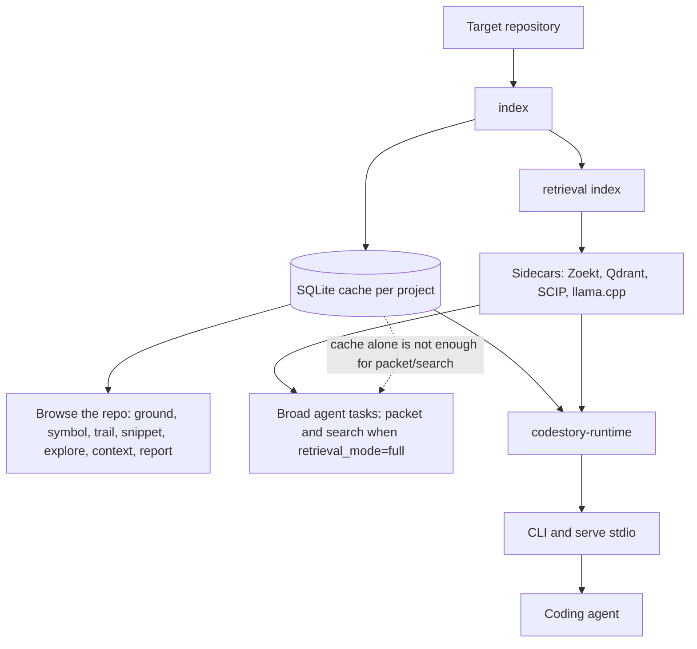

<h1 align="center">CodeStory</h1>

<p align="center">
Local codebase grounding for coding agents.
</p>

<p align="center">
<a href="LICENSE"></a>
<a href="Cargo.toml"></a>
<a href="docs/testing/benchmark-ledger.md"></a>
</p>

## Why CodeStory

You've watched an agent grep the wrong folder, explain code it never opened, or
spend half a session rediscovering the same files. Big repos are not hard because
the model is dumb — they are hard because **nobody gave the agent a map of the
codebase**.

CodeStory is that map. It indexes your repository locally — symbols, calls,
relationships, snippets — so you or your coding agent can orient before guessing.
Good answers name the files they used. Thin evidence gets called out instead of
papered over.

Your code stays on your machine. The index lives in a local cache you control.

## How it fits together



Most people start with the left path — index once, then explore. The right path
adds sidecars when you want agent-grade `packet` and `search`; see
[docs/usage.md](docs/usage.md) and [docs/ops/retrieval-sidecars.md](docs/ops/retrieval-sidecars.md).

## Try It On A Repo

From this checkout, build the CLI and point it at any repository:

```sh
cargo build --release -p codestory-cli
CODESTORY_CLI="./target/release/codestory-cli"
TARGET_WORKSPACE="/path/to/repo"

"$CODESTORY_CLI" doctor --project "$TARGET_WORKSPACE"
"$CODESTORY_CLI" setup embeddings --project "$TARGET_WORKSPACE" --dry-run --format json
"$CODESTORY_CLI" index --project "$TARGET_WORKSPACE" --refresh full
"$CODESTORY_CLI" ground --project "$TARGET_WORKSPACE" --why
"$CODESTORY_CLI" report --project "$TARGET_WORKSPACE" --output-file codestory-report.md
"$CODESTORY_CLI" report --project "$TARGET_WORKSPACE" --format json --output-file codestory-graph.json
```

On Windows PowerShell, use `.\target\release\codestory-cli.exe`, environment
assignments such as `$env:NAME = "value"`, and normal Windows paths such as
`C:\path\to\repo`.

That basic path gets you browsing: health checks, orientation, symbol trails,
snippets, and a generated repo report. For full agent `packet`/`search`, you
also need sidecars at `retrieval_mode=full` — covered in the usage and sidecar
docs linked above.

After that first index, use narrower commands instead of asking the agent to
start over:

```sh
"$CODESTORY_CLI" search --project "$TARGET_WORKSPACE" --query "request routing" --why
"$CODESTORY_CLI" trail --project "$TARGET_WORKSPACE" --id <node-id> --story --hide-speculative
"$CODESTORY_CLI" snippet --project "$TARGET_WORKSPACE" --id <node-id> --context 40
```

A good CodeStory-backed answer should name the source files it used, say when
evidence is stale or partial, and give the next concrete command when more proof
is needed.

For task-shaped flows, use [docs/usage.md](docs/usage.md).

## Retrieval sidecars

For Zoekt/Qdrant/SCIP packet retrieval, run `cargo retrieval-setup` once from
this repository root, then follow
[docs/ops/retrieval-sidecars.md](docs/ops/retrieval-sidecars.md) for bootstrap
flags, version pins, and troubleshooting.

## Install As An Agent Skill

Use this path when CodeStory should be installed once as a grounding skill and
then pointed at whatever repository an agent is working on.

```sh
SkillHome="<agent-global-skill-directory>"
mkdir -p "$SkillHome"
cp -R ./.agents/skills/codestory-grounding "$SkillHome/codestory-grounding"
bash "$SkillHome/codestory-grounding/scripts/setup.sh"
```

On Windows PowerShell:

```powershell
$SkillHome = "<agent-global-skill-directory>"
New-Item -ItemType Directory -Force -Path $SkillHome | Out-Null
Copy-Item -Recurse -Force .\.agents\skills\codestory-grounding "$SkillHome\codestory-grounding"
& "$SkillHome\codestory-grounding\scripts\setup.ps1"
```

The setup script prints `CODESTORY_CLI=<path>`. Persist that path if your agent
environment does not preserve variables between sessions.

The skill package lives at
[.agents/skills/codestory-grounding/SKILL.md](.agents/skills/codestory-grounding/SKILL.md).

## Core Flow

| Need | Command |
| --- | --- |
| Local navigation readiness | `codestory-cli doctor --project <target-workspace>` |
| Build or refresh an index | `codestory-cli index --project <target-workspace> --refresh full` |
| Broad orientation | `codestory-cli ground --project <target-workspace> --why` |
| Repo report / graph export | `codestory-cli report --project <target-workspace> --format markdown` |
| Broad task evidence (requires full sidecar retrieval) | `codestory-cli packet --project <target-workspace> --question "<task>" --budget compact` |
| Candidate discovery (requires full sidecar retrieval) | `codestory-cli search --project <target-workspace> --query "<term>" --why` |
| Exact symbol evidence | `codestory-cli symbol --project <target-workspace> --id <node-id>` |
| Flow evidence | `codestory-cli trail --project <target-workspace> --id <node-id> --story --hide-speculative` |
| Source excerpt | `codestory-cli snippet --project <target-workspace> --id <node-id>` |
| Bundled navigation packet | `codestory-cli explore --project <target-workspace> --id <node-id> --no-tui` |
| Deep context bundle | `codestory-cli context --project <target-workspace> --id <node-id>` |
| Changed-file impact | `codestory-cli affected --project <target-workspace> --format markdown` |
| Persistent read surface | `codestory-cli serve --project <target-workspace> --stdio` |

Use `packet` for broad task questions once `ready --goal agent` reports full
sidecar retrieval. For local cache-only inspection, start with `ground`,
`report`, or `doctor`, then use `symbol`, `trail`, `snippet`, or `context` after
you have a concrete target. Use `doctor` when output looks stale, incomplete, or
inconsistent.

## Language Support

CodeStory separates parser-backed graph indexing, regression-tested accuracy,
structural extraction, framework route coverage, and agent packet/search
readiness. The current contract is documented in
[docs/architecture/language-support.md](docs/architecture/language-support.md).

In short: Python, Java, Rust, JavaScript, TypeScript/TSX, C++, C, Go, Ruby,
PHP, C#, Kotlin, Swift, Dart, and Bash are fidelity-gated parser-backed graph
languages; HTML, CSS, and SQL use structural collectors.

The opt-in OSS language corpus pairs each public language-support profile with a
pinned medium-sized open source project and compares raw filesystem counts
against CodeStory indexing of the same files:
[docs/testing/oss-language-corpus.md](docs/testing/oss-language-corpus.md).
The separate `language-expansion-holdout` benchmark suite runs strict
`without_codestory` versus `with_codestory` agent tasks on those pinned
projects and records elapsed time, token usage, estimated cost, tool calls,
command counts, source reads, post-packet source reads, and quality gates.

For the system model, start with
[docs/concepts/how-codestory-works.md](docs/concepts/how-codestory-works.md),
then [docs/architecture/overview.md](docs/architecture/overview.md).

## Evidence and claims

Benchmark rows are environment-specific — see the ledger before repeating any
number. CodeStory helps agents find evidence; it does not guarantee correct
answers on its own.

- Public evidence summary and caveats:
  [docs/testing/benchmark-ledger.md](docs/testing/benchmark-ledger.md)
- Repo-scale timing history:
  [docs/testing/codestory-e2e-stats-log.md](docs/testing/codestory-e2e-stats-log.md)
- Warm stdio loop evidence:
  [docs/testing/codestory-stdio-warm-loop-stats.md](docs/testing/codestory-stdio-warm-loop-stats.md)
- Repeatable with/without harness:
  [`scripts/codestory-agent-ab-benchmark.mjs`](scripts/codestory-agent-ab-benchmark.mjs)

Do not promote a single benchmark row into a universal savings claim.

## Hack On CodeStory

Start with the contributor docs, then run Cargo checks serially because this
workspace shares build locks.

- [docs/contributors/getting-started.md](docs/contributors/getting-started.md)
- [docs/contributors/debugging.md](docs/contributors/debugging.md)
- [docs/contributors/testing-matrix.md](docs/contributors/testing-matrix.md)
- [docs/architecture/runtime-execution-path.md](docs/architecture/runtime-execution-path.md)
- [docs/architecture/language-support.md](docs/architecture/language-support.md)
- [docs/architecture/subsystems/contracts.md](docs/architecture/subsystems/contracts.md)
- [docs/architecture/subsystems/workspace.md](docs/architecture/subsystems/workspace.md)
- [docs/architecture/subsystems/indexer.md](docs/architecture/subsystems/indexer.md)
- [docs/architecture/subsystems/store.md](docs/architecture/subsystems/store.md)
- [docs/architecture/subsystems/runtime.md](docs/architecture/subsystems/runtime.md)
- [docs/architecture/subsystems/cli.md](docs/architecture/subsystems/cli.md)

## License

Apache-2.0. See [LICENSE](LICENSE).
