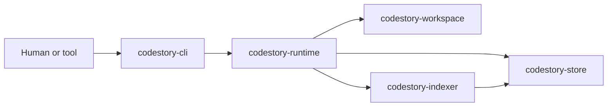
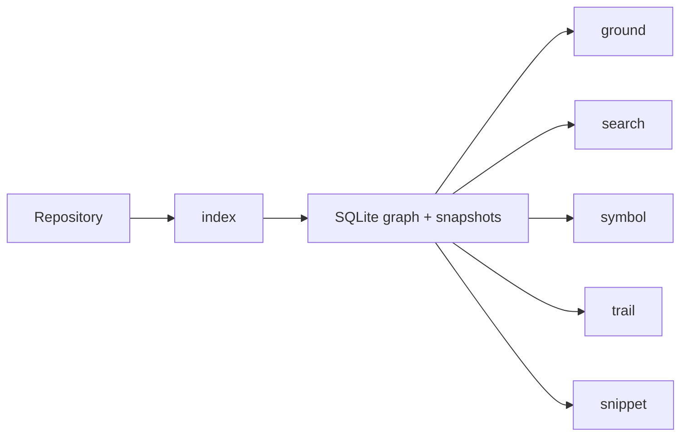

# CodeStory

CodeStory is a local codebase grounding engine. It indexes a repository into a SQLite-backed graph, keeps grounding-oriented read models up to date, and exposes six workflows through `codestory-cli`.

## System Map



## Use CodeStory

Use this path if you want to run the tool against a repository.

1. Build the CLI.
   ```powershell
   cargo build --release -p codestory-cli
   ```
2. Use the built binary from this repo checkout.
   ```powershell
   .\target\release\codestory-cli.exe --help
   ```
3. Create or refresh the local index.
   ```powershell
   .\target\release\codestory-cli.exe index --project . --refresh auto
   ```
4. Run the grounding workflows against the existing cache.
   ```text
   .\target\release\codestory-cli.exe ground --project <path>
   .\target\release\codestory-cli.exe search --project <path> --query <query>
   .\target\release\codestory-cli.exe symbol --project <path> (--id <node-id> | --query <query>)
   .\target\release\codestory-cli.exe trail --project <path> (--id <node-id> | --query <query>)
   .\target\release\codestory-cli.exe snippet --project <path> (--id <node-id> | --query <query>)
   ```

Read commands default to `--refresh none`. They query the current cache unless you explicitly ask them to refresh.

If you are using an agent in this repo, point it at the available `codestory-grounding` skill in `.agents/skills/codestory-grounding/SKILL.md` so it can use the indexed grounding workflows directly.

Start here when you are using the tool:

- [Runtime execution path](docs/architecture/runtime-execution-path.md)
- [CLI subsystem](docs/architecture/subsystems/cli.md)
- [Glossary](docs/glossary.md)

## Hack on CodeStory

Use this path if you want to change the codebase.

1. Read the architecture overview, runtime execution path, and indexing pipeline before you jump into crate-specific details.
2. Run Cargo verification serially because the workspace shares build locks.
3. Make changes in the owning crate instead of threading behavior through the CLI.
4. Use the contributor docs as a short path through architecture, debugging, and test coverage.

Start here when you are contributing:

- [Architecture overview](docs/architecture/overview.md)
- [Contributor setup](docs/contributors/getting-started.md)
- [Indexing pipeline](docs/architecture/indexing-pipeline.md)
- [Debugging guide](docs/contributors/debugging.md)
- [Testing matrix](docs/contributors/testing-matrix.md)
- [Architecture history](docs/decision-log.md)
- [Contracts subsystem](docs/architecture/subsystems/contracts.md)
- [Workspace subsystem](docs/architecture/subsystems/workspace.md)
- [Indexer subsystem](docs/architecture/subsystems/indexer.md)
- [Store subsystem](docs/architecture/subsystems/store.md)
- [Runtime subsystem](docs/architecture/subsystems/runtime.md)
- [CLI subsystem](docs/architecture/subsystems/cli.md)

## Grounding Workflows

The product surface remains organized around six workflows:



- `index`: discover files, parse supported languages, resolve semantics, and persist graph/search state locally
- `ground`: build grounded context from indexed symbols, snippets, graph traversal, and search results
- `search`: find symbols, files, and query matches
- `symbol`: inspect one symbol and its indexed relationships

Hybrid retrieval is the intended default when local embedding assets are available. `index`, `ground`, and `search` now report retrieval mode, semantic doc counts, and explicit fallback reasons when the runtime drops back to symbolic ranking.
- `trail`: walk caller/callee and usage neighborhoods through the graph
- `snippet`: fetch focused source context for a symbol or file location

## Retrieval Defaults

`index`, `ground`, and `search` now report the active retrieval mode. Hybrid retrieval is the default when local embedding assets are available; otherwise CodeStory falls back to symbolic or lexical ranking and reports why.

Hybrid retrieval setup:

- fast local-dev semantic mode: set `CODESTORY_EMBED_RUNTIME_MODE=hash`
- local model artifacts: set `CODESTORY_EMBED_MODEL_PATH` to the ONNX model; `CODESTORY_EMBED_TOKENIZER_PATH` defaults to a sibling `tokenizer.json`
- lexical-only mode: set `CODESTORY_HYBRID_RETRIEVAL_ENABLED=false`
- verification: `index`, `ground`, and `search` will report the retrieval mode plus any fallback reason

Refresh behavior:

- `index --refresh auto`: full on an empty cache, incremental once indexed files already exist
- `ground`, `search`, `symbol`, `trail`, `snippet`: default to `--refresh none`
- use `--refresh incremental` when you want a read command to refresh an existing cache first
- use `--refresh full` after a cache reset, schema change, or suspected stale-state incident

## Cache Hygiene

By default, `codestory-cli` stores per-project caches under the user cache root using a hash of the project path. If you pass `--cache-dir`, that directory is used exactly as written.

Typical recovery flow:

```powershell
.\target\release\codestory-cli.exe index --project . --refresh full
.\target\release\codestory-cli.exe search --project . --query WorkspaceIndexer
```

If the cache itself is suspect, remove the project cache directory and rebuild:

```powershell
Remove-Item -LiteralPath <cache-dir> -Recurse -Force
.\target\release\codestory-cli.exe index --project . --refresh full
```

Low-memory guidance:

- prefer `index --refresh incremental` over repeated full refreshes
- avoid running multiple cargo commands at once in this repo
- if semantic retrieval assets are unavailable or too heavy for the current machine, symbolic retrieval remains supported and is reported explicitly
- if the repo-scale runtime integration gate exceeds local memory, stop there and fall back to the smaller runtime lanes before escalating to a larger machine

## Workspace Shape

The workspace is organized into seven durable crates:

- `codestory-contracts`: shared graph, API, grounding, trail, and event types
- `codestory-workspace`: manifest loading, file discovery, and refresh-plan computation
- `codestory-store`: SQLite persistence, snapshots, trails, bookmarks, and search docs
- `codestory-indexer`: parsing, extraction, resolution, batching, and indexing tests
- `codestory-runtime`: orchestration, grounding, search, trail, and agent flows
- `codestory-cli`: thin adapter and renderer for the six workflows
- `codestory-bench`: criterion benches for indexing, grounding, resolution, and cleanup work

## Build And Verification

Run Cargo commands serially in this repo:

```powershell
cargo fmt --check
cargo check
cargo test
cargo clippy --all-targets -- -D warnings
```

Release-blocking fidelity suites:

```powershell
cargo test -p codestory-indexer --test fidelity_regression
cargo test -p codestory-indexer --test tictactoe_language_coverage
cargo test -p codestory-runtime --test retrieval_eval
```

Runtime-backed CLI fixture flows are an explicit heavier lane now:

```powershell
cargo test -p codestory-cli --test runtime_backed_flows -- --ignored
```

The repo-scale runtime integration smoke test is ignored by default because it indexes the full
`codestory` workspace and can exhaust memory. Run it only as an explicit heavy lane:

```powershell
$env:CODESTORY_RUN_REPO_SCALE_TEST = "1"
cargo test -p codestory-runtime --test integration test_repo_scale_call_resolution -- --ignored --nocapture
```

## Runtime Artifacts

CodeStory writes user-cache SQLite indexes keyed by the target project path. Build outputs live under `target/`.

## License

MIT. See `LICENSE`.

