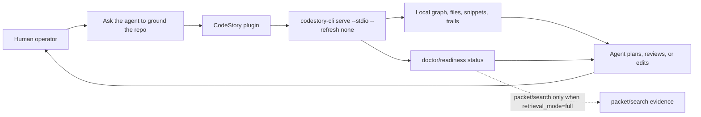

<h1 align="center">CodeStory</h1>

<p align="center">
Local codebase grounding for coding agents, with cited repository evidence and
readiness checks the human operator can inspect.
</p>

<p align="center">
<a href="LICENSE"></a>
<a href="Cargo.toml"></a>
</p>

Coding agents are very good at sounding certain before they have grounded the
repo in front of them. That is backwards. Before an operator asks for a plan,
review, or edit, the agent needs current local context it can cite and the
human can inspect.

CodeStory gives the agent a read-only local MCP/CLI grounding surface: files,
symbols, snippets, trails, packet/search, and readiness gates over the current
checkout. The result is not magic. It is better plumbing: the agent starts from
local evidence, knows when packet/search is trustworthy, and leaves claims a
reviewer can follow back to source.

Use it when the next agent answer needs to survive review:

- What is in this repo?
- Which files changed, and what else might be affected?
- Where is this behavior implemented?
- Which symbols, references, snippets, and trails support the answer?
- Is broad packet/search ready enough to use as evidence?

CodeStory does not replace source review, tests, or human judgment. It changes
the starting point: local cited evidence first, confident guesses last.

## Proof Before Trust

These are documented regression and protocol numbers, not marketing claims.
They do not prove token savings, answer quality, public benchmark promotion, or
generalization.

| What the repo evidence says | Number | Source | Trust boundary |
| --- | ---: | --- | --- |
| Repo-scale full-sidecar stats row | `75.36s` index, including `49.45s` semantic phase | 2026-06-18 `d8d59e9e+wt` #41 hardening row in [codestory-e2e-stats-log.md](docs/testing/codestory-e2e-stats-log.md); summarized in [performance-review-playbook.md](docs/testing/performance-review-playbook.md#current-ops-gates) | Regression telemetry only; the row says the real drill was intentionally skipped. |
| Retrieval sidecar readiness on that row | `retrieval_mode full`, `4.34s` retrieval index, `0.39s` retrieval status | Same 2026-06-18 #41 hardening row and playbook snapshot | `retrieval_mode=full` proves infrastructure readiness for packet/search, not answer quality. |
| Repeat full refresh cache reuse | `29.45s` repeat refresh with `750` reused and `0` embedded | Same 2026-06-18 #41 hardening row and playbook snapshot | Useful cache/reuse signal; not a quality or generalization result. |
| Agent stdio loop smoke | `20` reps, `53.50ms` warm loop, protocol stdout-only | Small-fixture release-binary row in [codestory-stdio-warm-loop-stats.md](docs/testing/codestory-stdio-warm-loop-stats.md) | Protocol/read-surface smoke; not repo-scale packet/search proof. |

The stricter rule is deliberate: local navigation readiness is useful, but broad
packet/search claims require `agent_packet_search` ready and `retrieval_mode=full`.
Even that is infrastructure readiness; public answer-quality claims need the
separate packet-runtime or drill evidence described in
[retrieval-architecture.md](docs/testing/retrieval-architecture.md).

## The Trust Loop



The normal path is plugin-first. The CLI exists for setup, repair, debugging,
and transcripts.

## Use It With An Agent

Most humans should install CodeStory through the agent plugin, not memorize CLI
commands. Open Codex in the workspace you want to ground and use:

```text
/plugins
```

Choose:

```text
TheGreenCedar -> codestory -> Install plugin
```

If your Codex build exposes terminal marketplace management for source
marketplaces, add or refresh this marketplace first:

```bash
codex plugin marketplace add TheGreenCedar/AgentPluginMarketplace
```

The marketplace catalog repo is `TheGreenCedar/AgentPluginMarketplace`. Its
marketplace display/name concept is `TheGreenCedar`. This repository is the
plugin source at `https://github.com/TheGreenCedar/CodeStory.git`, with source path `plugins/codestory`. The CodeStory repo does not contain the marketplace catalog.

Start a new Codex thread after install or refresh. A useful first prompt is:

```text
@CodeStory check whether this repository is ready for local navigation and packet/search, then ground it before planning changes.
```

The plugin launches `codestory-cli serve --stdio --refresh none` directly. The
local MCP server is read-only: it gives the agent grounding, inventory, graph,
snippet, packet, and search tools; it does not edit your repository.

The skill owns binary setup. It checks `codestory-cli --version`, compares the
installed binary with the latest GitHub release, installs a matching release
asset when practical, and checks `SHA256SUMS.txt` when the host can. If `PATH`
changed, the skill tells the human that a Codex host/app restart may be needed
before a fresh agent thread can see it.

CodeStory publishes cross-platform CLI assets for Windows, macOS, and Linux.
Source fallback is available when a release asset does not fit the host.

## What Your Agent Gets

| Human question | CodeStory surface | Trust boundary |
| --- | --- | --- |
| Is this repository ready to use? | `codestory://status`, `doctor` | Separates local navigation from packet/search readiness. |
| What is in this repo? | `codestory://grounding`, `ground`, `files` | Source-backed orientation, not a proof of every behavior. |
| What changed, and what might be affected? | `affected` | Review planning help; still run the relevant tests. |
| Where should we inspect next? | `symbol`, `trail`, `definition`, `references`, `symbols`, `snippet`, `context` | Follow concrete source anchors before claiming facts. |
| Can we ask a broad codebase question? | `packet`, `search` | Proof only with `agent_packet_search` ready and `retrieval_mode=full`. |

The canonical plugin skill is
[plugins/codestory/skills/codestory-grounding/SKILL.md](plugins/codestory/skills/codestory-grounding/SKILL.md).

## Trust And Readiness

| Lane | Use it for | Trust it when | If not ready |
| --- | --- | --- | --- |
| Local navigation | Grounding, file inventory, changed-file impact, graph/source follow-up. | `local_navigation` is ready. | Refresh or rebuild the local cache, then source-read the named files. |
| Packet/search | Broad repo questions and candidate discovery. | `agent_packet_search` is ready and `retrieval_mode=full`. | Treat output as navigation help only, then repair sidecars or fall back to direct source reads. |

Non-`full` packet/search output is not proof. Degraded, partial, stale, fallback,
or missing sidecar output may help the agent choose files to inspect; it cannot
carry a product-grade claim.

## When To Use The CLI

Use the CLI when you need a direct setup, repair, or debug transcript.

Setup and local navigation:

```sh
codestory-cli doctor --project <repo>
codestory-cli index --project <repo> --refresh auto
codestory-cli ground --project <repo> --why
codestory-cli files --project <repo> --limit 80
codestory-cli affected --project <repo> --format markdown
```

Repair a stale local cache:

```sh
codestory-cli doctor --project <repo>
codestory-cli index --project <repo> --refresh full
codestory-cli doctor --project <repo>
```

Debug packet/search readiness:

```sh
codestory-cli retrieval status --project <repo> --format json
```

Repair packet/search sidecars:

```sh
codestory-cli retrieval bootstrap --project <repo> --format json
codestory-cli retrieval index --project <repo> --refresh full
codestory-cli retrieval status --project <repo> --format json
```

For source checkout work:

```sh
cargo build --release -p codestory-cli
```

On Windows PowerShell, use `.\target\release\codestory-cli.exe` and normal
Windows paths. The release-binary installer path is:

```powershell
.\scripts\install-codestory.ps1 -Project C:\path\to\repo
```

See [docs/usage.md](docs/usage.md) for task-shaped flows and
[docs/ops/retrieval-sidecars.md](docs/ops/retrieval-sidecars.md) for
packet/search setup and repair.

## Docs For Operators And Contributors

Start with the [docs entry map](docs/README.md) to choose the right durable
page for setup, repair, architecture, verification, or research evidence.

## License

Apache-2.0. See [LICENSE](LICENSE).
