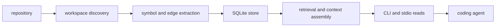

<h1 align="center">CodeStory</h1>

<p align="center">
Local codebase grounding for coding agents.
</p>

<p align="center">
<a href="LICENSE"></a>
<a href="Cargo.toml"></a>
<a href="docs/testing/benchmark-results.md"></a>
</p>

CodeStory builds a local evidence layer for a repository. It indexes files,
symbols, relationships, snippets, search state, and freshness notes into a
per-project SQLite cache, then exposes that evidence through a CLI and
`serve --stdio`.

Use it when a coding agent needs repository context before explaining behavior,
planning a change, or choosing files to inspect. The workflow is explicit: check
cache health, build or refresh the index, find candidate symbols, inspect
relationships, pull snippets, and return an answer tied to source evidence.

Repository contents and inference stay local after the required tool or model
assets are installed. Setup can fetch the CodeStory source artifact or managed
embedding assets; the indexed project data stays in the user cache and commands
stay explicit about which workspace they read.

## Try It On A Repo

From this checkout, build the CLI and point it at any repository:

```powershell
cargo build --release -p codestory-cli
$CodeStoryCli = ".\target\release\codestory-cli.exe"
$TargetWorkspace = "C:\path\to\repo"

& $CodeStoryCli doctor --project $TargetWorkspace
& $CodeStoryCli index --project $TargetWorkspace --refresh full
& $CodeStoryCli ground --project $TargetWorkspace --why
```

After that first index, use narrower commands instead of asking the agent to
start over:

```powershell
& $CodeStoryCli search --project $TargetWorkspace --query "request routing" --why
& $CodeStoryCli trail --project $TargetWorkspace --id <node-id> --story --hide-speculative
& $CodeStoryCli snippet --project $TargetWorkspace --id <node-id> --context 40
```

A good CodeStory-backed answer should name the source files it used, say when
evidence is stale or partial, and give the next concrete command when more proof
is needed.

For task-shaped flows, use [docs/usage.md](docs/usage.md).

## Install As An Agent Skill

Use this path when CodeStory should be installed once as a grounding skill and
then pointed at whatever repository an agent is working on.

```powershell
$SkillHome = "<agent-global-skill-directory>"
New-Item -ItemType Directory -Force -Path $SkillHome | Out-Null
Copy-Item -Recurse -Force .\.agents\skills\codestory-grounding "$SkillHome\codestory-grounding"
& "$SkillHome\codestory-grounding\scripts\setup.ps1"
```

On Unix-like systems:

```sh
bash "<agent-global-skill-directory>/codestory-grounding/scripts/setup.sh"
```

The setup script prints `CODESTORY_CLI=<path>`. Persist that path if your agent
environment does not preserve variables between sessions.

The skill package lives at
[.agents/skills/codestory-grounding/SKILL.md](.agents/skills/codestory-grounding/SKILL.md).

## Core Flow

| Need | Command |
| --- | --- |
| Health and cache readiness | `codestory-cli doctor --project <target-workspace>` |
| Build or refresh an index | `codestory-cli index --project <target-workspace> --refresh full` |
| Broad orientation | `codestory-cli ground --project <target-workspace> --why` |
| Broad task evidence | `codestory-cli packet --project <target-workspace> --question "<task>" --budget compact` |
| Candidate discovery | `codestory-cli search --project <target-workspace> --query "<term>" --why` |
| Exact symbol evidence | `codestory-cli symbol --project <target-workspace> --id <node-id>` |
| Flow evidence | `codestory-cli trail --project <target-workspace> --id <node-id> --story --hide-speculative` |
| Source excerpt | `codestory-cli snippet --project <target-workspace> --id <node-id>` |
| Bundled navigation packet | `codestory-cli explore --project <target-workspace> --id <node-id> --no-tui` |
| Deep context bundle | `codestory-cli context --project <target-workspace> --id <node-id>` |
| Changed-file impact | `codestory-cli affected --project <target-workspace> --format markdown` |
| Persistent read surface | `codestory-cli serve --project <target-workspace> --stdio` |

Use `packet` for broad task questions. Use `context` after you have one concrete
target. Use `doctor` when output looks stale, incomplete, or inconsistent.

## What It Builds



CodeStory builds a local evidence layer so agents can request grounded context
instead of relying on ad hoc file reads.

For the system model, start with
[docs/concepts/how-codestory-works.md](docs/concepts/how-codestory-works.md),
then [docs/architecture/overview.md](docs/architecture/overview.md).

## Evidence

The benchmark docs are deliberately cautious. They separate current checked-in
benchmark history from the state of your local cache, which can drift and should
be checked with `doctor`.

- Public evidence summary and caveats:
  [docs/testing/benchmark-results.md](docs/testing/benchmark-results.md)
- Repo-scale timing history:
  [docs/testing/codestory-e2e-stats-log.md](docs/testing/codestory-e2e-stats-log.md)
- Warm stdio loop evidence:
  [docs/testing/codestory-stdio-warm-loop-stats.md](docs/testing/codestory-stdio-warm-loop-stats.md)
- Repeatable with/without harness:
  [`scripts/codestory-agent-ab-benchmark.mjs`](scripts/codestory-agent-ab-benchmark.mjs)

Do not promote a single benchmark row into a universal savings claim.

## Hack On CodeStory

Start with the contributor docs, then run Cargo checks serially because this
workspace shares build locks.

- [docs/contributors/getting-started.md](docs/contributors/getting-started.md)
- [docs/contributors/debugging.md](docs/contributors/debugging.md)
- [docs/contributors/testing-matrix.md](docs/contributors/testing-matrix.md)
- [docs/architecture/runtime-execution-path.md](docs/architecture/runtime-execution-path.md)
- [docs/architecture/subsystems/contracts.md](docs/architecture/subsystems/contracts.md)
- [docs/architecture/subsystems/workspace.md](docs/architecture/subsystems/workspace.md)
- [docs/architecture/subsystems/indexer.md](docs/architecture/subsystems/indexer.md)
- [docs/architecture/subsystems/store.md](docs/architecture/subsystems/store.md)
- [docs/architecture/subsystems/runtime.md](docs/architecture/subsystems/runtime.md)
- [docs/architecture/subsystems/cli.md](docs/architecture/subsystems/cli.md)
- [docs/decision-log.md](docs/decision-log.md)

## License

Apache-2.0. See [LICENSE](LICENSE).
