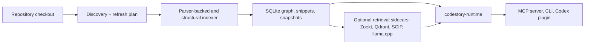

<h1 align="center">CodeStory</h1>

<p align="center">
Local code intelligence for coding agents: graph-backed context, source
citations, and explicit uncertainty.
</p>

<p align="center">
<a href="LICENSE"></a>
<a href="Cargo.toml"></a>
</p>

CodeStory builds a local map/code-intelligence layer for a repository so an
agent can inspect code relationships, retrieve source, trace behavior, and cite
what it found.

Coding agents can sound certain before they have actually mapped the current
checkout. That is the review problem: plausible prose arrives before the agent
knows the files, symbols, ownership boundaries, or call paths it is talking
about.

The human task is not to get more confident prose. It is to get answers that can
survive source review. CodeStory gives the agent a local, read-only code graph,
source snippets, trails, changed-file impact hints, and optional sidecar-backed
packet/search evidence.

The useful result is smaller and better: the agent starts from evidence it can
cite, says when the evidence is stale or partial, and treats degraded retrieval
as a lead to inspect instead of a fact to repeat.

## See It First

Ask the agent for evidence before it plans:

```text
@CodeStory Ground this repository, then trace where request routing is owned and identify the tests most likely affected by changing it.
```

A CodeStory-backed answer should come back shaped like this. This is a
representative result shape, not a transcript from this README branch.

| Result part | What CodeStory gives the agent | How to trust it |
| --- | --- | --- |
| Readiness | `local_navigation: ready`; `agent_packet_search: ready`; `retrieval_mode: full` when sidecars are healthy | Local graph output is usable from the SQLite index. Broad packet/search evidence needs full retrieval. |
| Source evidence | Files, symbols, definitions, references, snippets, and trails with concrete source anchors | Evidence: cite these paths, symbols, and snippets in the answer. |
| Behavior trace | A bounded trail such as entrypoint -> handler -> helper -> persistence call | Evidence when the trail comes from indexed graph/source rows; inspect snippets before editing. |
| Impact hints | Changed-file dependents and likely test files | Lead: review planning help, not a substitute for running tests. |
| Packet/search gaps | Missing sidecars, stale manifests, partial retrieval, truncation, or follow-up commands | Lead only until repaired or source-verified. |

## What Your Agent Gets

- A current file inventory and language coverage notes for the local checkout.
- Indexed files, symbols, definitions, references, occurrences, and snippets.
- Graph trails for following callers, callees, imports, overrides, and nearby
  relationships.
- Changed-file impact hints for review planning and test selection.
- Bounded `packet` output for broad repository questions, with citations, gaps,
  truncation notes, and follow-up commands.
- `search` for candidate discovery when the retrieval lane is full.
- Clear degraded-state signals when the cache, index, or sidecars cannot support
  a proof-bearing claim.

## Use It With An Agent

The easiest way to use CodeStory today is through its Codex plugin. The CLI and
read-only MCP server are also available directly, but they are the setup, repair,
and transcript path.

1. Open Codex in the repository you want to ground.
2. Use `/plugins`, then install `TheGreenCedar -> codestory`.
3. Start a fresh thread and ask:

```text
@CodeStory check whether this repository is ready for local navigation and packet/search, then ground it before planning changes.
```

The plugin launches the local `codestory-cli serve --stdio --refresh none`
runtime. It does not edit your repository. Marketplace catalog details, binary
bootstrap behavior, source fallback, refresh, and uninstall notes live in the
[plugin README](plugins/codestory/README.md).

## How CodeStory Works



The repository is discovered locally, indexed into SQLite-backed graph state,
and served through the runtime. Optional sidecars add full packet/search
retrieval when they are healthy. The plugin is the normal agent entry point; the
CLI is the direct operator path.

## Trust And Privacy

> [!IMPORTANT]
> CodeStory is local and read-only by default. Graph navigation comes from the
> local SQLite index. Broad `packet` and `search` output counts as evidence only
> when the retrieval lane reports `full`; degraded output is a lead to inspect,
> not a fact to repeat. Setup may fetch release binaries or sidecar assets, but
> indexed repository evidence stays in the local cache unless you copy it
> elsewhere.

## Language Support

Public support claims come from
[`crates/codestory-contracts/src/language_support.rs`](crates/codestory-contracts/src/language_support.rs)
and the contract summary in
[language-support.md](docs/architecture/language-support.md).

| Claim tier | Current surfaces | Safe wording |
| --- | --- | --- |
| Parser-backed graph, fidelity-gated | Python, Java, Rust, JavaScript, TypeScript/TSX, C++, C, Go, Ruby, PHP, C#, Kotlin, Swift, Dart, Bash | Daily graph navigation on typical code, with caveats. |
| Structural source-proof | HTML, CSS, SQL, path-scoped GitHub Actions workflows, path-scoped Docker Compose manifests, basename-scoped `Cargo.toml`, dedicated OpenAPI/Swagger endpoint schema anchors | Exact source/schema anchors; not parser-backed graph extraction or semantic runtime proof. |

Language support does not automatically prove typed semantic edges, framework
route completeness, packet answer quality, token savings, or generalization.
Those claims need their own tests or benchmark artifacts.

## CLI Escape Hatch

Use the CLI when you need a direct setup, repair, or debug transcript:

```sh
codestory-cli doctor --project <repo>
codestory-cli index --project <repo> --refresh auto
codestory-cli ground --project <repo> --why
codestory-cli files --project <repo> --limit 80
codestory-cli affected --project <repo> --format markdown
```

When packet/search readiness is the question, check the sidecar lane directly:

```sh
codestory-cli retrieval status --project <repo> --format json
```

Repair commands and sidecar setup details are in
[docs/usage.md](docs/usage.md) and
[docs/ops/retrieval-sidecars.md](docs/ops/retrieval-sidecars.md).

## Performance And Verification Evidence

These records are regression and protocol evidence. They are not product proof
of answer quality, token savings, public benchmark promotion, or generalization.

| Evidence lane | Current recorded signal | Source | Boundary |
| --- | --- | --- | --- |
| Repo-scale full-sidecar stats | 2026-06-18 `d8d59e9e+wt` #41 hardening row: `75.36s` index, `49.45s` semantic phase, `retrieval_mode full`, `4.34s` retrieval index, `0.39s` retrieval status | [codestory-e2e-stats-log.md](docs/testing/codestory-e2e-stats-log.md), summarized in [performance-review-playbook.md](docs/testing/performance-review-playbook.md#current-ops-gates) | Regression telemetry only; that row says the real drill was intentionally skipped. |
| Repeat full refresh | `29.45s` repeat refresh with `750` reused and `0` embedded | Same 2026-06-18 #41 hardening row | Cache/reuse signal, not quality or generalization proof. |
| Stdio agent loop smoke | Small fixture release-binary run: `20` reps, `53.50ms` warm loop, protocol stdout-only | [codestory-stdio-warm-loop-stats.md](docs/testing/codestory-stdio-warm-loop-stats.md) | Protocol/read-surface smoke, not repo-scale packet/search proof. |

Use [retrieval-architecture.md](docs/testing/retrieval-architecture.md) for
packet/search promotion gates and
[docs/README.md](docs/README.md) to choose the right operator, architecture,
verification, or research document.

## License

Apache-2.0. See [LICENSE](LICENSE).
