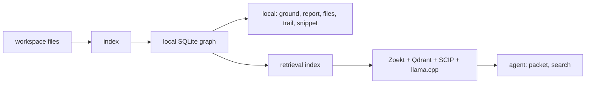

<h1 align="center">CodeStory</h1>

<p align="center">
Local codebase grounding for coding agents.
</p>

<p align="center">
<a href="LICENSE"></a>
<a href="Cargo.toml"></a>
</p>

**Situation.** You are in a repo with more files than anyone holds in memory.
The agent needs to change behavior that spans packages - routing, indexing,
auth, whatever - not rename a variable in the one file already open.

**Task.** Find the symbol that owns the behavior, see who calls it, read the
source that actually runs, and know what to touch next. Without treating
`grep -R` as architecture.

**Action.** CodeStory indexes the workspace into a local SQLite graph:
files, symbols, calls, imports, snippets, search projections, and freshness
notes. Use `doctor`, `index`, `ground`, and `report` for local navigation. Use
`packet` and `search` after sidecars report `retrieval_mode: "full"`.

**Result.** Work starts at a file and line you can open, not whichever match
ranked first in ripgrep. Answers say what they used; gaps say when the index or
sidecars are stale.



## What You Get

| Need | Use |
| --- | --- |
| "Where do I start?" | `doctor`, `index`, `ground`, `report` |
| "What does this symbol touch?" | `symbol`, `trail`, `snippet` |
| "What changed and what might break?" | `affected` |
| "Answer a broad repo question with citations." | `packet` with full sidecars |
| "Find candidates by behavior term, path, symbol, or literal." | `search` with full sidecars |

## Try It On A Repo

From this checkout, build the CLI and point it at any repository:

```sh
cargo build --release -p codestory-cli
CODESTORY_CLI="./target/release/codestory-cli"
TARGET_WORKSPACE="/path/to/repo"

"$CODESTORY_CLI" doctor --project "$TARGET_WORKSPACE"
"$CODESTORY_CLI" setup embeddings --project "$TARGET_WORKSPACE" --dry-run --format json
"$CODESTORY_CLI" index --project "$TARGET_WORKSPACE" --refresh full
"$CODESTORY_CLI" ground --project "$TARGET_WORKSPACE" --why
"$CODESTORY_CLI" report --project "$TARGET_WORKSPACE" --output-file codestory-report.md
```

On Windows PowerShell, use `.\target\release\codestory-cli.exe`, environment
assignments such as `$env:TARGET_WORKSPACE = "C:\path\to\repo"`, and normal
Windows paths.

For a release-binary first Windows check, run:

```powershell
.\scripts\install-codestory.ps1 -Project C:\path\to\repo
```

The wrapper reuses `-CodestoryCli`, `CODESTORY_CLI`, or PATH before downloading
the Windows x64 release asset. Its output separates executable install, local
navigation readiness, and agent packet/search readiness from `doctor`.

Only a `ready` local-navigation verdict proves local navigation readiness. It
does not prove sidecar readiness for `packet` or `search`.

For agent-facing packet/search evidence, build and verify sidecars first:

```sh
"$CODESTORY_CLI" retrieval bootstrap --project "$TARGET_WORKSPACE" --format json
"$CODESTORY_CLI" retrieval index --project "$TARGET_WORKSPACE" --refresh full
"$CODESTORY_CLI" retrieval status --project "$TARGET_WORKSPACE" --format json
"$CODESTORY_CLI" packet --project "$TARGET_WORKSPACE" --question "what owns request routing?"
"$CODESTORY_CLI" search --project "$TARGET_WORKSPACE" --query "request routing" --why
```

`retrieval status` must report `retrieval_mode: "full"` before trusting
`packet` or `search`. See
[docs/usage.md](docs/usage.md) for task-shaped flows and
[docs/ops/retrieval-sidecars.md](docs/ops/retrieval-sidecars.md) for sidecar
setup and repair.

## Install As An Agent Plugin

Install `codestory` from the external `TheGreenCedar` marketplace catalog in
`TheGreenCedar/AgentPluginMarketplace`. The plugin entry is `codestory`, with
source `git-subdir`, URL `https://github.com/TheGreenCedar/CodeStory.git`, and
path `plugins/codestory`. The canonical skill ships inside this repository's
plugin package at
[`plugins/codestory/skills/codestory-grounding/SKILL.md`](plugins/codestory/skills/codestory-grounding/SKILL.md).

The plugin launches `codestory-cli serve --stdio --refresh none` directly. If
the binary is missing or older than the latest GitHub release on the agent host,
use the matching host release asset or source fallback documented in
[the plugin README](plugins/codestory/README.md), then restart the agent thread
if `PATH` changed.

## Commands

| Task | Command |
| --- | --- |
| Cache health | `doctor --project <repo>` |
| Index | `index --project <repo> --refresh full` |
| Orientation | `ground --project <repo> --why` |
| Lookup with sidecars | `search --project <repo> --query "..." --why` |
| Call graph | `trail --project <repo> --id <node-id> --story` |
| Source | `snippet --project <repo> --id <node-id>` |
| Target bundle | `context --project <repo> --id <node-id>` |
| Task packet with sidecars | `packet --project <repo> --question "..."` |
| Persistent reads | `serve --project <repo> --stdio` |

## Language Support

CodeStory separates parser-backed graph coverage, structural collectors,
regression-tested fidelity, and agent packet/search readiness. The current
contract is documented in
[docs/architecture/language-support.md](docs/architecture/language-support.md).

Python, Java, Rust, JavaScript, TypeScript/TSX, C++, C, Go, Ruby, PHP, C#,
Kotlin, Swift, Dart, and Bash are fidelity-gated parser-backed graph languages.
HTML, CSS, and SQL use structural collectors.

## Evidence

Benchmark notes are environment- and repository-specific evidence. Do not turn
one row into a universal savings claim. Run-specific scorecards, generated
comparison docs, and benchmark ledgers belong in PRs, issues, release notes, or
ignored `target/` artifacts instead of committed durable docs.

- Verification tiers and commands: [docs/contributors/testing-matrix.md](docs/contributors/testing-matrix.md)
- Repo-scale timing history: [docs/testing/codestory-e2e-stats-log.md](docs/testing/codestory-e2e-stats-log.md)
- Warm stdio loop history: [docs/testing/codestory-stdio-warm-loop-stats.md](docs/testing/codestory-stdio-warm-loop-stats.md)
- Repeatable with/without harness: [`scripts/codestory-agent-ab-benchmark.mjs`](scripts/codestory-agent-ab-benchmark.mjs)

## Contributing

Start with the contributor docs, then run Cargo checks serially because this
workspace shares build locks.

- [docs/contributors/getting-started.md](docs/contributors/getting-started.md)
- [docs/contributors/debugging.md](docs/contributors/debugging.md)
- [docs/contributors/testing-matrix.md](docs/contributors/testing-matrix.md)
- [docs/architecture/overview.md](docs/architecture/overview.md)
- [docs/architecture/runtime-execution-path.md](docs/architecture/runtime-execution-path.md)

## Docs Map

- Usage: [docs/usage.md](docs/usage.md)
- Concepts: [docs/concepts/how-codestory-works.md](docs/concepts/how-codestory-works.md)
- Architecture: [docs/architecture/overview.md](docs/architecture/overview.md)
- Languages: [docs/architecture/language-support.md](docs/architecture/language-support.md)
- Testing: [docs/contributors/testing-matrix.md](docs/contributors/testing-matrix.md)
- Contributing: [docs/contributors/getting-started.md](docs/contributors/getting-started.md)

## License

Apache-2.0. See [LICENSE](LICENSE).
