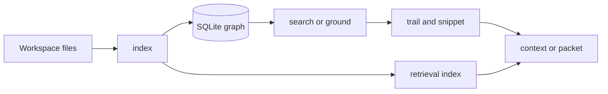

<h1 align="center">CodeStory</h1>

<p align="center">
Local codebase grounding for coding agents.
</p>

<p align="center">
<a href="LICENSE"></a>
<a href="Cargo.toml"></a>
<a href="docs/testing/benchmark-ledger.md"></a>
</p>

**Situation.** You are in a repo with more files than anyone holds in memory. The
agent (or you) needs to change behavior that spans packages — routing, indexing,
auth, whatever — not rename a variable in the one file already open.

**Task.** Find the symbol that owns the behavior, see who calls it, read the
source that actually runs, and know what to touch next. Without treating
`grep -R` as architecture.

**Action.** CodeStory indexes the workspace into a local SQLite graph — symbols,
calls, imports, snippets — and exposes it through a CLI. `index` once;
`search` or `ground` to land somewhere; `trail` and `snippet` to follow it;
`context` or `packet` when you need a bundle. Sidecars (Zoekt, Qdrant, SCIP)
are for full `packet`/`search`; local browsing does not require them.

**Result.** Work starts at a file and line you can open, not at whichever match
ranked first in ripgrep. Answers say what they used; gaps say when the index is
stale or incomplete.



## How it works

The indexer uses tree-sitter on supported languages, writes nodes, edges,
occurrences, and symbol search docs to a per-project cache under your user
directory. Incremental refresh picks up edits without a full rebuild every time.

| Command | What you get |
| --- | --- |
| `ground` | Repo summary and coverage gaps |
| `search` | Ranked symbols, paths, literals |
| `trail` | Callers, callees, references for one node id |
| `snippet` | Source lines around a node |
| `context` | Bundled evidence for one target |
| `packet` | Task-sized citations (`retrieval_mode=full`) |

Most lookup is graph + lexical symbol docs. `retrieval index` embeds a
policy-selected subset of anchors when you need sidecar search — not every
symbol gets a vector.

[docs/usage.md](docs/usage.md) · [docs/ops/retrieval-sidecars.md](docs/ops/retrieval-sidecars.md)

## Try it

```sh
cargo build --release -p codestory-cli
export CODESTORY_CLI="./target/release/codestory-cli"
export TARGET_WORKSPACE="/path/to/repo"

"$CODESTORY_CLI" doctor --project "$TARGET_WORKSPACE"
"$CODESTORY_CLI" index --project "$TARGET_WORKSPACE" --refresh full
"$CODESTORY_CLI" ground --project "$TARGET_WORKSPACE" --why
"$CODESTORY_CLI" search --project "$TARGET_WORKSPACE" --query "WorkspaceIndexer" --why
```

Windows: `.\target\release\codestory-cli.exe`, `$env:TARGET_WORKSPACE = "C:\path\to\repo"`.

## Install as an agent skill

Copy [`.agents/skills/codestory-grounding`](.agents/skills/codestory-grounding) to
your skill directory. Run `scripts/setup.sh` or `scripts/setup.ps1`. See
[`.agents/skills/codestory-grounding/SKILL.md`](.agents/skills/codestory-grounding/SKILL.md).

## Commands

| Task | Command |
| --- | --- |
| Cache health | `doctor --project <repo>` |
| Index | `index --project <repo> --refresh full` |
| Orientation | `ground --project <repo> --why` |
| Lookup | `search --project <repo> --query "…" --why` |
| Call graph | `trail --project <repo> --id <node-id> --story` |
| Source | `snippet --project <repo> --id <node-id>` |
| Target bundle | `context --project <repo> --id <node-id>` |
| Task packet (sidecars) | `packet --project <repo> --question "…"` |
| Persistent reads | `serve --project <repo> --stdio` |

## Docs

- Usage: [docs/usage.md](docs/usage.md)
- Concepts: [docs/concepts/how-codestory-works.md](docs/concepts/how-codestory-works.md)
- Architecture: [docs/architecture/overview.md](docs/architecture/overview.md)
- Languages: [docs/architecture/language-support.md](docs/architecture/language-support.md)
- Benchmarks: [docs/testing/benchmark-ledger.md](docs/testing/benchmark-ledger.md)
- Contributing: [docs/contributors/getting-started.md](docs/contributors/getting-started.md)

## License

Apache-2.0. See [LICENSE](LICENSE).
