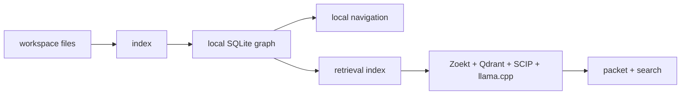

<h1 align="center">CodeStory</h1>

<p align="center">
Local source evidence for coding agents and the humans reviewing them.
</p>

<p align="center">
<a href="LICENSE"></a>
<a href="Cargo.toml"></a>
</p>

CodeStory turns a repository into a local evidence surface: files, symbols,
calls, imports, snippets, graph walks, reports, and sidecar-backed packet/search
results. Use it when an agent needs to work from source-backed context instead
of guessing from a few open files.

The product contract is simple:

1. Local navigation starts from a healthy SQLite graph.
2. Agent packet/search starts only after sidecars report `retrieval_mode=full`.
3. Output must name its evidence or say why the evidence is stale, partial, or
   unavailable.



## When To Use It

| Situation | Start with | Trust only when |
| --- | --- | --- |
| Find the repo shape before editing | `doctor`, `index`, `ground`, `report` | `local_navigation=ready` |
| Follow one symbol, call path, or file | `symbol`, `trail`, `snippet`, `context --id` | the target came from indexed output |
| Explain broad behavior with citations | `packet` | `agent_packet_search=ready` and `retrieval_mode=full` |
| Find candidates by behavior term | `search --why` | `agent_packet_search=ready` and `retrieval_mode=full` |
| Diagnose a stale cache or sidecar | `doctor`, `retrieval status` | the repair command has been rerun and rechecked |

Do not use a degraded packet/search result as product evidence. If sidecars are
missing, stale, or non-`full`, stay on exact local navigation or read source
directly.

## Start Here

For agent use, install the CodeStory plugin package and keep
`codestory-cli` available on the host `PATH`. The canonical grounding skill is
[plugins/codestory/skills/codestory-grounding/SKILL.md](plugins/codestory/skills/codestory-grounding/SKILL.md).
That skill tells the agent to read readiness first, use packet/search only when
sidecars are ready, and fall back to direct source reads when they are not.
If the binary is missing or outdated, the skill tells the agent to resolve the
latest GitHub release for the host before falling back to a source build.

For operator or repair work from this checkout:

```sh
cargo build --release -p codestory-cli
CODESTORY_CLI="./target/release/codestory-cli"
TARGET_WORKSPACE="/path/to/repo"

"$CODESTORY_CLI" doctor --project "$TARGET_WORKSPACE"
"$CODESTORY_CLI" index --project "$TARGET_WORKSPACE" --refresh full
"$CODESTORY_CLI" ground --project "$TARGET_WORKSPACE" --why
"$CODESTORY_CLI" report --project "$TARGET_WORKSPACE" --output-file codestory-report.md
```

On Windows PowerShell, use `.\target\release\codestory-cli.exe`,
`$env:TARGET_WORKSPACE = "C:\path\to\repo"`, and normal Windows paths.

For a release-binary first Windows check:

```powershell
.\scripts\install-codestory.ps1 -Project C:\path\to\repo
```

The installer reuses `-CodestoryCli`, `CODESTORY_CLI`, or `PATH` before
downloading the Windows x64 release asset. Its output separates executable
install, local navigation readiness, and agent packet/search readiness.

## Readiness

| Lane | Built by | Proves | Does not prove |
| --- | --- | --- | --- |
| `local_navigation` | `index` | the SQLite graph can support `ground`, `report`, `files`, `symbol`, `trail`, `snippet`, exact `context`, and `affected` | sidecar packet/search quality |
| `agent_packet_search` | `index` plus `retrieval index` | `packet` and `search` can use the required sidecars for broad source evidence | answer quality beyond the cited evidence |

Only `ready` proves the lane. `needs_attention`, `repair_index`, and
non-`full` retrieval modes are stop signs for broad packet/search claims.

For packet/search readiness:

```sh
"$CODESTORY_CLI" retrieval bootstrap --project "$TARGET_WORKSPACE" --format json
"$CODESTORY_CLI" retrieval index --project "$TARGET_WORKSPACE" --refresh full
"$CODESTORY_CLI" retrieval status --project "$TARGET_WORKSPACE" --format json
"$CODESTORY_CLI" packet --project "$TARGET_WORKSPACE" --question "what owns request routing?"
"$CODESTORY_CLI" search --project "$TARGET_WORKSPACE" --query "request routing" --why
```

`retrieval status` must report `retrieval_mode: "full"` before trusting
`packet` or `search`. See [docs/usage.md](docs/usage.md) for task-shaped flows
and [docs/ops/retrieval-sidecars.md](docs/ops/retrieval-sidecars.md) for
sidecar setup and repair.

## Install As An Agent Plugin

For normal Codex use, open Codex in the repo you want to ground, then use:

```text
/plugins
```

Choose:

```text
TheGreenCedar -> codestory -> Install plugin
```

If the `TheGreenCedar` catalog is not listed and your Codex build supports
terminal marketplace management for source marketplaces, add or refresh the
external catalog first:

```bash
codex plugin marketplace add TheGreenCedar/AgentPluginMarketplace
```

The marketplace source is `TheGreenCedar/AgentPluginMarketplace`.
This repository remains the plugin source. The catalog can list many plugins,
and the CodeStory entry points at `plugins/codestory` in this repo.

Then return to `/plugins` and install `TheGreenCedar -> codestory`. Some
workspace plugin settings are managed from the Codex Apps/Plugins UI rather
than the terminal, so use the UI path when the CLI marketplace command is
unavailable.

Start a new Codex thread after installation or refresh. A good first prompt is:

```text
@CodeStory check whether this repository is ready for local navigation and packet/search, then ground it before planning changes.
```

The canonical skill ships inside this repository's plugin package at
[`plugins/codestory/skills/codestory-grounding/SKILL.md`](plugins/codestory/skills/codestory-grounding/SKILL.md).

The plugin launches `codestory-cli serve --stdio --refresh none` directly. If
the binary is missing or older than the latest GitHub release on the agent host,
use the matching host release asset or source fallback documented in
[the plugin README](plugins/codestory/README.md), then restart the agent thread
if `PATH` changed.

## Command Surfaces

| Task | Command |
| --- | --- |
| Cache and readiness health | `doctor --project <repo>` |
| Build or refresh the graph | `index --project <repo> --refresh full` |
| Repo orientation | `ground --project <repo> --why` |
| Report artifact | `report --project <repo> --output-file codestory-report.md` |
| Candidate discovery with sidecars | `search --project <repo> --query "..." --why` |
| Call graph | `trail --project <repo> --id <node-id> --story` |
| Source context | `snippet --project <repo> --id <node-id>` |
| Target bundle | `context --project <repo> --id <node-id>` |
| Broad task packet with sidecars | `packet --project <repo> --question "..."` |
| Persistent local reads | `serve --project <repo> --stdio` |

The CLI is an operator and repair surface, not the whole product experience.
Agent workflows should start from readiness and source evidence, then use the
smallest command that answers the current question.

## Language Support

CodeStory separates parser-backed graph coverage, structural collectors,
regression-tested fidelity, and agent packet/search readiness. The current
contract is documented in
[docs/architecture/language-support.md](docs/architecture/language-support.md).

Python, Java, Rust, JavaScript, TypeScript/TSX, C++, C, Go, Ruby, PHP, C#,
Kotlin, Swift, Dart, and Bash are fidelity-gated parser-backed graph languages.
HTML, CSS, and SQL use structural collectors.

## Evidence

Benchmark notes are environment- and repository-specific evidence. Do not turn
one row into a universal savings claim. Run-specific scorecards, generated
comparison docs, and benchmark ledgers belong in PRs, issues, release notes, or
ignored `target/` artifacts instead of committed durable docs.

- Verification tiers and commands: [docs/contributors/testing-matrix.md](docs/contributors/testing-matrix.md)
- Repo-scale timing history: [docs/testing/codestory-e2e-stats-log.md](docs/testing/codestory-e2e-stats-log.md)
- Warm stdio loop history: [docs/testing/codestory-stdio-warm-loop-stats.md](docs/testing/codestory-stdio-warm-loop-stats.md)
- Repeatable with/without harness: [scripts/codestory-agent-ab-benchmark.mjs](scripts/codestory-agent-ab-benchmark.mjs)

## Contributing

Start with the contributor docs, then run Cargo checks serially because this
workspace shares build locks.

- [docs/contributors/getting-started.md](docs/contributors/getting-started.md)
- [docs/contributors/debugging.md](docs/contributors/debugging.md)
- [docs/contributors/testing-matrix.md](docs/contributors/testing-matrix.md)
- [docs/architecture/overview.md](docs/architecture/overview.md)
- [docs/architecture/runtime-execution-path.md](docs/architecture/runtime-execution-path.md)

## Docs Map

- Usage: [docs/usage.md](docs/usage.md)
- Concepts: [docs/concepts/how-codestory-works.md](docs/concepts/how-codestory-works.md)
- Architecture: [docs/architecture/overview.md](docs/architecture/overview.md)
- Languages: [docs/architecture/language-support.md](docs/architecture/language-support.md)
- Testing: [docs/contributors/testing-matrix.md](docs/contributors/testing-matrix.md)
- Contributing: [docs/contributors/getting-started.md](docs/contributors/getting-started.md)

## License

Apache-2.0. See [LICENSE](LICENSE).
