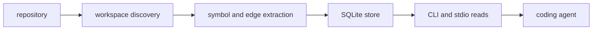

<h1 align="center">CodeStory</h1>

<p align="center">
Local codebase grounding for coding agents.
</p>

<p align="center">
<a href="LICENSE"></a>
<a href="Cargo.toml"></a>
<a href="docs/testing/benchmark-results.md"></a>
</p>

CodeStory turns a repository into a local, queryable evidence layer: symbols,
relationships, source snippets, search hits, semantic docs, and freshness notes.
It is built for coding agents that need to understand a codebase before they
spend half the session reading the same five files sideways.

Everything stays local. The CLI writes user-cache SQLite and search artifacts
keyed by the target project path, reports when evidence is stale or partial, and
keeps commands explicit about which workspace they are reading.

## Why It Exists

Agents are fast, but ungrounded agents are also weirdly committed to rediscovering
the obvious. CodeStory gives them a repeatable loop:

```text
doctor -> index -> ground -> search -> symbol/trail/snippet/explore -> context
```

Use it when you want source-backed orientation, focused navigation, change-impact
hints, or a persistent `serve --stdio` read surface instead of a pile of ad hoc
file reads.

## Benchmark Results

Current evidence supports local indexing, warm reads, protocol hygiene, and
retrieval quality. An exploratory one-repeat agent A/B run also completed on
2026-05-23: the CodeStory arm used `17.4%` fewer total tokens, but was `6.8%`
slower and started more tool commands. Treat that as a real harness check, not a
public savings claim.

- Exploratory agent A/B: `2,440,580` tokens with CodeStory vs. `2,953,233`
  without CodeStory on the CodeStory repo prompt.
- CodeStory repo cold index: `9.23s`, with `47,107` nodes, `39,808` edges,
  `145` files, and `6,358` semantic docs.
- One-shot reads after that index: search `0.92s`, symbol `0.62s`,
  trail `0.20s`, snippet `0.18s`.
- Warm stdio small-fixture loop: `53.50ms` per
  `search -> symbol -> trail -> snippet` loop across `20` reps.
- Warm stdio search p95 smoke: `25.96ms`, with protocol-clean stdout.
- Historical cross-repo retrieval gate: Hit@10 `1.0`, MRR@10 `0.826831`
  across `4` projects and `225` queries.

Read the benchmark source before promoting numbers:
[docs/testing/benchmark-results.md](docs/testing/benchmark-results.md),
[docs/testing/codestory-e2e-stats-log.md](docs/testing/codestory-e2e-stats-log.md),
and
[docs/testing/codestory-stdio-warm-loop-stats.md](docs/testing/codestory-stdio-warm-loop-stats.md).
Generate repeatable with/without rows with
[`scripts/codestory-agent-ab-benchmark.mjs`](scripts/codestory-agent-ab-benchmark.mjs).

## Global Skill Setup

Use this path when CodeStory is installed once as a grounding skill and then
pointed at whatever repository the agent is working on.

1. Install the skill into your agent's global skill directory. `$SkillHome`
   should be whatever global skill home your agent documents.

   ```powershell
   $SkillHome = "<agent-global-skill-directory>"
   New-Item -ItemType Directory -Force -Path $SkillHome | Out-Null
   Copy-Item -Recurse -Force .\.agents\skills\codestory-grounding "$SkillHome\codestory-grounding"
   ```

   Source package:
   [.agents/skills/codestory-grounding/SKILL.md](.agents/skills/codestory-grounding/SKILL.md).

2. Run the one-time setup script from the installed skill. It clones or
   refreshes the CodeStory CLI source artifact, builds the binary, and prints
   `CODESTORY_CLI=<path>`.

   ```powershell
   & "$SkillHome\codestory-grounding\scripts\setup.ps1"
   ```

   On Unix-like systems:

   ```sh
   sh "<agent-global-skill-directory>/codestory-grounding/scripts/setup.sh"
   ```

3. Persist the printed `CODESTORY_CLI` path if your agent environment does not
   preserve it between sessions.

   ```powershell
   setx CODESTORY_CLI "C:\Users\you\AppData\Local\CodeStory\bin\codestory-cli.exe"
   ```

To ground a repository:

```powershell
$CodeStoryCli = $env:CODESTORY_CLI
$TargetWorkspace = "C:\path\to\repo"
& $CodeStoryCli doctor --project $TargetWorkspace
& $CodeStoryCli index --project $TargetWorkspace --refresh full
& $CodeStoryCli ground --project $TargetWorkspace --why
```

For the longer command guide, see [docs/usage.md](docs/usage.md).

## Use CodeStory

From this source checkout:

```powershell
cargo build --release -p codestory-cli
.\target\release\codestory-cli.exe index --project C:\path\to\repo --refresh auto
.\target\release\codestory-cli.exe ground --project C:\path\to\repo --why
```

Keep the executable and target workspace separate. CodeStory is the tool; the
`--project` path is the codebase being grounded.

## Agent Loop

| Need | Command |
| --- | --- |
| Health and cache readiness | `codestory-cli doctor --project <target-workspace>` |
| Build or refresh an index | `codestory-cli index --project <target-workspace> --refresh full` |
| Broad orientation | `codestory-cli ground --project <target-workspace> --why` |
| Candidate discovery | `codestory-cli search --project <target-workspace> --query "<term>" --why` |
| Exact symbol evidence | `codestory-cli symbol --project <target-workspace> --id <node-id>` |
| Flow evidence | `codestory-cli trail --project <target-workspace> --id <node-id> --story --hide-speculative` |
| Source excerpt | `codestory-cli snippet --project <target-workspace> --id <node-id>` |
| Bundled navigation packet | `codestory-cli explore --project <target-workspace> --id <node-id> --no-tui` |
| Deep context bundle | `codestory-cli context --project <target-workspace> --id <node-id>` |
| Changed-file impact | `codestory-cli affected --project <target-workspace> --format markdown` |
| Persistent read surface | `codestory-cli serve --project <target-workspace> --stdio` |

Broad questions work best when you first search for concrete anchors, then ask
for context on the exact node ids. `context` is an evidence packet, not a chat
endpoint.

## What It Builds



The Rust workspace is split by responsibility:

- `codestory-contracts`: shared API, graph, trail, grounding, and event types.
- `codestory-workspace`: repo discovery, manifests, and refresh plans.
- `codestory-indexer`: parsing, extraction, resolution, and indexing tests.
- `codestory-store`: SQLite persistence, snapshots, trails, bookmarks, and search.
- `codestory-runtime`: orchestration, grounding, search, trails, and agent flows.
- `codestory-cli`: thin command and rendering surface.
- `codestory-bench`: Criterion benchmark lanes.

## Hack on CodeStory

Start with the architecture and contributor docs, then run Cargo checks serially
because this workspace shares build locks.

- [docs/architecture/overview.md](docs/architecture/overview.md)
- [docs/architecture/runtime-execution-path.md](docs/architecture/runtime-execution-path.md)
- [docs/contributors/debugging.md](docs/contributors/debugging.md)
- [docs/contributors/testing-matrix.md](docs/contributors/testing-matrix.md)
- [docs/contributors/getting-started.md](docs/contributors/getting-started.md)
- [docs/architecture/subsystems/contracts.md](docs/architecture/subsystems/contracts.md)
- [docs/architecture/subsystems/workspace.md](docs/architecture/subsystems/workspace.md)
- [docs/architecture/subsystems/indexer.md](docs/architecture/subsystems/indexer.md)
- [docs/architecture/subsystems/store.md](docs/architecture/subsystems/store.md)
- [docs/architecture/subsystems/runtime.md](docs/architecture/subsystems/runtime.md)
- [docs/architecture/subsystems/cli.md](docs/architecture/subsystems/cli.md)
- [docs/decision-log.md](docs/decision-log.md)

## License

Apache-2.0. See [LICENSE](LICENSE).
