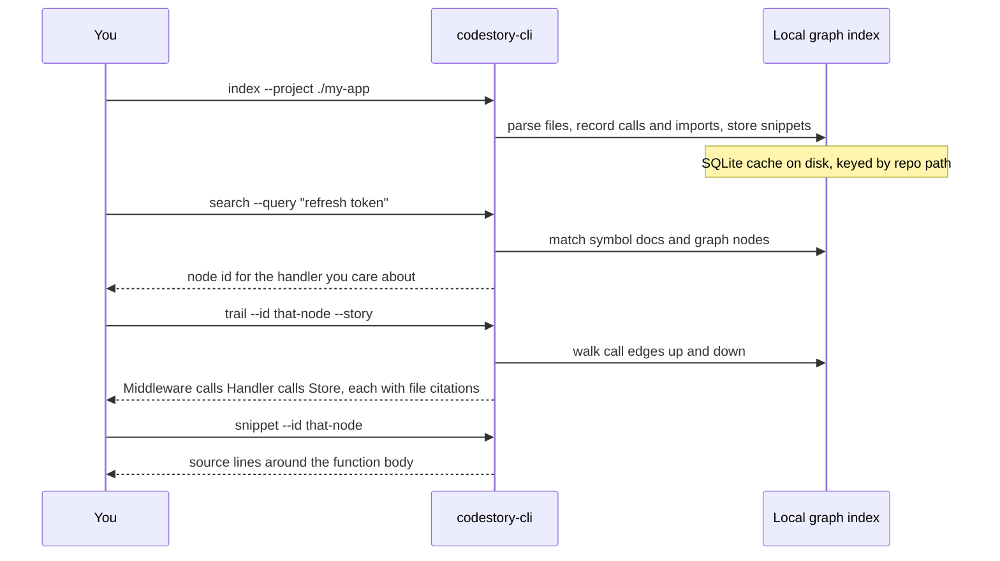

<h1 align="center">CodeStory</h1>

<p align="center">
Local codebase grounding for coding agents.
</p>

<p align="center">
<a href="LICENSE"></a>
<a href="Cargo.toml"></a>
<a href="docs/testing/benchmark-ledger.md"></a>
</p>

## Why CodeStory

You've watched an agent grep the wrong folder, explain code it never opened, or
spend half a session rediscovering the same files. Big repos are not hard because
the model is dumb — they are hard because **nobody gave the agent a map of the
codebase**.

CodeStory builds that map on your machine: a queryable graph of symbols, calls,
imports, and snippets tied to real file locations. You or your agent orient
before guessing, follow relationships instead of opening random paths, and cite
the files that actually support an answer.

Your code stays local. The index lives in a per-repo cache under your user
profile, not on someone else's server.

## How it works

**Indexing** walks the repository, parses supported languages with tree-sitter,
and writes a SQLite graph: functions, types, modules, call edges, import edges,
and source snippets with line ranges. Incremental runs pick up changed files
without rebuilding from scratch. This is the foundation — everything else reads
from that graph.

**Search** finds a starting symbol or file. `ground` summarizes a repo you have
never opened (entry points, hotspots, gaps). `search` matches names, paths,
literals, and generated symbol summaries stored during indexing — not a blind
full-repo text scan.

**Trails** follow the graph. Given one symbol, `trail` walks callers, callees,
and references and returns a path through the code with file-and-line citations.
That is the difference from grep: you see *who calls whom*, not every string
match in the tree.

**Snippets and context** pull the actual source around a node. `context` bundles
trails, neighbors, and citations when you need a handoff packet for one target.

**Embeddings** are optional and separate. Most commands only need the graph.
Broad agent `packet` and sidecar-backed `search` add a second pass: local Zoekt
and Qdrant sidecars, plus vectors for a *small policy-selected set* of anchors
(entry points, public APIs, high-centrality nodes) — not an embedding per symbol.
See [docs/ops/retrieval-sidecars.md](docs/ops/retrieval-sidecars.md) when you
need that lane.



Optional sidecar setup adds `packet --question "how does auth work?"` — a cited
evidence bundle for a broad task without the agent opening twenty files first.
Operator details: [docs/usage.md](docs/usage.md).

## Get started

```sh
cargo build --release -p codestory-cli
export CODESTORY_CLI="./target/release/codestory-cli"
export TARGET_WORKSPACE="/path/to/your/repo"

"$CODESTORY_CLI" doctor --project "$TARGET_WORKSPACE"
"$CODESTORY_CLI" index --project "$TARGET_WORKSPACE" --refresh full
"$CODESTORY_CLI" ground --project "$TARGET_WORKSPACE" --why
"$CODESTORY_CLI" report --project "$TARGET_WORKSPACE" --output-file codestory-report.md
```

On Windows, use `.\target\release\codestory-cli.exe` and `$env:TARGET_WORKSPACE =
"C:\path\to\repo"`.

Then drill into one symbol: `search` → `trail` → `snippet`. Full command
reference and recovery flows live in [docs/usage.md](docs/usage.md).

## Use with an agent

Install the grounding skill once, point it at whatever repo the agent is working
on, and persist the `CODESTORY_CLI` path the setup script prints.

```sh
SkillHome="<agent-global-skill-directory>"
cp -R ./.agents/skills/codestory-grounding "$SkillHome/codestory-grounding"
bash "$SkillHome/codestory-grounding/scripts/setup.sh"
```

Skill source: [.agents/skills/codestory-grounding/SKILL.md](.agents/skills/codestory-grounding/SKILL.md).
Windows setup is in the same folder under `scripts/setup.ps1`.

For a persistent read surface (stdio MCP-style queries against a warm index),
use `codestory-cli serve --project <repo> --stdio`.

## Documentation

- [Usage and workflows](docs/usage.md)
- [How CodeStory works (concepts)](docs/concepts/how-codestory-works.md)
- [Architecture overview](docs/architecture/overview.md)
- [Retrieval sidecars](docs/ops/retrieval-sidecars.md) — when you need `packet` / full `search`
- [Language support](docs/architecture/language-support.md) — parser-backed languages vs structural collectors
- [Contributing](docs/contributors/getting-started.md)
- [Benchmarks and evidence notes](docs/testing/benchmark-ledger.md)

## License

Apache-2.0. See [LICENSE](LICENSE).
