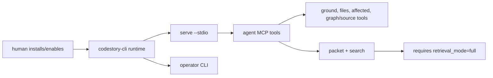

<h1 align="center">CodeStory</h1>

<p align="center">
Local codebase grounding for coding agents, with explicit readiness checks for
the humans operating them.
</p>

<p align="center">
<a href="LICENSE"></a>
<a href="Cargo.toml"></a>
</p>

CodeStory is not a CLI tutorial with an agent bolted on. It is a local evidence
surface for coding agents.

The human job is to install or enable the CodeStory plugin/runtime, check
readiness when something looks off, and use the CLI for operation and debugging.
The agent job is to read status first, use the local MCP/stdio grounding tools,
and make source claims only from evidence that is ready enough to trust.

| Who | Uses CodeStory for |
| --- | --- |
| Coding agent | Repo orientation, file inventory, graph/source follow-up, broad packets, and search candidates before planning or editing. |
| Human operator | Plugin install, binary/runtime setup, readiness repair, transcripts, and debugging. |
| Reviewer | Evidence paths, cited files/symbols, readiness state, and clear non-claims when packet/search is not ready. |

First rule: packet/search is product evidence only when sidecars report
`retrieval_mode=full`. Everything weaker is a navigation hint.



## Primary Flow

1. Install the CodeStory plugin, or make `codestory-cli` available where the
   agent runs.
2. Read readiness before trusting output: local navigation and agent
   packet/search are separate lanes.
3. Let the agent use the read-only MCP/stdio surfaces for grounding, inventory,
   graph traversal, snippets, packets, and search.
4. Use CLI commands when a human needs setup, repair, a transcript, or a direct
   debug run.

## What The Agent Gets

| Need | Surface | Trust gate |
| --- | --- | --- |
| Check whether the repo is usable | `codestory://status`, `doctor` | Readiness lane says `ready` |
| Learn how to proceed | `codestory://agent-guide` | Same target workspace |
| Get a compact repo map | `codestory://grounding`, `ground` | `local_navigation=ready` |
| Inspect file inventory and coverage | `files` | `local_navigation=ready` |
| Map changed files to likely impact | `affected` | `local_navigation=ready` |
| Follow concrete graph/source targets | `symbol`, `trail`, `definition`, `references`, `symbols`, `snippet`, `context` | Exact target from indexed output |
| Find candidates by behavior, symbol, path, or API term | `search` | `agent_packet_search=ready` and `retrieval_mode=full` |
| Answer a broad repo question with bounded evidence | `packet` | `agent_packet_search=ready` and `retrieval_mode=full` |

The MCP server is local and read-only. It is for grounding, not for changing the
repository.

## Install As An Agent Plugin

For normal Codex use, install the plugin through the Codex plugin flow in the
workspace you want to ground:

```text
/plugins
```

Choose:

```text
TheGreenCedar -> codestory -> Install plugin
```

If your Codex build exposes terminal marketplace management for source
marketplaces, add or refresh this marketplace first:

```bash
codex plugin marketplace add TheGreenCedar/AgentPluginMarketplace
```

The marketplace source is `TheGreenCedar/AgentPluginMarketplace`.
This repository remains the plugin source. The catalog can list many plugins,
and the CodeStory entry points at `plugins/codestory` in this repo.
Marketplace edits do not live in this repo.

Start a new Codex thread after install or refresh so the MCP process can see
the current environment. A good first prompt is:

```text
@CodeStory check whether this repository is ready for local navigation and packet/search, then ground it before planning changes.
```

The canonical plugin skill is
[plugins/codestory/skills/codestory-grounding/SKILL.md](plugins/codestory/skills/codestory-grounding/SKILL.md).
The plugin launches `codestory-cli serve --stdio --refresh none` directly.
The skill owns the runtime check: it should verify `codestory-cli --version`,
resolve the latest GitHub release when needed, and restart the agent thread if
`PATH` changed.

## Readiness Contract

CodeStory has two readiness lanes. Do not mix them.

| Lane | Built by | Proves | Does not prove |
| --- | --- | --- | --- |
| `local_navigation` | `index` | The SQLite graph can support `ground`, `files`, `affected`, and focused graph/source tools. | Sidecar packet/search quality. |
| `agent_packet_search` | `index` plus `retrieval index` | `packet` and `search` can use the required sidecars for broad source evidence. | That the answer is good beyond its cited evidence. |

`ready` is the only green light. `needs_attention`, `repair_index`,
`retrieval_unavailable`, stale manifests, backend drift, and non-`full`
retrieval modes are stop signs for broad packet/search claims.

## Operator CLI

Use the CLI when you need a direct setup or debug transcript. Always pass the
target workspace explicitly.

```sh
codestory-cli doctor --project <repo>
codestory-cli index --project <repo> --refresh full
codestory-cli ground --project <repo> --why
codestory-cli files --project <repo> --limit 80
codestory-cli affected --project <repo> --format markdown
```

For sidecar-backed packet/search readiness:

```sh
codestory-cli retrieval bootstrap --project <repo> --format json
codestory-cli retrieval index --project <repo> --refresh full
codestory-cli retrieval status --project <repo> --format json
codestory-cli packet --project <repo> --question "what owns request routing?"
codestory-cli search --project <repo> --query "request routing" --why
```

`retrieval status` must report `retrieval_mode: "full"` before trusting
`packet` or `search`.

For source checkout work:

```sh
cargo build --release -p codestory-cli
```

On Windows PowerShell, use `.\target\release\codestory-cli.exe` and normal
Windows paths. The release-binary installer path is:

```powershell
.\scripts\install-codestory.ps1 -Project C:\path\to\repo
```

## Command Reference

| Task | Command |
| --- | --- |
| Cache and readiness health | `doctor --project <repo>` |
| Build or refresh the graph | `index --project <repo> --refresh full` |
| Repo orientation | `ground --project <repo> --why` |
| File inventory and coverage | `files --project <repo> --limit 80` |
| Changed-file impact | `affected --project <repo>` |
| Candidate discovery with sidecars | `search --project <repo> --query "..." --why` |
| Broad task packet with sidecars | `packet --project <repo> --question "..."` |
| Focused source context | `symbol`, `trail`, `definition`, `references`, `symbols`, `snippet`, `context` |
| Persistent local agent surface | `serve --project <repo> --stdio --refresh none` |

See [docs/usage.md](docs/usage.md) for task-shaped flows and
[docs/ops/retrieval-sidecars.md](docs/ops/retrieval-sidecars.md) for sidecar
setup and repair.

## Language Support

CodeStory separates parser-backed graph coverage, structural collectors,
regression-tested fidelity, and agent packet/search readiness. The current
contract is in
[docs/architecture/language-support.md](docs/architecture/language-support.md).

Parser-backed graph languages include Python, Java, Rust, JavaScript,
TypeScript/TSX, C++, C, Go, Ruby, PHP, C#, Kotlin, Swift, Dart, and Bash. HTML,
CSS, and SQL use structural collectors.

## Evidence And Contributing

Benchmark rows are environment-specific evidence, not universal product claims.
Generated comparison docs, CSVs, ledgers, and scorecards belong in PRs, issues,
release notes, or ignored `target/` artifacts unless they become durable product
documentation.

Useful docs:

- [docs/usage.md](docs/usage.md)
- [docs/concepts/how-codestory-works.md](docs/concepts/how-codestory-works.md)
- [docs/architecture/overview.md](docs/architecture/overview.md)
- [docs/contributors/getting-started.md](docs/contributors/getting-started.md)
- [docs/contributors/debugging.md](docs/contributors/debugging.md)
- [docs/contributors/testing-matrix.md](docs/contributors/testing-matrix.md)
- [docs/testing/codestory-e2e-stats-log.md](docs/testing/codestory-e2e-stats-log.md)
- [docs/testing/codestory-stdio-warm-loop-stats.md](docs/testing/codestory-stdio-warm-loop-stats.md)

Run Cargo verification serially in this repo because build locks are shared.

## License

Apache-2.0. See [LICENSE](LICENSE).
