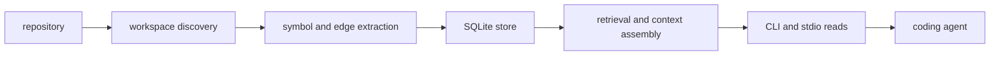

<h1 align="center">CodeStory</h1>

<p align="center">
Local codebase grounding for coding agents.
</p>

<p align="center">
<a href="LICENSE"></a>
<a href="Cargo.toml"></a>
<a href="docs/testing/benchmark-results.md"></a>
</p>

CodeStory builds a local evidence layer for a repository. It indexes files,
symbols, relationships, snippets, search state, and freshness notes into a
per-project SQLite cache, then exposes that evidence through a CLI and
`serve --stdio`.

Use it when a coding agent needs repository context before explaining behavior,
planning a change, or choosing files to inspect. The workflow is explicit: check
cache health, build or refresh the index, find candidate symbols, inspect
relationships, pull snippets, and return an answer tied to source evidence.

Repository contents and inference stay local after the required tool or model
assets are installed. Setup can fetch the CodeStory source artifact or managed
embedding assets; the indexed project data stays in the user cache and commands
stay explicit about which workspace they read.

## Public Promise

CodeStory is a local evidence layer for repositories, not an automatic
correctness guarantee. It gives operators and coding agents explicit commands
for cache health, indexing, search, trails, snippets, and source-backed answers
that name the files they used. The per-project SQLite cache is separate from
the optional local retrieval sidecars used by packet/search workflows; a healthy
local navigation readiness report does not by itself prove agent packet/search
readiness and does not by itself prove sidecar readiness. Benchmark notes are
environment- and repository-specific evidence, so public claims should cite the
checked setup instead of promising universal speedups or savings.

## Try It On A Repo

From this checkout, build the CLI and point it at any repository:

```sh
cargo build --release -p codestory-cli
CODESTORY_CLI="./target/release/codestory-cli"
TARGET_WORKSPACE="/path/to/repo"

"$CODESTORY_CLI" doctor --project "$TARGET_WORKSPACE"
"$CODESTORY_CLI" setup embeddings --project "$TARGET_WORKSPACE" --dry-run --format json
"$CODESTORY_CLI" index --project "$TARGET_WORKSPACE" --refresh full
"$CODESTORY_CLI" ground --project "$TARGET_WORKSPACE" --why
"$CODESTORY_CLI" report --project "$TARGET_WORKSPACE" --output-file codestory-report.md
"$CODESTORY_CLI" report --project "$TARGET_WORKSPACE" --format json --output-file codestory-graph.json
```

On Windows PowerShell, use `.\target\release\codestory-cli.exe`, environment
assignments such as `$env:NAME = "value"`, and normal Windows paths such as
`C:\path\to\repo`.

That basic path establishes local navigation readiness: the local cache, graph,
lexical index, and DB-backed navigation commands are usable for health, file,
symbol, trail, snippet, context, orientation checks, and derived report/export
artifacts.
`report` reads the current SQLite store and writes generated artifacts; the
Markdown report and full JSON graph export are not source-of-truth state. The managed
embedding dry-run is a local semantic setup check; it does not prove agent
packet/search readiness.

Agent packet/search readiness has one extra contract: sidecar packet/search
evidence is trustworthy only when retrieval status reports `retrieval_mode=full`.
That full mode depends on local Zoekt, Qdrant, SCIP, and llama.cpp embedding
sidecars.

```sh
node scripts/setup-retrieval-env.mjs --fetch-embed-model
export CODESTORY_EMBED_MODEL_DIR="$(pwd)/target/retrieval-models"
export CODESTORY_EMBED_BACKEND="llamacpp"
export CODESTORY_EMBED_LLAMACPP_URL="http://127.0.0.1:8080/v1/embeddings"

cargo retrieval-setup
"$CODESTORY_CLI" index --project "$TARGET_WORKSPACE" --refresh full
"$CODESTORY_CLI" retrieval index --project "$TARGET_WORKSPACE" --refresh full
"$CODESTORY_CLI" retrieval status --project "$TARGET_WORKSPACE" --format json
"$CODESTORY_CLI" doctor --project "$TARGET_WORKSPACE"
```

Missing sidecars, stale manifests, disabled sidecars, mixed stored-doc vector
contracts, or diagnostic embedding modes are setup failures to fix before
trusting agent-facing packet/search evidence.

After that first index, use narrower commands instead of asking the agent to
start over:

```sh
"$CODESTORY_CLI" search --project "$TARGET_WORKSPACE" --query "request routing" --why
"$CODESTORY_CLI" trail --project "$TARGET_WORKSPACE" --id <node-id> --story --hide-speculative
"$CODESTORY_CLI" snippet --project "$TARGET_WORKSPACE" --id <node-id> --context 40
```

A good CodeStory-backed answer should name the source files it used, say when
evidence is stale or partial, and give the next concrete command when more proof
is needed.

For task-shaped flows, use [docs/usage.md](docs/usage.md).

## Retrieval sidecars

For Zoekt/Qdrant/SCIP packet retrieval, run once from this repository root
(Windows, macOS, or Linux):

```sh
cargo retrieval-setup
```

`cargo retrieval-setup` builds `codestory-cli` if needed, starts Docker Compose sidecars when
Docker is available, writes local sidecar state, and waits for health probes. Check status with
`cargo retrieval-status`.

Bootstrap modifiers (pass through `cargo run`):

```sh
cargo run -p codestory-cli -- retrieval bootstrap --project . --skip-compose
cargo run -p codestory-cli -- retrieval bootstrap --project . --wait-secs 120
```

Thin wrapper (same bootstrap, optional holdout clone): `node scripts/setup-retrieval-env.mjs`.
Details: [docs/ops/retrieval-sidecars.md](docs/ops/retrieval-sidecars.md).

## Install As An Agent Skill

Use this path when CodeStory should be installed once as a grounding skill and
then pointed at whatever repository an agent is working on.

```sh
SkillHome="<agent-global-skill-directory>"
mkdir -p "$SkillHome"
cp -R ./.agents/skills/codestory-grounding "$SkillHome/codestory-grounding"
bash "$SkillHome/codestory-grounding/scripts/setup.sh"
```

On Windows PowerShell:

```powershell
$SkillHome = "<agent-global-skill-directory>"
New-Item -ItemType Directory -Force -Path $SkillHome | Out-Null
Copy-Item -Recurse -Force .\.agents\skills\codestory-grounding "$SkillHome\codestory-grounding"
& "$SkillHome\codestory-grounding\scripts\setup.ps1"
```

The setup script prints `CODESTORY_CLI=<path>`. Persist that path if your agent
environment does not preserve variables between sessions.

The skill package lives at
[.agents/skills/codestory-grounding/SKILL.md](.agents/skills/codestory-grounding/SKILL.md).

## Core Flow

| Need | Command |
| --- | --- |
| Local navigation readiness | `codestory-cli doctor --project <target-workspace>` |
| Build or refresh an index | `codestory-cli index --project <target-workspace> --refresh full` |
| Broad orientation | `codestory-cli ground --project <target-workspace> --why` |
| Repo report / graph export | `codestory-cli report --project <target-workspace> --format markdown` |
| Broad task evidence | `codestory-cli packet --project <target-workspace> --question "<task>" --budget compact` |
| Candidate discovery | `codestory-cli search --project <target-workspace> --query "<term>" --why` |
| Exact symbol evidence | `codestory-cli symbol --project <target-workspace> --id <node-id>` |
| Flow evidence | `codestory-cli trail --project <target-workspace> --id <node-id> --story --hide-speculative` |
| Source excerpt | `codestory-cli snippet --project <target-workspace> --id <node-id>` |
| Bundled navigation packet | `codestory-cli explore --project <target-workspace> --id <node-id> --no-tui` |
| Deep context bundle | `codestory-cli context --project <target-workspace> --id <node-id>` |
| Changed-file impact | `codestory-cli affected --project <target-workspace> --format markdown` |
| Persistent read surface | `codestory-cli serve --project <target-workspace> --stdio` |

Use `packet` for broad task questions. Target context is DB-first evidence for
one concrete target; use `context` after search, trail, explore, or a bookmark
has selected that target. Use `doctor` when output looks stale, incomplete, or
inconsistent.

## What It Builds



CodeStory builds a local evidence layer so agents can request grounded context
instead of relying on ad hoc file reads.

## Language Support Claims

CodeStory separates parser-backed graph indexing, regression-tested accuracy,
structural extraction, framework route coverage, and agent packet/search
readiness. The current contract is documented in
[docs/architecture/language-support.md](docs/architecture/language-support.md).

In short: Python, Java, Rust, JavaScript, TypeScript/TSX, C++, and C are
fidelity-gated parser-backed graph languages; Go, Ruby, PHP, and C# are
parser-backed beta languages with basic fidelity coverage; HTML, CSS, and SQL
use structural collectors; Kotlin, Swift, Dart, and Bash are parser
compatibility candidates only.

For the system model, start with
[docs/concepts/how-codestory-works.md](docs/concepts/how-codestory-works.md),
then [docs/architecture/overview.md](docs/architecture/overview.md).

## Evidence

The benchmark docs are deliberately cautious. They separate current checked-in
benchmark history from the state of your local cache, which can drift and should
be checked with `doctor`.

- Public evidence summary and caveats:
  [docs/testing/benchmark-results.md](docs/testing/benchmark-results.md)
- Repo-scale timing history:
  [docs/testing/codestory-e2e-stats-log.md](docs/testing/codestory-e2e-stats-log.md)
- Warm stdio loop evidence:
  [docs/testing/codestory-stdio-warm-loop-stats.md](docs/testing/codestory-stdio-warm-loop-stats.md)
- Repeatable with/without harness:
  [`scripts/codestory-agent-ab-benchmark.mjs`](scripts/codestory-agent-ab-benchmark.mjs)

Do not promote a single benchmark row into a universal savings claim.

## Hack On CodeStory

Start with the contributor docs, then run Cargo checks serially because this
workspace shares build locks.

- [docs/contributors/getting-started.md](docs/contributors/getting-started.md)
- [docs/contributors/debugging.md](docs/contributors/debugging.md)
- [docs/contributors/testing-matrix.md](docs/contributors/testing-matrix.md)
- [docs/architecture/runtime-execution-path.md](docs/architecture/runtime-execution-path.md)
- [docs/architecture/language-support.md](docs/architecture/language-support.md)
- [docs/architecture/subsystems/contracts.md](docs/architecture/subsystems/contracts.md)
- [docs/architecture/subsystems/workspace.md](docs/architecture/subsystems/workspace.md)
- [docs/architecture/subsystems/indexer.md](docs/architecture/subsystems/indexer.md)
- [docs/architecture/subsystems/store.md](docs/architecture/subsystems/store.md)
- [docs/architecture/subsystems/runtime.md](docs/architecture/subsystems/runtime.md)
- [docs/architecture/subsystems/cli.md](docs/architecture/subsystems/cli.md)
- [docs/decision-log.md](docs/decision-log.md)

## License

Apache-2.0. See [LICENSE](LICENSE).
