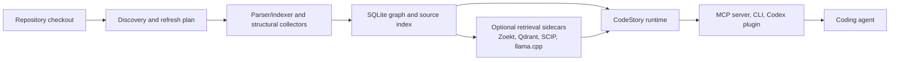

<h1 align="center">CodeStory</h1>

<p align="center">
Local code intelligence for coding agents: graph-backed context, source
citations, and explicit uncertainty.
</p>

<p align="center">
<a href="LICENSE"></a>
<a href="Cargo.toml"></a>
</p>

Coding agents can sound certain before they have mapped the repository in front
of them. That is how plausible answers turn into review work.

The human needs answers that survive inspection: which files were read, which
symbols connect, which behavior trail was followed, and where the evidence
stops.

CodeStory builds a local map/code-intelligence layer for a repository so an
agent can inspect code relationships, retrieve source, trace behavior, and cite
what it found. It exposes that map through a read-only MCP server, a CLI, and a
Codex plugin. When the map is stale, partial, or missing, CodeStory says so
instead of letting a lead harden into a claim.

## See It First

Ask the agent for a grounded trace before it plans an edit:

```text
@CodeStory Ground this repository, then trace where request routing is owned and identify the tests most likely affected by changing it.
```

A representative result should look like this shape, with repo-specific paths
and symbols filled in from the current checkout:

```text
readiness
- local_navigation: ready
- agent_packet_search: ready only when retrieval_mode=full

evidence
- files: <router file>, <handler file>, <route tests>
- symbols: <router entrypoint>, <handler>, <test module>
- trail: <entrypoint> -> <router> -> <handler>
- snippets: cited source ranges for the concrete functions inspected
- affected: likely review/test surfaces based on changed files and graph edges

leads, not proof
- degraded packet/search candidates when sidecars are not full
- packet gaps and follow-up commands when broad evidence is partial
```

The useful distinction is simple: files, symbols, snippets, and trails are
source-backed evidence. Broad `packet` and `search` output is evidence only when
the retrieval lane reports `full`; otherwise it is a lead to inspect.

## What It Helps An Agent Do

- Orient inside an unfamiliar repository before planning work.
- Inspect files, symbols, definitions, references, snippets, and graph trails.
- Trace how behavior moves from an entrypoint to supporting code.
- Estimate changed-file impact and likely test surfaces.
- Build a bounded packet for a broad repository question.
- Preserve uncertainty with readiness status, packet gaps, and follow-up
  commands.

## Install The Plugin

The easiest path today is the Codex plugin.

1. Open Codex in the repository you want to ground.
2. Run `/plugins`, then install `TheGreenCedar -> codestory`.
3. Start a fresh thread and ask `@CodeStory` to check readiness before planning
   changes.

Marketplace/catalog details and binary bootstrap behavior live in the
[plugin README](plugins/codestory/README.md). Sidecar setup and repair details
live in [retrieval-sidecars.md](docs/ops/retrieval-sidecars.md).

## Architecture



The SQLite graph is the local navigation base. Retrieval sidecars add broad
lexical, dense, and graph-backed search for packet/search workflows when they
are healthy.

> [!IMPORTANT]
> **Trust and privacy boundary**
>
> CodeStory runs locally and read-only. It does not edit the repository, and
> CodeStory itself does not send indexed source to a hosted service. The agent
> using CodeStory still has its own model/provider boundary.
>
> Local graph navigation works from the CodeStory index. Broad `packet` and
> `search` results count as evidence only when `agent_packet_search` is ready
> and retrieval reports `full`. Degraded, stale, fallback, or partial output is
> a lead to inspect, not a fact to repeat.

## Language Support

CodeStory uses "support" with qualifiers. Parser-backed graph extraction,
structural source anchors, and agent answer quality are different claims.

| Claim | Current source truth | Safe wording |
| --- | --- | --- |
| Parser-backed graph, fidelity-gated | Python, Java, Rust, JavaScript, TypeScript/TSX, C++, C, Go, Ruby, PHP, C#, Kotlin, Swift, Dart, Bash | Daily graph navigation on typical code, with caveats. |
| Structural source-proof | HTML, CSS, SQL, path-scoped GitHub Actions workflows, path-scoped Docker Compose manifests, basename-scoped Cargo manifests, dedicated OpenAPI/Swagger endpoint schema anchors | Exact-source structural/schema anchors, not semantic runtime proof. |
| Agent-facing packet/search quality | Run-specific packet-runtime, drill, or benchmark evidence | Not implied by language support or sidecar readiness alone. |

The durable claim contract is
[docs/architecture/language-support.md](docs/architecture/language-support.md).
The source registry is
[`crates/codestory-contracts/src/language_support.rs`](crates/codestory-contracts/src/language_support.rs).

## CLI Escape Hatch

Use the CLI when you need a direct setup, repair, or debug transcript:

```sh
codestory-cli doctor --project <repo>
codestory-cli index --project <repo> --refresh auto
codestory-cli ground --project <repo> --why
codestory-cli affected --project <repo> --format markdown
codestory-cli retrieval status --project <repo> --format json
```

For task-shaped CLI flows, see [docs/usage.md](docs/usage.md). For packet/search
sidecars, see [docs/ops/retrieval-sidecars.md](docs/ops/retrieval-sidecars.md).

## Performance And Verification

These numbers are regression and protocol evidence. They do not prove answer
quality, token savings, public benchmark promotion, or generalization.

| Evidence surface | Current documented signal | Boundary |
| --- | --- | --- |
| Repo-scale e2e stats | 2026-06-18 `d8d59e9e+wt` #41 hardening row recorded `75.36s` index time, including `49.45s` semantic phase. See [codestory-e2e-stats-log.md](docs/testing/codestory-e2e-stats-log.md). | Regression telemetry; that row says the real drill was intentionally skipped. |
| Retrieval sidecar readiness | Same row recorded `retrieval_mode full`, `4.34s` retrieval index, and `0.39s` retrieval status. | Infrastructure readiness for packet/search, not answer quality. |
| Repeat full refresh cache reuse | Same row recorded `29.45s` repeat refresh with `750` reused and `0` embedded. | Cache/reuse signal only. |
| Agent stdio loop smoke | Small-fixture release-binary row recorded `20` reps and `53.50ms` warm loop in [codestory-stdio-warm-loop-stats.md](docs/testing/codestory-stdio-warm-loop-stats.md). | Protocol/read-surface smoke, not repo-scale packet/search proof. |

Promotion and proof tiers are described in
[retrieval-architecture.md](docs/testing/retrieval-architecture.md).

## Docs For Operators And Contributors

Start with [docs/README.md](docs/README.md) for setup, repair, architecture,
verification, and research evidence.

## License

Apache-2.0. See [LICENSE](LICENSE).
