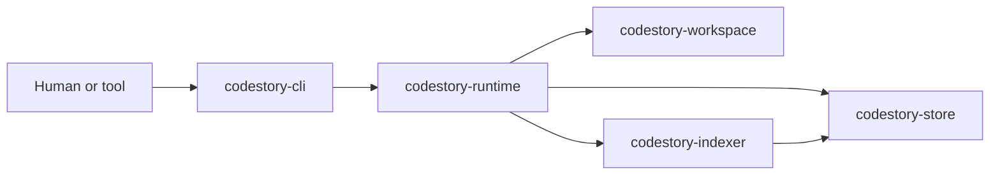
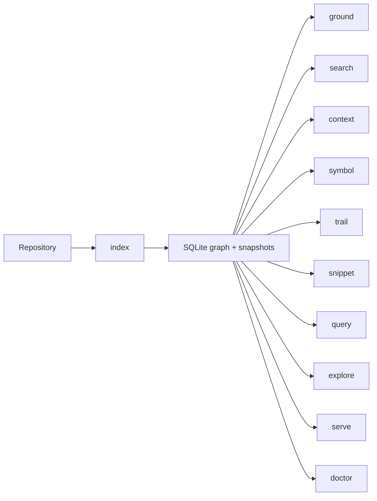

# CodeStory

CodeStory is a local codebase grounding engine. It indexes a repository into a SQLite-backed graph, keeps grounding-oriented read models up to date, and exposes grounding, graph-query, visualization, and local-serving workflows through `codestory-cli`.

## System Map



## Use CodeStory

Use this path if you want to run the tool against a repository.

1. Build the CLI.
   ```powershell
   cargo build --release -p codestory-cli
   ```
2. Use the built binary from this repo checkout.
   ```powershell
   .\target\release\codestory-cli.exe --help
   ```
3. Create or refresh the local index.
   ```powershell
   .\target\release\codestory-cli.exe index --project . --refresh auto
   ```
4. Run the grounding workflows against the existing cache.
   ```text
   .\target\release\codestory-cli.exe ground --project <path>
   .\target\release\codestory-cli.exe search --project <path> --query <query> --why
   .\target\release\codestory-cli.exe context --project <path> --query AppController
   .\target\release\codestory-cli.exe context --project <path> --id <node-id>
   .\target\release\codestory-cli.exe symbol --project <path> (--id <node-id> | --query <query>)
   .\target\release\codestory-cli.exe trail --project <path> (--id <node-id> | --query <query>)
   .\target\release\codestory-cli.exe snippet --project <path> (--id <node-id> | --query <query>)
   .\target\release\codestory-cli.exe query --project <path> "trail(symbol: 'Foo') | filter(kind: function)"
   .\target\release\codestory-cli.exe explore --project <path> --query <query>
   .\target\release\codestory-cli.exe serve --project <path>
   .\target\release\codestory-cli.exe doctor --project <path>
   ```

Read commands default to `--refresh none`. They query the current cache unless you explicitly request a refresh.

### `index` Options

`codestory-cli index` accepts these CLI options:

| Option | Default | How it works |
| --- | --- | --- |
| `--project <PROJECT>` | `.` | Repository root to index. `--path` is an alias. Paths are resolved before CodeStory chooses the cache key. |
| `--cache-dir <CACHE_DIR>` | user cache root plus a per-project hash | Uses the exact directory passed for the SQLite database and sibling search directory. Use this for temp-cache benchmarks or isolated repros. |
| `--refresh <auto\|full\|incremental\|none>` | `auto` | Controls whether indexing work runs before the summary is returned. See the refresh table below. |
| `--format <markdown\|json>` | `markdown` | Markdown is for humans. JSON exposes the same summary, retrieval state, and phase timings for tests and automation. |
| `--dry-run` | off | Computes the refresh plan and reports files that would be indexed or removed without parsing, resolving, or writing storage. |
| `--summarize` | off | After indexing, generates cached one-sentence symbol summaries. Requires `CODESTORY_SUMMARY_ENDPOINT`, unless set to `local` or `mock` for deterministic local summaries. |
| `--progress` | off | Prints an incremental text progress bar to stderr so stdout stays parseable. |
| `--watch` | off | Keeps running after the first index and triggers incremental refreshes when files change. |

Refresh modes:

| Mode | Behavior |
| --- | --- |
| `auto` | Chooses `full` when the cache has no indexed files; chooses `incremental` once stored inventory exists. |
| `full` | Builds a staged SQLite database from the full workspace, copies reusable semantic docs forward from the previous live DB when present, finalizes snapshots, publishes the staged DB, and syncs semantic docs before returning. |
| `incremental` | Opens the live DB, asks `codestory-workspace` for changed/new/removed files, reindexes only that refresh scope, refreshes live snapshots, and rebuilds semantic docs only for touched files. |
| `none` | Opens the existing cache and returns a summary without running graph or semantic indexing. This is mainly for inspecting a known-good cache. |

There is intentionally no `index --semantic off` option in the current CLI. Default `index` completes semantic docs when embedding assets are available. Semantic behavior is controlled by retrieval environment settings such as `CODESTORY_HYBRID_RETRIEVAL_ENABLED=false`, `CODESTORY_SEMANTIC_DOC_SCOPE=all`, and the `CODESTORY_EMBED_*` variables documented below.

If you are using an agent in this repo, point it at the available `codestory-grounding` skill in `.agents/skills/codestory-grounding/SKILL.md` so it can use the indexed grounding workflows directly.

Start here when you are using the tool:

- [Runtime execution path](docs/architecture/runtime-execution-path.md)
- [CLI subsystem](docs/architecture/subsystems/cli.md)
- [Glossary](docs/glossary.md)

## Hack on CodeStory

Use this path if you want to change the codebase.

1. Read the architecture overview, runtime execution path, and indexing pipeline before you jump into crate-specific details.
2. Run Cargo verification serially because the workspace shares build locks.
3. Make changes in the owning crate instead of threading behavior through the CLI.
4. Use the contributor docs as a short path through architecture, debugging, and test coverage.

Start here when you are contributing:

- [Architecture overview](docs/architecture/overview.md)
- [Contributor setup](docs/contributors/getting-started.md)
- [Research handbook](docs/research.md)
- [Indexing pipeline](docs/architecture/indexing-pipeline.md)
- [Debugging guide](docs/contributors/debugging.md)
- [Testing matrix](docs/contributors/testing-matrix.md)
- [Architecture history](docs/decision-log.md)
- [Contracts subsystem](docs/architecture/subsystems/contracts.md)
- [Workspace subsystem](docs/architecture/subsystems/workspace.md)
- [Indexer subsystem](docs/architecture/subsystems/indexer.md)
- [Store subsystem](docs/architecture/subsystems/store.md)
- [Runtime subsystem](docs/architecture/subsystems/runtime.md)
- [CLI subsystem](docs/architecture/subsystems/cli.md)

## Grounding Workflows

The product surface starts with core grounding workflows and adds deeper context, graph, explorer, serving, health, and shell-integration commands:



- `doctor`: read-only health check for project/cache/index/retrieval readiness.
- `index`: build or refresh the SQLite graph/search/semantic cache.
- `ground`: broad repo-level orientation snapshot; `--why` explains retrieval mode, coverage, gaps, and next commands.
- `search`: lightweight candidate discovery for symbols, files, literals, API paths, modules, and specific behavior terms; use `--why` for ranking reasons.
- `context`: deep evidence/context bundle for one concrete target selected by `--id`, `--query`, or `--bookmark`; it is not question answering, chatting, or prompt interpretation.
- `symbol`: inspect one exact symbol and relationships.
- `trail`: follow caller/callee/reference graph around a symbol; `--story --hide-speculative` gives a readable flow with uncertainty.
- `snippet`: fetch source context around a symbol; Markdown snippets use ANSI syntax highlighting when stdout is an interactive terminal.
- `query`: run structured graph-query pipelines such as `trail(symbol: 'Foo', depth: 2) | filter(kind: function) | limit(10)`.
- `explore`: interactive or bundled navigation view around a target.
- `bookmark`: save, list, or remove investigation focus nodes.
- `setup embeddings`: install and validate managed embedding assets.
- `serve`: expose HTTP/stdio read-only browser surfaces.
- `generate-completions`: emit bash, zsh, fish, or PowerShell completions generated from the clap command model.

Use `search` when you only need candidates. Use `context` when you already have one concrete target and want the deeper packet: target resolution metadata, symbol details, related hits, trail/story evidence, snippets/source context, retrieval/freshness health, citations/evidence ids, gaps/uncertainty, and optional bundle artifacts.

Do not pass broad natural-language questions to `context`. For broad repo/product questions, use `ground --why`, run one or more concrete `search --repo-text on --why` queries, select anchors, then run `context --id <node-id>` for each anchor.

Hybrid retrieval is the intended default when local embedding assets are available. `index`, `ground`, `search`, `context`, and `doctor` now report retrieval mode, semantic doc counts, and explicit fallback reasons when the runtime drops back to symbolic ranking.

## Template Workflows

Fresh repo orientation:

```powershell
codestory-cli doctor --project <workspace>
codestory-cli index --project <workspace> --refresh full
codestory-cli ground --project <workspace> --why
codestory-cli search --project <workspace> --query "<architecture term>" --why
```

Candidate-to-context workflow:

```powershell
codestory-cli search --project <workspace> --query "<symbol/file/literal/API path>" --why
# choose a concrete node_id
codestory-cli context --project <workspace> --id <node-id>
```

Exact symbol investigation:

```powershell
codestory-cli symbol --project <workspace> --id <node-id>
codestory-cli trail --project <workspace> --id <node-id> --story --hide-speculative
codestory-cli snippet --project <workspace> --id <node-id> --context 40
codestory-cli context --project <workspace> --id <node-id> --bundle out/context-<name>
```

Broad repo/product question workflow:

```powershell
# do not pass the question to context
codestory-cli ground --project <workspace> --why
codestory-cli search --project <workspace> --repo-text on --query "<concrete term>" --why
codestory-cli search --project <workspace> --repo-text on --query "<another concrete term>" --why
# select anchors
codestory-cli context --project <workspace> --id <node-id>
```

Stale or unhealthy semantic retrieval:

```powershell
codestory-cli doctor --project <workspace>
codestory-cli setup embeddings --project <workspace>
codestory-cli index --project <workspace> --refresh full
codestory-cli doctor --project <workspace>
```

If retrieval is still partial, stale, or failed, use `search --repo-text on --why`, `symbol`, `trail`, and `snippet`; treat `context` output as incomplete when it reports gaps.

## Workspace And Config Files

CodeStory supports an optional `codestory_workspace.json` file at the repo root for monorepo-style sessions:

```json
{
  "members": ["backend/", "frontend/", "shared/"]
}
```

When the manifest is present, `index --project .` discovers all listed member roots and reports per-member refresh counts in index output. Repos without the manifest keep the single-root behavior. OpenAPI JSON/YAML schemas are treated as lightweight endpoint sources, and literal client calls such as `fetch("/api/users")` or `axios.post("/api/users")` create speculative graph edges to matching endpoint refs.

Team or user defaults can live in `.codestory.toml` at the project root or in the user home directory. CodeStory loads the home file first, then the project file, so project settings override home settings. Explicit environment variables still win over config defaults.

Supported keys include `cache_dir`, `embedding_profile`, `embedding_model_id`, `hybrid_retrieval_enabled`, `semantic_doc_scope`, `semantic_doc_alias_mode`, `summary_endpoint`, and `summary_model`. The legacy `embedding_model` key is still accepted as a deprecated alias for `embedding_model_id`.

Example:

```toml
embedding_profile = "bge-base-en-v1.5"
embedding_model_id = "BAAI/bge-base-en-v1.5-local"
hybrid_retrieval_enabled = true
semantic_doc_scope = "durable"
```

`embedding_profile` maps to `CODESTORY_EMBED_PROFILE`, and `embedding_model_id` maps to `CODESTORY_EMBED_MODEL_ID`. If those environment variables are already set before the CLI starts, the CLI leaves them unchanged.

## Retrieval Defaults

`index`, `ground`, `search`, `context`, and `doctor` report the active retrieval mode when they have retrieval state available. Hybrid retrieval is the default when local embedding assets are available; otherwise CodeStory falls back to symbolic or lexical ranking and reports why.

The default `index` path is a full semantic sync, not a deferred background task. When embedding assets are available, the command returns after graph state, snapshots, lexical search state, and durable semantic docs are all ready. The index summary reports semantic timing and reuse counts so cold-start and repeated-refresh costs stay visible.

Hybrid retrieval setup:

- managed real-model setup: run `codestory-cli setup embeddings --project .` to download the pinned Qdrant BGE-base ONNX graph plus tokenizer files into the user cache. Setup derives `model_optimized_cls_pool.onnx` from the downloaded graph so runtime receives `sentence_embedding` directly instead of the full token hidden state. The CLI seeds the managed local defaults of semantic doc window `512`, doc batch `2048`, ONNX provider `directml` on Windows or `cpu` elsewhere, ONNX per-call token budget `32768`, and in-memory stored vectors `int8` unless explicit environment variables override them.
- fast local-dev semantic mode: set `CODESTORY_EMBED_RUNTIME_MODE=hash`
- backend and profile selection: set `CODESTORY_EMBED_BACKEND=onnx`, `llamacpp`, or `hash`; default profile is `bge-base-en-v1.5`; explicit profiles include `minilm`, `bge-small-en-v1.5`, `bge-base-en-v1.5`, `qwen3-embedding-0.6b`, `embeddinggemma-300m`, `nomic-embed-text-v1.5`, `nomic-embed-text-v2-moe`, or `custom`
- managed ONNX paths: `setup embeddings` sets `CODESTORY_EMBED_ONNX_MODEL`, `CODESTORY_EMBED_ONNX_TOKENIZER`, `CODESTORY_EMBED_ONNX_PROVIDER`, and `CODESTORY_EMBED_ONNX_BATCH_TOKENS`; set them manually only for custom ONNX assets or profiling
- external legacy llama.cpp GGUF server: run `llama-server --embedding` yourself, set `CODESTORY_EMBED_BACKEND=llamacpp`, and set `CODESTORY_EMBED_LLAMACPP_URL` if it is not listening at `http://127.0.0.1:8080/v1/embeddings`; tune concurrent embedding requests with `CODESTORY_EMBED_LLAMACPP_REQUEST_COUNT`
- durable semantic docs are the default; set `CODESTORY_SEMANTIC_DOC_SCOPE=all` to include lower-signal local/member/module symbols for investigation
- embedding batch size defaults to `128` for unmanaged runtimes and `2048` for the managed ONNX path; override with `CODESTORY_LLM_DOC_EMBED_BATCH_SIZE` only while profiling
- search and context research can override hybrid ranking weights with hidden `--hybrid-lexical <WEIGHT> --hybrid-semantic <WEIGHT> --hybrid-graph <WEIGHT>` tuning flags; omit these flags for the runtime defaults
- context bundles: `context --bundle <DIR>` writes `context.md`, `context.json`, generated graph artifacts, and a bundle manifest for sharing or review
- lexical-only mode: set `CODESTORY_HYBRID_RETRIEVAL_ENABLED=false`
- verification: `index`, `ground`, `search`, `context`, and `doctor` will report the retrieval mode plus any fallback reason when relevant

Measured backend tradeoffs and current model recommendations are summarized in
the [research handbook](docs/research.md), with the decision matrix in
[embedding-backend-benchmarks.md](docs/testing/embedding-backend-benchmarks.md).

Refresh behavior:

- `index --refresh auto`: full on an empty cache, incremental once indexed files already exist
- `ground`, `search`, `context`, `symbol`, `trail`, `snippet`, `query`, `explore`, and `serve`: default to `--refresh none`
- use `--refresh incremental` when you want a read command to refresh an existing cache first
- use `--refresh full` after a cache reset, schema change, or suspected stale-state incident

## Cache Hygiene

By default, `codestory-cli` stores per-project caches under the user cache root using a hash of the project path. If you pass `--cache-dir`, that directory is used exactly as written.

Typical recovery flow:

```powershell
.\target\release\codestory-cli.exe index --project . --refresh full
.\target\release\codestory-cli.exe search --project . --query WorkspaceIndexer
```

If the cache itself is suspect, remove the project cache directory and rebuild:

```powershell
Remove-Item -LiteralPath <cache-dir> -Recurse -Force
.\target\release\codestory-cli.exe index --project . --refresh full
```

Low-memory guidance:

- prefer `index --refresh incremental` over repeated full refreshes
- avoid running multiple cargo commands at once in this repo
- if semantic retrieval assets are unavailable or too heavy for the current machine, symbolic retrieval remains supported and is reported explicitly
- if a cold index is slow, inspect `semantic_ms` and `semantic_docs` in the index output before changing parser or graph code
- if the repo-scale runtime integration gate exceeds local memory, stop there and fall back to the smaller runtime lanes before escalating to a larger machine

## Workspace Shape

The workspace is organized into seven durable crates:

- `codestory-contracts`: shared graph, API, grounding, trail, and event types
- `codestory-workspace`: manifest loading, file discovery, and refresh-plan computation
- `codestory-store`: SQLite persistence, snapshots, trails, bookmarks, and search docs
- `codestory-indexer`: parsing, extraction, resolution, batching, and indexing tests
- `codestory-runtime`: orchestration, grounding, search, trail, and agent flows
- `codestory-cli`: thin adapter and renderer for grounding, context packets, navigation, health, and serving workflows
- `codestory-bench`: criterion benches for indexing, grounding, resolution, and cleanup work

## Build And Verification

Run Cargo commands serially in this repo:

```powershell
cargo fmt --check
cargo check
cargo test
cargo clippy --all-targets -- -D warnings
```

Release-blocking fidelity suites:

```powershell
cargo test -p codestory-indexer --test fidelity_regression
cargo test -p codestory-indexer --test tictactoe_language_coverage
cargo test -p codestory-runtime --test retrieval_eval
```

Runtime-backed CLI fixture flows are an explicit heavier lane now:

```powershell
cargo test -p codestory-cli --test runtime_backed_flows -- --ignored
```

The repo-scale runtime integration smoke test is ignored by default because it indexes the full
`codestory` workspace and can exhaust memory. Run it only as an explicit heavy lane:

```powershell
$env:CODESTORY_RUN_REPO_SCALE_TEST = "1"
cargo test -p codestory-runtime --test integration test_repo_scale_call_resolution -- --ignored --nocapture
```

## Runtime Artifacts

CodeStory writes user-cache SQLite indexes keyed by the target project path. Build outputs live under `target/`.

## License

Apache-2.0. See `LICENSE`.
