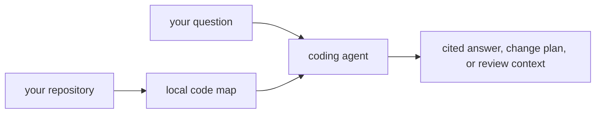
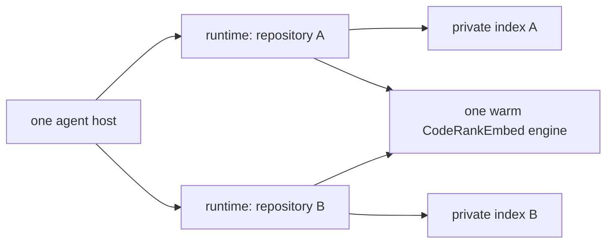

# CodeStory

**A local code map your coding agent can trust.**

[](LICENSE)
[](Cargo.toml)

CodeStory gives coding agents a durable understanding of the repository in
front of them: files, symbols, call paths, routes, snippets, and search evidence.
Answers stay tied to source locations, and incomplete coverage is reported as a
gap instead of being filled with guesses.



The released executable includes CodeRankEmbed Q8 and its accelerator engine.
There is no service to start, model to download, port to manage, or retrieval
setup to approve. Source, indexes, and queries stay local by default.

## What it adds

- **Repository grounding:** a compact map of the checkout, its languages,
  components, and important paths.
- **Symbol and impact navigation:** definitions, callers, references, trails,
  routes, and likely tests without repeated whole-tree scans.
- **Broad retrieval:** lexical, semantic, graph, and SCIP evidence combined into
  cited search results and answer packets.
- **Visible limits:** stale, partial, or incoherent evidence fails closed instead
  of looking complete.

## Pick your host

| Host | Start here |
| --- | --- |
| Codex | [Codex guide](docs/users/codex.md) — the recommended first install |
| Cursor | [Cursor guide](docs/users/cursor.md) |
| Claude Code | [Claude Code guide](docs/users/claude-code.md) |
| GitHub Copilot | [Copilot guide](docs/users/copilot.md) |

Capability comparison, day-1 checklist, and shared prompts: [User guides](docs/users/README.md).

## Quick start

1. Open the [guide for your host](docs/users/README.md#pick-your-host) and install
   CodeStory once.
2. Start a fresh agent session in the repository you want to understand.
3. Ask an ordinary code question.

That is the normal setup. The first relevant call builds the local map. The
first broad question also initializes the embedded model and prepares semantic
search. If it needs more than one foreground turn, the agent retries the same
call; there is no separate setup or approval flow.

One host process can work across several repositories. Their indexes stay
isolated while they share one warm embedding engine:



**Something blocked?** [Troubleshooting](docs/users/troubleshooting.md).

## Platform support

<!-- codestory-public-support:start -->
| Released package | Local map | Broad retrieval |
| --- | --- | --- |
| macOS 15+ on Apple Silicon | Yes | Metal |
| Windows x64 | Yes | Vulkan |
| Linux x64 | Yes | Vulkan |

CPU-only Windows and Linux are unsupported. Intel Mac and Windows ARM are
unsupported. Answer quality and performance are separate release non-claims.
<!-- codestory-public-support:end -->

## Example prompts

Use your project's symbols and paths:

**Find ownership**

```text
Where is [Feature] defined, who calls it, and which files should I read first?
```

**Plan a change**

```text
I am changing [path/to/file]. What symbols are affected and what tests should I run first?
```

**Understand a subsystem**

```text
How does [subsystem] work? Cite concrete files and flag gaps if coverage is incomplete.
```

More shapes and host-specific invocation: [User guides](docs/users/README.md#portable-prompt-shapes).

Surfaces, host differences, and platform support: [User guides](docs/users/README.md).

## Documentation

| If you want to... | Read |
| --- | --- |
| Install and use CodeStory | [User guides](docs/users/README.md) |
| Know when to trust agent output | [Trust and readiness](docs/users/trust-and-readiness.md) |
| Repair a blocked session | [Troubleshooting](docs/users/troubleshooting.md) |
| Run CLI repair or debug | [CLI reference](docs/users/cli-reference.md) |
| Change CodeStory itself | [Contributor setup](docs/contributors/getting-started.md) |
| Verify a claim or PR | [Testing matrix](docs/contributors/testing-matrix.md) |

Full routing: [docs/README.md](docs/README.md).

## Evaluation

> **Scope:** The language-expansion holdout proves **token and wall-time reduction**
> on 18 pinned public OSS tasks when agents use CodeStory instead of re-reading
> the tree. It does **not** prove equal quality for every language, every repo
> size, or your private checkout. For day-to-day limits, see
> [What to expect](docs/users/what-to-expect.md).

### Language expansion holdout (18 tasks)

Broader public-repo evidence uses the
[`language-support-ab`](benchmarks/tasks/language-expansion-holdout/language-support-ab.task.json)
manifest across 18 pinned OSS packages. Latest recorded suite totals:

| Metric | Without | With | Change |
| --- | ---: | ---: | --- |
| Context tokens | 9,692,559 | 5,514,580 | -43% |
| Repeat-task wall time | 7,943s | 4,343s | -45% |
| Tool calls | 475 | 60 | -87% |
| Direct source reads | 417 | 0 | -100% |

Per-task medians, ranges, reproduction commands, and boundary notes:
[language-expansion holdout stats](docs/testing/language-expansion-holdout-stats.md).

## License

Apache-2.0. See [LICENSE](LICENSE).
