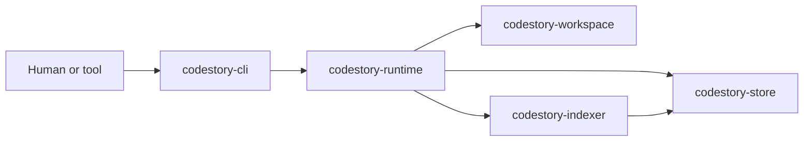
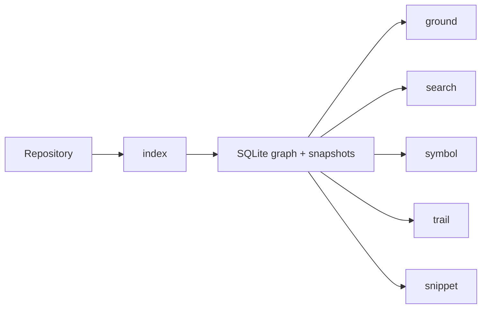

# CodeStory

CodeStory is a local codebase grounding engine. It indexes a repository into a SQLite-backed graph, keeps grounding-oriented read models up to date, and exposes six workflows through `codestory-cli`.

## System Map



## Use CodeStory

Use this path if you want to run the tool against a repository.

1. Build the CLI.
   ```powershell
   cargo build --release -p codestory-cli
   ```
2. Create or refresh the local index.
   ```powershell
   cargo run --release -p codestory-cli -- index --project .
   ```
3. Run the grounding workflows.
   ```text
   codestory-cli ground --project <path>
   codestory-cli search --project <path> --query <query>
   codestory-cli symbol --project <path> (--id <node-id> | --query <query>)
   codestory-cli trail --project <path> (--id <node-id> | --query <query>)
   codestory-cli snippet --project <path> (--id <node-id> | --query <query>)
   ```

If you are using an agent in this repo, point it at the available `codestory-grounding` skill in `.agents/skills/codestory-grounding/SKILL.md` so it can use the indexed grounding workflows directly.

Start here when you are using the tool:

- [Runtime execution path](docs/architecture/runtime-execution-path.md)
- [CLI subsystem](docs/architecture/subsystems/cli.md)
- [Glossary](docs/glossary.md)

## Hack on CodeStory

Use this path if you want to change the codebase.

1. Read the architecture overview and the subsystem page that owns your change.
2. Run Cargo verification serially because the workspace shares build locks.
3. Make changes in the owning crate instead of threading behavior through the CLI.

Start here when you are contributing:

- [Architecture overview](docs/architecture/overview.md)
- [Contributor setup](docs/contributors/getting-started.md)
- [Debugging guide](docs/contributors/debugging.md)
- [Testing matrix](docs/contributors/testing-matrix.md)
- [Decision log](docs/decision-log.md)
- [Contracts subsystem](docs/architecture/subsystems/contracts.md)
- [Workspace subsystem](docs/architecture/subsystems/workspace.md)
- [Indexer subsystem](docs/architecture/subsystems/indexer.md)
- [Store subsystem](docs/architecture/subsystems/store.md)
- [Runtime subsystem](docs/architecture/subsystems/runtime.md)
- [CLI subsystem](docs/architecture/subsystems/cli.md)

## Grounding Workflows

The product surface remains organized around six workflows:



- `index`: discover files, parse supported languages, resolve semantics, and persist graph/search state locally
- `ground`: build grounded context from indexed symbols, snippets, graph traversal, and search results
- `search`: find symbols, files, and query matches
- `symbol`: inspect one symbol and its indexed relationships

Hybrid retrieval is the intended default when local embedding assets are available. `index`, `ground`, and `search` now report retrieval mode, semantic doc counts, and explicit fallback reasons when the runtime drops back to symbolic ranking.
- `trail`: walk caller/callee and usage neighborhoods through the graph
- `snippet`: fetch focused source context for a symbol or file location

## Retrieval Defaults

`index`, `ground`, and `search` now report the active retrieval mode. Hybrid retrieval is the default when local embedding assets are available; otherwise CodeStory falls back to symbolic or lexical ranking and reports why.

## Workspace Shape

The workspace is organized into seven durable crates:

- `codestory-contracts`: shared graph, API, grounding, trail, and event types
- `codestory-workspace`: manifest loading, file discovery, and refresh-plan computation
- `codestory-store`: SQLite persistence, snapshots, trails, bookmarks, and search docs
- `codestory-indexer`: parsing, extraction, resolution, batching, and indexing tests
- `codestory-runtime`: orchestration, grounding, search, trail, and agent flows
- `codestory-cli`: thin adapter and renderer for the six workflows
- `codestory-bench`: criterion benches for indexing, grounding, resolution, and cleanup work

## Build And Verification

Run Cargo commands serially in this repo:

```powershell
cargo fmt --check
cargo check
cargo test
cargo clippy --all-targets -- -D warnings
```

Release-blocking fidelity suites:

```powershell
cargo test -p codestory-indexer --test fidelity_regression
cargo test -p codestory-indexer --test tictactoe_language_coverage
cargo test -p codestory-runtime --test retrieval_eval
```

## Runtime Artifacts

CodeStory writes user-cache SQLite indexes keyed by the target project path. Build outputs live under `target/`.

## License

MIT. See `LICENSE`.

