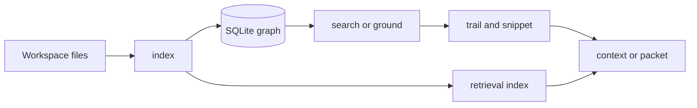

<h1 align="center">CodeStory</h1>

<p align="center">
Local codebase grounding for coding agents.
</p>

<p align="center">
<a href="LICENSE"></a>
<a href="Cargo.toml"></a>
<a href="docs/testing/benchmark-ledger.md"></a>
</p>

CodeStory indexes a git workspace into a local SQLite graph: files, symbols, call
and import edges, and source snippets. You query that graph through a CLI (or
`serve --stdio`) instead of having an agent grep the tree blind.

Everything stays on disk under your user cache unless you opt into managed
embedding assets. Packet and full search need local sidecars (Zoekt, Qdrant,
SCIP, llama.cpp); browsing with `ground`, `trail`, and `snippet` does not.

## How it works

Run `index` once per repo. The indexer parses supported languages with
tree-sitter, resolves what it can, and writes nodes, edges, occurrences, and
symbol search docs into a per-project database.

From there:

- `ground` — repo summary and gaps
- `search` — candidates by symbol name, path, literal, or behavior term
- `trail` — callers, callees, references for one node id
- `snippet` — source lines around a node
- `context` — bundled evidence for one target
- `packet` — wide task question with citations (requires `retrieval_mode=full`)

Vectors are not built for every symbol. The graph and lexical symbol docs handle
most lookup. Run `retrieval index` when you want sidecar-backed `packet`/`search`;
that pass embeds a policy-selected set of anchors only.



Operator detail: [docs/usage.md](docs/usage.md). Sidecar setup:
[docs/ops/retrieval-sidecars.md](docs/ops/retrieval-sidecars.md).

## Try it

```sh
cargo build --release -p codestory-cli
export CODESTORY_CLI="./target/release/codestory-cli"
export TARGET_WORKSPACE="/path/to/repo"

"$CODESTORY_CLI" doctor --project "$TARGET_WORKSPACE"
"$CODESTORY_CLI" index --project "$TARGET_WORKSPACE" --refresh full
"$CODESTORY_CLI" ground --project "$TARGET_WORKSPACE" --why
"$CODESTORY_CLI" search --project "$TARGET_WORKSPACE" --query "WorkspaceIndexer" --why
```

Windows: `.\target\release\codestory-cli.exe`, `$env:TARGET_WORKSPACE = "C:\path\to\repo"`.

## Install as an agent skill

Copy [`.agents/skills/codestory-grounding`](.agents/skills/codestory-grounding) to
your skill directory. Run `scripts/setup.sh` or `scripts/setup.ps1`. See
[`.agents/skills/codestory-grounding/SKILL.md`](.agents/skills/codestory-grounding/SKILL.md).

## Commands

| Task | Command |
| --- | --- |
| Cache health | `doctor --project <repo>` |
| Index | `index --project <repo> --refresh full` |
| Orientation | `ground --project <repo> --why` |
| Lookup | `search --project <repo> --query "…" --why` |
| Call graph | `trail --project <repo> --id <node-id> --story` |
| Source | `snippet --project <repo> --id <node-id>` |
| Target bundle | `context --project <repo> --id <node-id>` |
| Task packet (sidecars) | `packet --project <repo> --question "…"` |
| Persistent reads | `serve --project <repo> --stdio` |

## Docs

- Usage: [docs/usage.md](docs/usage.md)
- Concepts: [docs/concepts/how-codestory-works.md](docs/concepts/how-codestory-works.md)
- Architecture: [docs/architecture/overview.md](docs/architecture/overview.md)
- Languages: [docs/architecture/language-support.md](docs/architecture/language-support.md)
- Benchmarks: [docs/testing/benchmark-ledger.md](docs/testing/benchmark-ledger.md)
- Contributing: [docs/contributors/getting-started.md](docs/contributors/getting-started.md)

## License

Apache-2.0. See [LICENSE](LICENSE).
