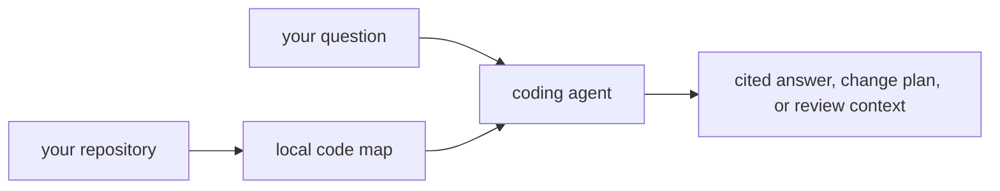
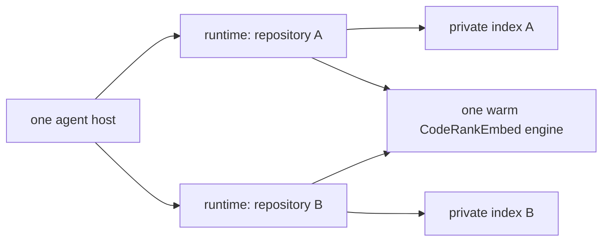

# CodeStory

**A local code map your coding agent can trust.**

[](LICENSE)
[](Cargo.toml)

CodeStory gives coding agents a durable understanding of the repository in
front of them: files, symbols, call paths, routes, snippets, and search evidence.
Answers stay tied to source locations, and incomplete coverage is reported as a
gap instead of being filled with guesses.


```mermaid
flowchart LR
    Repo["your repository"] --> Map["local code map"]
    Question["your question"] --> Agent["coding agent"]
    Map --> Agent
    Agent --> Answer["cited answer, change plan, or review context"]
```

The released executable includes CodeRankEmbed Q8 and its accelerator engine.
There is no service to start, model to fetch separately, port to manage, or
retrieval setup to approve. The plugin downloads that executable once, the first
time you use it, and reports progress while it does. Source, indexes, and
queries stay local by default.

## What it adds

- **Repository grounding:** a compact map of the checkout, its languages,
  components, and important paths.
- **Symbol and impact navigation:** definitions, callers, references, trails,
  routes, and likely tests without repeated whole-tree scans.
- **Broad retrieval:** lexical, semantic, graph, and SCIP evidence combined into
  cited search results and answer packets.
- **Visible limits:** stale, partial, or incoherent evidence fails closed instead
  of looking complete.

## Pick your host

| Host | Start here |
| --- | --- |
| Codex | [Codex guide](docs/users/codex.md) — the recommended first install |
| Cursor | [Cursor guide](docs/users/cursor.md) — install from Customize |
| Claude Code | [Claude Code guide](docs/users/claude-code.md) |
| GitHub Copilot | [Copilot guide](docs/users/copilot.md) |

Capability comparison, day-1 checklist, and shared prompts: [User guides](docs/users/README.md).

## Quick start

1. Open the [guide for your host](docs/users/README.md#pick-your-host) and install
   CodeStory once.
2. Start a fresh agent session in the repository you want to understand.
3. Ask an ordinary code question.

That is the normal setup. The first relevant call builds the local map. The
first broad question also initializes the embedded model and prepares semantic
search. If it needs more than one foreground turn, the agent retries the same
call; there is no separate setup or approval flow.

One host process can work across several repositories. Their indexes stay
isolated while they share one warm embedding engine:


```mermaid
flowchart LR
    Host["one agent host"] --> A["runtime: repository A"]
    Host --> B["runtime: repository B"]
    A --> CacheA["private index A"]
    B --> CacheB["private index B"]
    A --> Engine["one warm CodeRankEmbed engine"]
    B --> Engine
```

**Something blocked?** [Troubleshooting](docs/users/troubleshooting.md).

## Platform support

<!-- codestory-public-support:start -->
| Platform | Release support |
| --- | --- |
| macOS 15+ on Apple Silicon | Supported with Metal |
| Windows x64 | Supported with Vulkan |
| Linux x64 | Supported with Vulkan |
| CPU-only Windows and Linux | Unsupported |
| Intel Mac | Unsupported |
| Windows ARM | Unsupported |
<!-- codestory-public-support:end -->

"Supported with Metal" and "Supported with Vulkan" describe what the release
line ships and intends to prove. Each individual release proves it on the
protected hardware for that platform, and a release whose accelerator host was
unreachable ships with that platform's accelerator claim **withheld** rather
than assumed: the accelerator ran on that host in earlier releases, but this
release did not observe it.

You do not have to take the table's word for any single release. Every release
ships `release-closeout-summary.json` as a release asset, and its platform
section in the GitHub release notes is rendered from that release's ledger, so
a platform whose accelerator was withheld says so in the notes instead of being
listed as supported. In the summary, `withheld_cells` names every cell that did
not run, `withheld_claims` names the claims nothing in that release proved, and
`partially_withheld_claims` names the ones another host still proved. At most
one platform's accelerator may be withheld
(`non_claim_policy.withhold_policy.maximum_withheld_hosts`); a release that
proved no accelerator anywhere is refused rather than published. See
[the testing matrix](docs/contributors/testing-matrix.md) for how a claim
becomes withheld.

## Example prompts

Use your project's symbols and paths:

**Find ownership**

```text
Where is [Feature] defined, who calls it, and which files should I read first?
```

**Plan a change**

```text
I am changing [path/to/file]. What symbols are affected and what tests should I run first?
```

**Understand a subsystem**

```text
How does [subsystem] work? Cite concrete files and flag gaps if coverage is incomplete.
```

More shapes and host-specific invocation: [User guides](docs/users/README.md#portable-prompt-shapes).

Surfaces, host differences, and platform support: [User guides](docs/users/README.md).

## Documentation

| If you want to... | Read |
| --- | --- |
| Install and use CodeStory | [User guides](docs/users/README.md) |
| Know when to trust agent output | [Trust and readiness](docs/users/trust-and-readiness.md) |
| Repair a blocked session | [Troubleshooting](docs/users/troubleshooting.md) |
| Run CLI repair or debug | [CLI reference](docs/users/cli-reference.md) |
| Change CodeStory itself | [Contributor setup](docs/contributors/getting-started.md) |
| Verify a claim or PR | [Testing matrix](docs/contributors/testing-matrix.md) |

Full routing: [docs/README.md](docs/README.md).

## Evaluation

> **Scope:** The language-expansion holdout compares agents on 18 pinned public OSS tasks with and without CodeStory. There is no current public 18-task performance or answer-quality claim. For day-to-day limits, see [What to expect](docs/users/what-to-expect.md).

### Language expansion holdout (18 tasks)

Broader public-repo evidence uses the [`language-support-ab`](benchmarks/tasks/language-expansion-holdout/language-support-ab.task.json) manifest across 18 pinned OSS packages. There is no current public 18-task claim: no 18×3 nested `summary.json` has passed the publication bar, so this page has no savings headline and no 18-row quality table. See the [language-expansion holdout evidence record](docs/testing/language-expansion-holdout-stats.md) for the 2026-08-18 packet-gate census, the nested A/B attempt that did not produce a sheet, and the rejected 2026-08-10 rerun.

## License

Apache-2.0. See [LICENSE](LICENSE).
