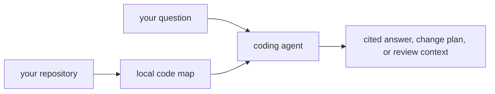
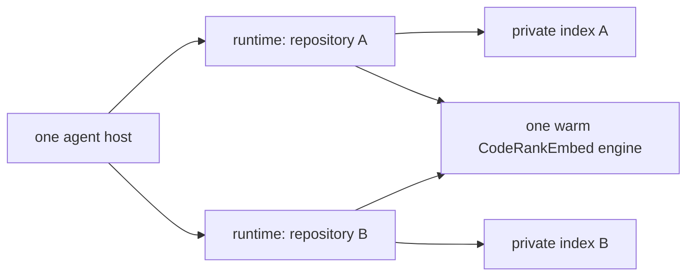

# CodeStory

**A local code map your coding agent can trust.**

[](LICENSE)
[](Cargo.toml)

CodeStory gives coding agents a durable understanding of the repository in
front of them: files, symbols, call paths, routes, snippets, and search evidence.
Answers stay tied to source locations, and incomplete coverage is reported as a
gap instead of being filled with guesses.


```mermaid
flowchart LR
    Repo["your repository"] --> Map["local code map"]
    Question["your question"] --> Agent["coding agent"]
    Map --> Agent
    Agent --> Answer["cited answer, change plan, or review context"]
```

The released executable includes CodeRankEmbed Q8 and its accelerator engine.
There is no service to start, model to fetch separately, port to manage, or
retrieval setup to approve. The plugin downloads that executable once, the first
time you use it, and reports progress while it does. Source, indexes, and
queries stay local by default.

## What it adds

- **Repository grounding:** a compact map of the checkout, its languages,
  components, and important paths.
- **Symbol and impact navigation:** definitions, callers, references, trails,
  routes, and likely tests without repeated whole-tree scans.
- **Broad retrieval:** lexical, semantic, graph, and SCIP evidence combined into
  cited search results and answer packets.
- **Visible limits:** stale, partial, or incoherent evidence fails closed instead
  of looking complete.

## Pick your host

| Host | Start here |
| --- | --- |
| Codex | [Codex guide](docs/users/codex.md) — the recommended first install |
| Cursor | [Cursor guide](docs/users/cursor.md) — add the marketplace in Customize |
| Claude Code | [Claude Code guide](docs/users/claude-code.md) |
| GitHub Copilot | [Copilot guide](docs/users/copilot.md) |

Capability comparison, day-1 checklist, and shared prompts: [User guides](docs/users/README.md).

## Quick start

1. Open the [guide for your host](docs/users/README.md#pick-your-host) and install
   CodeStory once.
2. Start a fresh agent session in the repository you want to understand.
3. Ask an ordinary code question.

That is the normal CodeStory setup. The first relevant call builds the local
map. The first broad question also initializes the embedded model and prepares
semantic search. If it needs more than one foreground turn, the agent retries
the same call. CodeStory does not ask you to start a service or approve a
retrieval helper. Some hosts still have their own steps: Cursor requires
enabling the MCP server once, and Copilot and Claude Code need MCP connected
before tools appear. Use the host page for those gestures.

One host process can work across several repositories. Their indexes stay
isolated while they share one warm embedding engine:


```mermaid
flowchart LR
    Host["one agent host"] --> A["runtime: repository A"]
    Host --> B["runtime: repository B"]
    A --> CacheA["private index A"]
    B --> CacheB["private index B"]
    A --> Engine["one warm CodeRankEmbed engine"]
    B --> Engine
```

**Something blocked?** [Troubleshooting](docs/users/troubleshooting.md).

## Platform support

<!-- codestory-public-support:start -->
| Platform | Release support |
| --- | --- |
| macOS 15+ on Apple Silicon | Supported with Metal |
| Windows x64 | Supported with Vulkan |
| Linux x64 | Supported with Vulkan |
| CPU-only Windows and Linux | Unsupported |
| Intel Mac | Unsupported |
| Windows ARM | Unsupported |
<!-- codestory-public-support:end -->

The table is what the release line ships and intends to prove. A given release
may withhold one platform's accelerator claim when that host was unreachable;
that release's GitHub notes and `release-closeout-summary.json` asset say so
instead of listing the platform as proved. How a claim becomes withheld:
[testing matrix](docs/contributors/testing-matrix.md).

## Example prompts

Use your project's symbols and paths:

**Find ownership**

```text
Where is [Feature] defined, who calls it, and which files should I read first?
```

**Plan a change**

```text
I am changing [path/to/file]. What symbols are affected and what tests should I run first?
```

**Understand a subsystem**

```text
How does [subsystem] work? Cite concrete files and flag gaps if coverage is incomplete.
```

More shapes and host-specific invocation: [User guides](docs/users/README.md#portable-prompt-shapes).

Surfaces, host differences, and platform support: [User guides](docs/users/README.md).

## Documentation

| If you want to... | Read |
| --- | --- |
| Install and use CodeStory | [User guides](docs/users/README.md) |
| Know when to trust agent output | [Trust and readiness](docs/users/trust-and-readiness.md) |
| Repair a blocked session | [Troubleshooting](docs/users/troubleshooting.md) |
| Run CLI repair or debug | [CLI reference](docs/users/cli-reference.md) |
| Change CodeStory itself | [Contributor setup](docs/contributors/getting-started.md) |
| Verify a claim or PR | [Testing matrix](docs/contributors/testing-matrix.md) |

Full routing: [docs/README.md](docs/README.md).

## Evaluation

The same agent answered one architecture question in each of 18 pinned public
repositories, three times with CodeStory and three times without. Overall
passing answers were 45 of 54 with CodeStory and 44 of 54 without. Tokens and
tool calls dropped sharply. C++ and Bash each fell from 3 of 3 without to 2 of
3 with. HTML forms and the Chinook schema failed in both arms.

This sheet is a development comparison, not a publishable promotion run: dirty
tree, no `summary.json`, not `--publishable`, and the without-arm was reused
from an earlier window. A later publishable `summary.json` can replace the
table.

| | Without CodeStory | With CodeStory |
| --- | ---: | ---: |
| Passing answers | 44 of 54 | 45 of 54 |
| Tokens | 19.8 million | 1.7 million (−91%) |
| Tool calls | 834 | 54 (−94%) |

| Language | Asked about | Without | With |
| --- | --- | ---: | ---: |
| Python | Requests session send | 3 of 3 | 3 of 3 |
| Java | Commons Lang string checks | 3 of 3 | 3 of 3 |
| Rust | ripgrep search pipeline | 3 of 3 | 3 of 3 |
| JavaScript | Express routing | 3 of 3 | 3 of 3 |
| TypeScript | SWR hooks | 3 of 3 | 3 of 3 |
| C++ | fmt formatting | 3 of 3 | 2 of 3 |
| C | Redis command loop | 3 of 3 | 3 of 3 |
| Go | Gin route dispatch | 3 of 3 | 3 of 3 |
| Ruby | Jekyll site build | 3 of 3 | 3 of 3 |
| PHP | Monolog records | 3 of 3 | 3 of 3 |
| C# | AutoMapper maps | 2 of 3 | 2 of 3 |
| Kotlin | Okio buffers | 0 of 3 | 3 of 3 |
| Swift | Alamofire requests | 3 of 3 | 3 of 3 |
| Dart | HTTP client | 3 of 3 | 3 of 3 |
| Bash | nvm install | 3 of 3 | 2 of 3 |
| HTML | MDN form validation | 0 of 3 | 0 of 3 |
| CSS | animate.css keyframes | 3 of 3 | 3 of 3 |
| SQL | Chinook schema relations | 0 of 3 | 0 of 3 |

These numbers describe this suite, not your checkout. Day-to-day limits:
[What to expect](docs/users/what-to-expect.md). How this was measured:
[holdout evidence](docs/testing/language-expansion-holdout-stats.md).

## License

Apache-2.0. See [LICENSE](LICENSE).
