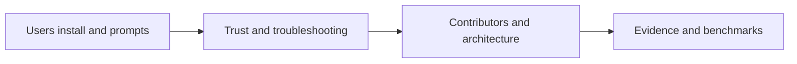

# CodeStory docs

You want your agent to work from cited repo evidence. Start from the job you
need to do.

## Users

Install CodeStory for your agent host, ground a repository, and ask questions
with portable prompts.

| Reader job | Start here |
| --- | --- |
| Pick a host and install | [User guides](users/README.md) |
| When to trust agent output | [Trust and readiness](users/trust-and-readiness.md) |
| Codex plugin path | [Codex guide](users/codex.md) |
| Cursor rule and MCP | [Cursor guide](users/cursor.md) |
| Claude Code hooks | [Claude Code guide](users/claude-code.md) |
| GitHub Copilot | [Copilot guide](users/copilot.md) |
| Session blocked or stale output | [Troubleshooting](users/troubleshooting.md) |
| Power-user CLI repair | [CLI reference](users/cli-reference.md) |
| Term definitions | [Glossary](glossary.md) |

## Contributors

Change CodeStory itself, verify claims, or read architecture and benchmark
evidence.

| Reader job | Start here |
| --- | --- |
| Local dev setup and verification lanes | [Contributor setup](contributors/getting-started.md) |
| Which test proves a claim | [Testing matrix](contributors/testing-matrix.md) |
| How CodeStory works internally | [Architecture overview](architecture/overview.md) |
| In-process retrieval operations | [Retrieval engine](ops/retrieval-engine.md) |
| Retrieval design and promotion | [Retrieval design](architecture/retrieval-design.md), [Retrieval architecture guide](testing/retrieval-architecture.md) |
| Language support claims | [Language support](architecture/language-support.md) |
| Timing and benchmark records | [E2E stats log](testing/codestory-e2e-stats-log.md), [language-expansion holdout stats](testing/language-expansion-holdout-stats.md) |
| Research comparisons | [Research handbook](research.md) |
| Docs maintenance | [Documentation checklist](contributors/documentation-maintenance-checklist.md), [templates](templates/) |

## Common paths

| Question | Start here | Then read |
| --- | --- | --- |
| Where do I start as a user? | [User guides](users/README.md) | Your host page under `users/` |
| How do I diagnose readiness? | [Troubleshooting](users/troubleshooting.md) | [Retrieval engine](ops/retrieval-engine.md) |
| How does CodeStory work internally? | [Architecture overview](architecture/overview.md) | [Runtime execution path](architecture/runtime-execution-path.md) |
| Which test proves my docs change? | [Testing matrix - Docs-only fast path](contributors/testing-matrix.md#docs-only-fast-path) | [Contributor setup](contributors/getting-started.md) |
| What does a term mean? | [Glossary](glossary.md) | Linked owner page for that concept |
| With/without benchmark summary? | [README - Evaluation](../README.md#evaluation) | [Agent benchmark harness verification](testing/agent-benchmark-harness-verification.md) |

## Canonical owners

| Topic | Canonical doc |
| --- | --- |
| User install, prompts, host setup | [users/](users/README.md) |
| Trust and readiness boundaries | [users/trust-and-readiness.md](users/trust-and-readiness.md) |
| Prompt patterns | [users/prompt-patterns.md](users/prompt-patterns.md) |
| Coverage expectations | [users/what-to-expect.md](users/what-to-expect.md) |
| Terminology | [glossary.md](glossary.md) |
| CLI commands and repair transcripts | [users/cli-reference.md](users/cli-reference.md) |
| Verification lanes and proof tiers | [contributors/testing-matrix.md](contributors/testing-matrix.md) |

## Documentation maintenance

| Need | Start here |
| --- | --- |
| Search this doc set by topic | [search-index.md](search-index.md) |
| Checklist before committing docs | [documentation-maintenance-checklist.md](contributors/documentation-maintenance-checklist.md) |
| Templates for new docs | [templates/](templates/) |
