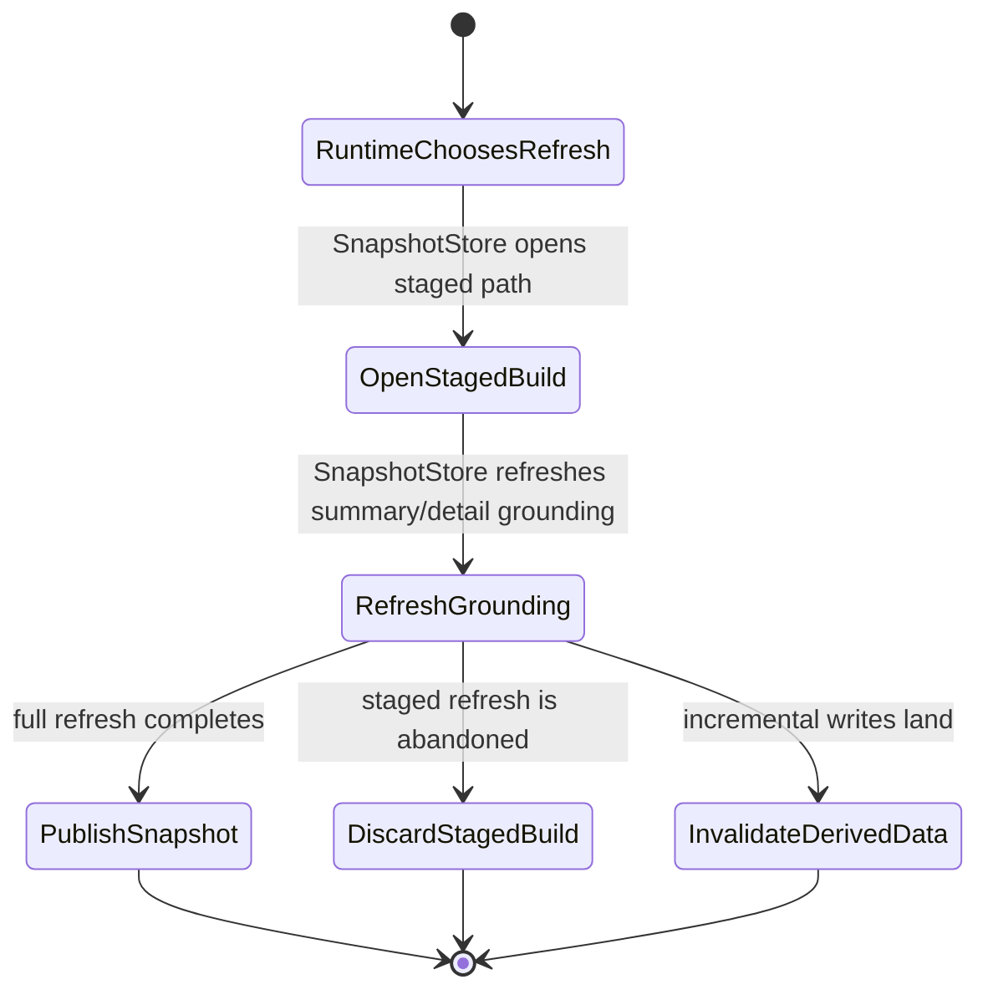

# ADR 0004: Snapshot Lifecycle Ownership

## Current State

`codestory-store::SnapshotStore` now owns staged snapshot pathing, staged-build open, staged publish or discard, and summary or detail grounding refresh operations.

`codestory-runtime` now decides when to run a full or incremental index, and it uses the store snapshot surface for staged publish and refresh.

## Target State

All snapshot lifecycle transitions stay behind `codestory-store`, including staged publish preparation, summary or detail refresh, and invalidation of derived grounding data.

## Decision

Keep snapshot lifecycle responsibilities store-owned so runtime and CLI layers orchestrate indexing without duplicating SQLite snapshot mechanics.

