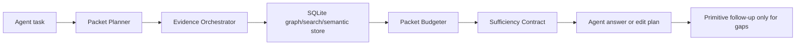

# Agent Context Engine Blueprint

## Core Objective

CodeStory should become the local context engine that lets agents answer and edit from a compact, cited, confidence-ranked packet instead of adding another command layer before the usual `rg` and file-read sweep. Success means the with-CodeStory agent arm reduces redundant ordinary source exploration while maintaining or improving answer quality.

## Evidence Baseline

| Evidence | Current signal | Source |
| --- | --- | --- |
| Agent A/B baseline | The legacy broad-prompt CodeStory arm used more median tokens, wall time, and tool starts than the no-CodeStory arm on the three-repeat CodeStory prompt. | [benchmark-results.md](../../testing/benchmark-results.md) |
| Packet-first A/B diagnostic | Strict reanalysis invalidated the older packet-first claim for the public-core subset; corrected with-CodeStory rows now run an answer packet first `3/3` and quality-pass `3/3` on CodeStory, Vite, Express, and mux tasks, with zero ordinary source reads. | [benchmark-results.md](../../testing/benchmark-results.md) |
| Quality-comparable paired rows | Five Express and mux tasks quality-passed `3/3` in both arms across bug localization, architecture explanation, symbol ownership, edit planning, and route tracing; with CodeStory, these rows used `49.1%` to `74.2%` fewer median tokens, with lower median wall time and fewer median tool starts on every row. | [benchmark-results.md](../../testing/benchmark-results.md) |
| Harness capability | The A/B harness separates public/local repos, records sandbox/model/repeats, counts tool starts, and gates publishable rows on successful token-bearing runs. | [codestory-agent-ab-benchmark.mjs](../../../scripts/codestory-agent-ab-benchmark.mjs) |
| Existing context surface | `context` already builds a deep evidence packet around one concrete retrieval target and exposes a structured packet schema over stdio. | [args.rs](../../../crates/codestory-cli/src/args.rs), [stdio_catalog.rs](../../../crates/codestory-cli/src/stdio_catalog.rs) |
| Existing warm transport | `serve --stdio` exposes read-only tools including search, symbol, trail, definition, references, symbols, snippet, and context. | [stdio_catalog.rs](../../../crates/codestory-cli/src/stdio_catalog.rs) |
| External comparator | Public context-engine benchmark uses multi-repo, multi-language repeated medians and attributes wins to compact context/explore calls that prevent broad file reads. | [research.md](research.md) |
| External context pattern | Sourcegraph documents multi-source code context and agentic context fetching as proactive, iterative retrieval around coding tasks. | [SRC-1](https://sourcegraph.com/docs/cody/core-concepts/context), [SRC-2](https://sourcegraph.com/docs/cody/core-concepts/agentic-context) |
| Integration pattern | MCP standardizes tools, resources, and prompts for connecting models to context systems. | [SRC-3](https://modelcontextprotocol.io/specification) |
| Navigation pattern | LSP standardizes definition, references, and document symbol operations as core code-intelligence primitives. | [SRC-4](https://microsoft.github.io/language-server-protocol/specifications/lsp/3.17/specification/) |

## Scope

### In Scope

- Add an agent-native context packet workflow that accepts a task/question and returns one bounded answer-ready packet.
- Update the skill to route agents through the packet workflow first, then use primitive commands only for gaps.
- Expand the benchmark harness from cost telemetry into behavior telemetry: duplicate reads, non-CodeStory source reads after packet, expected-anchor coverage, and answer quality.
- Add repeatable public benchmark scenarios across multiple repositories and task classes.
- Use the external comparator's benchmark bar as the minimum public-claims bar:
  multi-repo, multi-language, repeated medians, raw medians, and a clear
  explanation of why agents stop reading files.
- Preserve local-first operation and explicit `--project` targeting.

### Out Of Scope

- Hosted indexing service.
- Cloud upload of source code.
- Replacing human code review.
- Claiming agent cost savings until multi-repo, repeated, quality-scored rows support it.
- Editor UI work beyond stdio/MCP/CLI surfaces needed for agents.

## Components

| Component | Single Responsibility |
| --- | --- |
| Benchmark Harness | Run controlled with/without-CodeStory agent tasks and report medians, quality, and behavior telemetry. |
| Task Corpus | Define public, repeatable tasks with expected files, symbols, and claims. |
| Packet Planner | Decompose broad agent questions into concrete retrieval subqueries and anchors. |
| Evidence Orchestrator | Execute search, symbol, trail, snippet, and context collection behind one packet command. |
| Packet Budgeter | Bound packet size by mode and prevent output from exceeding the agent's useful context budget. |
| Sufficiency Contract | Tell the agent what is covered, what remains uncertain, and which files to open next. |
| Warm Transport | Serve packet and primitive reads over a persistent read-only stdio/MCP-compatible surface. |
| Skill Router | Keep installed skill guidance small and route agents to packet-first workflows. |

## High-Level Flow

## Key Integration Points

- CLI: `codestory-cli packet --project <repo> --question "<task>" --budget compact`.
- Stdio/MCP: read-only `packet` tool with the same response DTO as the CLI command.
- Skill: first command is packet; follow-up commands are selected only from reported gaps.
- Benchmark: harness records packet usage, ordinary source reads after packet, answer quality, and raw transcripts.

## Source Notes

- [SRC-1] Sourcegraph Cody context documentation: https://sourcegraph.com/docs/cody/core-concepts/context
- [SRC-2] Sourcegraph agentic context documentation: https://sourcegraph.com/docs/cody/core-concepts/agentic-context
- [SRC-3] Model Context Protocol specification: https://modelcontextprotocol.io/specification
- [SRC-4] Language Server Protocol 3.17 specification: https://microsoft.github.io/language-server-protocol/specifications/lsp/3.17/specification/
- External comparator source is summarized in [research.md](research.md) without naming it in public docs.
