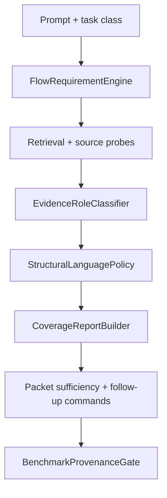

# Architectural Blueprint

## 1. Core Objective

Make packet-runtime promotion pass without reintroducing benchmark-shaped production logic by aligning sufficiency with typed evidence roles, language-tier capabilities, compact-budget proof retention, and honest benchmark provenance.

## 2. System Scope and Boundaries

### In Scope

- Replace text-shaped sufficiency family checks with generic `FlowRequirement` and citation role coverage.
- Add a small structural-language policy for HTML, CSS, SQL, Bash, and other source-range-first surfaces.
- Fix packet-runtime cache provenance so publishable blockers report prepared sidecar state correctly.
- Tighten compact packet budgeting around proof roles before expanding output size.
- Add targeted regressions for the current failure clusters.

### Out of Scope

- No new MCP server.
- No new retrieval backend.
- No benchmark expected strings in production packet modules.
- No broad language parser rewrite.
- No public packet schema break.

## 3. Core System Components

| Component Name | Single Responsibility |
|---|---|
| **FlowRequirementEngine** | Own generic flow roles, query seeds, and coverage modes for planning, probes, and sufficiency. |
| **EvidenceRoleClassifier** | Convert citations and source ranges into proof roles with tier and resolution eligibility. |
| **CoverageReportBuilder** | Decide `sufficient`, `partial`, or `insufficient` from covered, missing, ineligible, unresolved, and budget-omitted roles. |
| **StructuralLanguagePolicy** | Declare which evidence tiers can prove structural languages and file types without resolved graph symbols. |
| **PacketAnswerSynthesizer** | Emit source-backed claims and symbol labels that agents can preserve without benchmark claim templates. |
| **BenchmarkProvenanceGate** | Separate product packet failures from harness/cache/repo provenance failures. |

## 4. High-Level Data Flow

## 5. Key Integration Points

- **FlowRequirementEngine to CoverageReportBuilder**: `FlowRequirement` ids and coverage modes become sufficiency inputs.
- **EvidenceRoleClassifier to StructuralLanguagePolicy**: citation tier, producer, file type, and resolution decide whether a citation can prove a role.
- **PacketAnswerSynthesizer to CoverageReportBuilder**: generated claims carry `coverage_role` and `eligible_for_sufficiency`; generic navigation claims stay diagnostic.
- **BenchmarkProvenanceGate to packet-runtime rows**: cold and warm packet-runtime rows include prepared-cache state, retrieval mode, freshness, sidecar generation, and promotion blocker categories.
