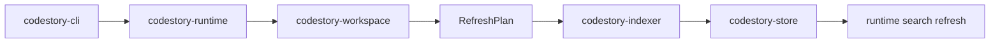
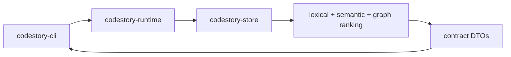
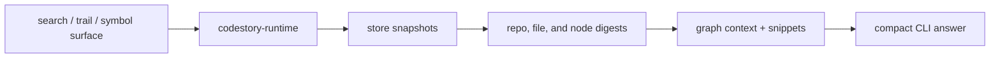

# Data Flow

## Index Flow

1. `codestory-cli` parses the command and builds a runtime context.
2. `codestory-runtime` opens the workspace root and the target store.
3. `codestory-workspace` computes a `RefreshPlan` from manifest rules, discovery, and stored file inventory.
4. `codestory-indexer` parses the selected files, emits nodes, edges, occurrences, projection state, and search-doc payloads.
5. `codestory-store` writes graph rows, projection batches, and derived snapshot state.
6. `codestory-runtime` refreshes runtime-owned search state from store-backed search docs when needed.

## Query Flow

1. `codestory-cli` maps the command into a runtime service call.
2. `codestory-runtime` opens the store and reads the needed graph, snapshot, trail, or search data.
3. Runtime search combines lexical, semantic, and graph-informed ranking.
4. Runtime maps store and graph results into contract DTOs.
5. `codestory-cli` renders markdown or JSON.

## Grounding Flow

1. Runtime starts from the search/trail/symbol surface.
2. Store snapshots provide fast repo summaries, file digests, and node digests.
3. Runtime expands the candidate set with graph context and snippets.
4. CLI renders a compact answer surface for higher-level tools or humans.
