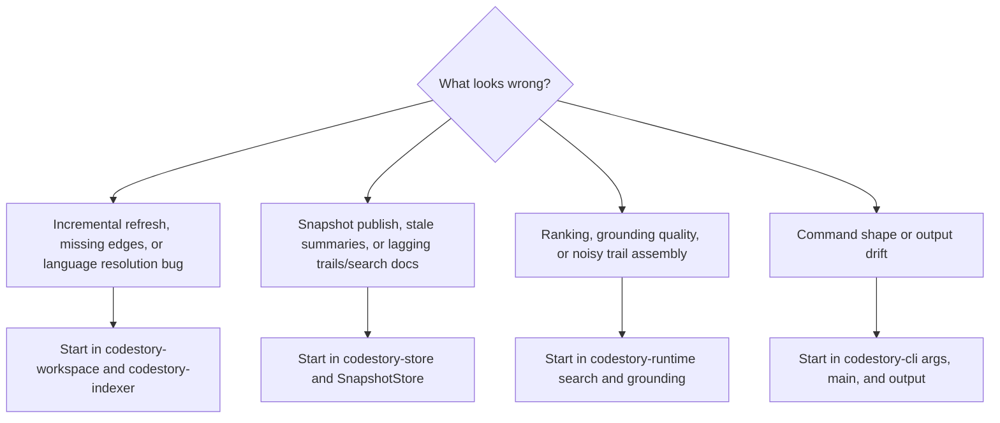

# Failure Modes

## Indexing Bugs

Common symptoms:

- a changed file is skipped during incremental refresh
- symbols exist but edges or occurrences are missing
- resolution regresses for one language only

Start with:

- `codestory-workspace` refresh-plan computation
- `codestory-indexer/src/lib.rs`
- `codestory-indexer/src/resolution/`
- `codestory-indexer/src/semantic/`

## Store And Snapshot Bugs

Common symptoms:

- full refresh succeeds but the live snapshot does not publish
- grounding summaries are stale after writes
- trails or search docs lag behind graph rows

Start with:

- `codestory-store/src/lib.rs`
- `codestory-store/src/storage_impl/mod.rs`
- `codestory-store/src/snapshot_store.rs`
- `codestory-store/src/trail_store.rs`

## Search And Grounding Bugs

Common symptoms:

- lexical results exist but semantic ranking disappears
- grounding returns the right files but poor symbol digests
- trail output is correct but grounding assembly is noisy

Start with:

- `codestory-runtime/src/search/`
- `codestory-runtime/src/grounding.rs`
- `codestory-runtime/src/support.rs`

## Adapter Bugs

Common symptoms:

- command parsing accepts the wrong shape
- output formatting changes without a runtime contract change
- CLI bypasses runtime behavior with local logic

Start with:

- `codestory-cli/src/args.rs`
- `codestory-cli/src/main.rs`
- `codestory-cli/src/output.rs`
