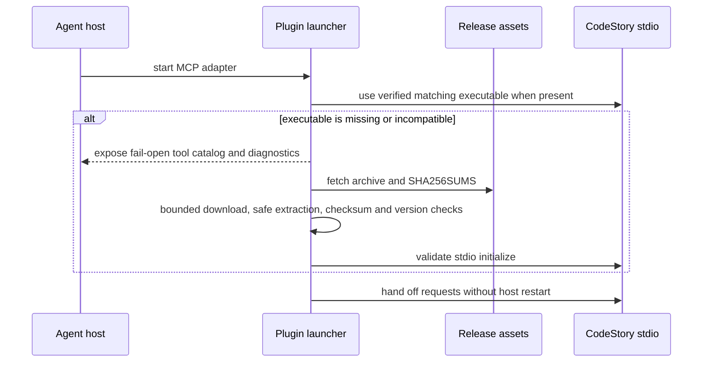
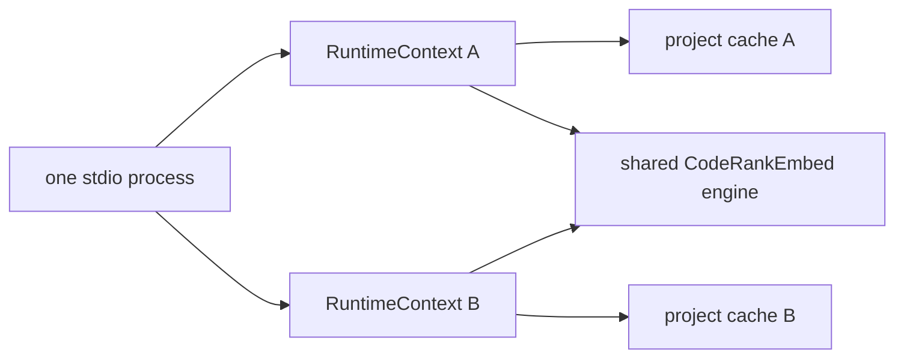

# Host Integration

CodeStory presents one agent capability even though the installed path has two
pieces: a small Node launcher packaged with the plugin and the matching native
CodeStory executable. The launcher owns installation compatibility. The native
process owns every product operation.

## Installed lifecycle

Provisioning is single-flight and bounded. A failed or incomplete download is
not installed as current. The launcher may download the version-matched
executable; the executable never downloads an embedding model, accelerator
backend, helper executable, or retrieval service.

The fail-open catalog prevents installation work from looking like a missing
plugin. It keeps diagnostics and the complete tool schema visible while the
native executable is prepared, then forwards requests to that executable.

## Request routing

Every tool and resource request includes an absolute `project` root. The
launcher forwards it unchanged, and the stdio adapter selects or creates the
matching project runtime. There is no process-global active project.

One stdio process can therefore serve repositories A, B, then A again:

- each project retains its own repository identity, cache namespace,
  configuration, graph, and retrieval publication;
- process startup defaults are captured once and are not reread when projects
  switch;
- the in-process embedding engine and materialized model are shared;
- the heavy model and accelerator allocation sleep after 60 idle seconds and
  wake automatically on the next product request;
- small request-local and project-local caches are reset or selected explicitly,
  rather than leaking the prior project.

Switching projects changes the selected runtime and cache, not the engine
owner. Returning to A during an active burst reuses the warm model. Returning
after the idle window reloads the same verified model automatically without
making either project's state visible to the other.

## Managed activation

Activation is a single-flight runtime operation for one native
project/configuration key. Its stable snapshot contains the operation ID,
stage, state, attempt, retry delay, and terminal failure. Concurrent callers
join the same operation. The stdio and plugin layers only render this snapshot;
they do not own another readiness or repair state machine.

Cold status and resource reads are observational. Missing or incompatible
storage is reported as unavailable without creating directories, initializing
SQLite, migrating schema, loading the embedding engine, or starting refresh.
Project tool calls own activation.

Status and diagnostics are observational. They can report installed version,
local graph state, retrieval publication state, and engine diagnostics, but
must not download assets, refresh an index, or initialize the engine.

Every project tool joins the same activation operation; caller intent does not
select a shorter or parallel preparation path:

1. validate the tool name, URI, and arguments;
2. select the project;
3. join or start discovery, core freshness, dense preparation, validation, and
   publication for that project/configuration key;
4. execute the requested operation only after that activation is ready.

If managed work exceeds the foreground budget, the result is `preparing` with
a retry delay and the original tool name. The agent retries the same call.

The runtime also owns the publication boundary for every public response,
independent of transport. Ordinary CLI calls and stdio/MCP calls use the same
`PublicOperationService`: packet, search, context, drill, and query-resolved
graph responses pin one complete core snapshot plus one retrieval publication
from target resolution and planning through response assembly. Nested search
adapters borrow that outer pin and attach its retrieval identity to their
normal response fields; they do not execute a second search or retry loop.

Multi-project transports accept only an explicit absolute repository root.
Missing, relative, or unavailable roots fail closed instead of inheriting the
launcher working directory or a mutable active-project file. Existing cache
and storage roots are compared by native filesystem identity before context
fingerprints or activation targets are reused; missing paths use platform
lexical identity until they exist.
Users are not asked to approve, start, repair, or understand an internal
retrieval component.

Tool safety metadata reflects this contract: CodeStory project tools are local,
idempotent where declared, and do not require confirmation for managed
activation. A user-controlled external side effect still follows the host's
normal safety policy.

## Update and restart boundary

The launcher can hand off to a newly provisioned executable without restarting
the current host when the adapter itself is compatible. A host restart is
relevant only when the installed plugin package or long-lived adapter code must
change. Marketplace refresh, package installation, executable provisioning, and
native runtime handoff are distinct events.

## Code entry points

- `plugins/codestory/scripts/codestory-mcp.cjs`: provisioning, fail-open proxy,
  validation, and handoff
- `crates/codestory-cli/src/stdio_catalog.rs`: tool schemas and safety metadata
- `crates/codestory-cli/src/stdio_transport.rs`: project selection, activation,
  readiness gates, resources, tools, and public status
- `crates/codestory-cli/src/config.rs`: process startup defaults
- `crates/codestory-cli/src/runtime.rs`: retained project runtime contexts

See [runtime execution](runtime-execution-path.md) for the native request path
and [retrieval design](retrieval-design.md) for engine and publication state.
