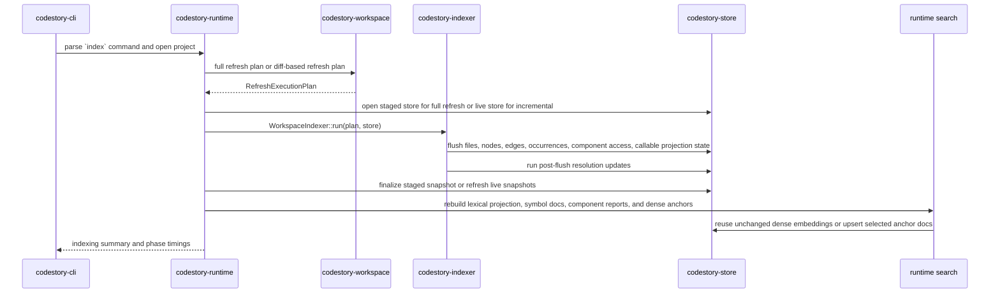
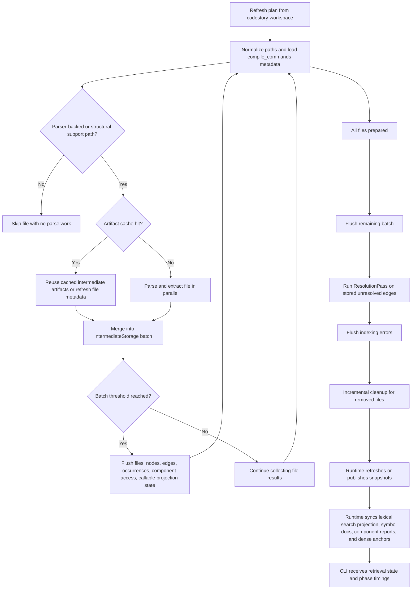

# Indexing Pipeline

This page explains how `codestory-cli index` turns a repository into SQLite-backed graph state, projection rows, and grounding snapshots.

Read this page when you need the implementation mental model. For live evidence
from an indexed workspace, use contributor CLI commands in
[getting-started.md](../contributors/getting-started.md) or operator repair
paths in [users/troubleshooting.md](../users/troubleshooting.md).

Default `index` includes graph-native symbol docs and selected dense anchors. A successful run returns only after graph indexing, snapshots, lexical search projection, deterministic `symbol_search_doc` rows, component reports, and persisted dense-anchor docs are synchronized. Semantic work is measured separately in the phase timings instead of being hidden behind a later read command.

## End-To-End Command Path

## Who Owns What

- `codestory-cli` parses the command and renders the indexing summary.
- `codestory-runtime` chooses full versus incremental flow and staged versus live store behavior.
- `codestory-workspace` discovers source files and computes the refresh plan.
- `codestory-indexer` turns the plan into projection writes and post-flush resolution.
- `codestory-store` persists rows, invalidates or refreshes snapshots, publishes staged builds, and stores symbol docs plus dense-anchor docs.
- `codestory-runtime` owns the runtime search engine, symbol doc and dense-anchor sync, retrieval readiness, and timing surface.

That split is intentional: the runtime orchestrates the run, the indexer performs indexing work, and the store owns persistence mechanics.

## Indexer Phases

## Step By Step

### 1. CLI dispatches the `index` workflow

`crates/codestory-cli/src/main.rs` routes `Command::Index` into `run_index`. The CLI does not index files directly. It builds a runtime context, asks runtime to open the project with the requested refresh mode, and then renders the returned summary.

### 2. Runtime chooses full or incremental indexing

`crates/codestory-runtime/src/lib.rs` owns the orchestration split:

- `index_full` opens a staged store with `SnapshotStore::open_staged`, asks the workspace for a full refresh plan, runs the indexer against the staged store, finalizes the staged snapshot, and then publishes it to the live path
- `index_incremental` opens the live store, collects refresh inputs from stored inventory, builds a diff-based execution plan, runs the same indexer against the live store, and then refreshes live summary and detail snapshots

The indexer does not know whether the store is staged or live.

### 3. Workspace computes the refresh plan

`crates/codestory-workspace/src/lib.rs` decides which files belong in the run:

- `source_files` walks the configured source groups from the workspace manifest, follows directories, applies exclude globs, sorts the result, and removes duplicates
- `source_inventory` retains whether that walk was complete, partial, unreadable, or stopped by its candidate bound, plus any traversal failures
- `build_refresh_plan` compares discovered files against stored inventory and only plans stored-file deletion from a complete inventory. Stored parser-backed rows carry the verified SHA-256 identity of the bytes that produced their projection, so matching millisecond mtimes do not hide changed content

For incremental work, a file is reindexed when:

- it is new
- its modification time differs from the stored row
- its modification time matches but its verified parser content hash differs
- it exists in the store but is marked as not indexed

Legacy rows and collectors without a verified parser hash retain the metadata
fallback. Content comparison reads only rows that already carry a verified
source hash; it does not add hashing for structural, text-only, or oversized
files that did not produce one.

Files that disappeared from a complete discovery are collected into
`files_to_remove`. Partial, unreadable, and bounded inventories retain observed
files for safe reindexing but never infer deletion from absence. Runtime
freshness reports those incomplete inventories as `not_checked`.

### 4. The indexer prepares file work

`WorkspaceIndexer::run` in `crates/codestory-indexer/src/lib.rs` starts by preparing state for the whole run:

- it seeds the symbol table from existing stored node kinds for incremental runs
- it chunks `files_to_index` using batch settings
- it loads parsed compilation metadata from `compile_commands.json` when available
- it picks a parser-backed language configuration or structural collector for
  each file and skips unsupported files before any parse work

Compilation metadata matters mostly for native-language parsing and is part of the artifact-cache key, so changes to compiler flags or include paths can invalidate cached artifacts. Artifact-cache identity uses the root-relative file path so compatible clean worktrees can reuse copied artifact rows.

### 5. Artifact cache decides parse versus reuse

`prepare_index_work` checks the index artifact cache before reparsing a file.

The cache key includes:

- the root-relative file path
- file bytes
- language queries
- feature-flag values that affect graph shape
- compilation metadata when present and root-relative enough to be portable

A cache hit can reuse the serialized indexing artifact and turn it back into
`IntermediateStorage`. A cache miss sends the file through parse and extract
work. Before either result is accepted, the indexer re-reads the source and
compares its SHA-256 hash with the bytes used to build the cache key or parser
input. A mismatch, including one hidden by a restored timestamp, becomes an
incomplete file-level retry error; stale graph output and artifact-cache writes
are discarded.

### 6. Parse and extract run in parallel

Cache misses become `PreparedIndexInput` values and are parsed in parallel. Each file produces `IntermediateStorage`, which is the in-memory shape of a future store flush:

- file metadata
- verified parser source hashes
- nodes
- edges
- occurrences
- component access
- callable projection state
- impl anchors
- errors

This phase is where the indexer builds unresolved edges and other graph artifacts. Resolution does not happen yet.

### 7. The indexer flushes projection batches

As file results are merged, `WorkspaceIndexer::run` flushes batches once file, node, edge, or occurrence counts cross the configured thresholds.

Projection flushes write more than the core graph:

- files
- nullable verified parser source hashes
- nodes
- edges
- occurrences
- component access tuples
- callable projection state

The store flush path writes the verified hash beside the file row and clears it
when a refreshed row has no verified parser content identity. Modification time
is captured only after the verification read matches. The same flush invalidates
grounding snapshots as part of persistence. Projection flush is both a write
boundary and a derived-state invalidation boundary.

### 8. Resolution happens after flushes

Once all batched projection data has been flushed, the indexer runs `ResolutionPass`.

That pass:

- loads unresolved call, import, and override edges from the store
- builds candidate indexes
- applies structural strategies first
- uses semantic candidate lookup as a fallback when enabled and supported

Resolution is scoped differently by refresh mode:

- full refresh resolves without a touched-file scope
- incremental refresh limits the pass to touched files

This is why unresolved edges are visible in storage before resolution completes.

### 9. Incremental cleanup removes stale state

Cleanup is split into two pieces for incremental runs:

- before merging new results for a touched file, the indexer may delete stale callable projection rows for that file
- after the resolution pass, the indexer removes files that no longer exist in the workspace

That makes incremental indexing more than just "parse changed files." It also reconciles stale projection state.

### 10. Runtime refreshes or publishes snapshots

The last step belongs to runtime plus store:

- full refresh finalizes a staged build, creates deferred indexes, refreshes the summary snapshot, and publishes the staged database
- incremental refresh stays on the live database and refreshes both summary and detail snapshots in place

Full and incremental snapshot behavior are intentionally not symmetric.

### 11. Runtime synchronizes search, symbol docs, and dense anchors

After graph and snapshot work, runtime rebuilds the search-symbol projection, opens or refreshes the persisted Tantivy search directory, writes graph-native symbol docs, writes deterministic component reports, and synchronizes selected dense-anchor docs. This is part of the default `index` contract.

Semantic sync does these pieces of work:

- build deterministic generated text for durable AST symbols and store it in `symbol_search_doc`
- build deterministic component/community report docs with extracted provenance
- classify each symbol under `graph_first_v1`
- reuse existing dense embeddings when doc version, generated text hash, embedding profile/backend/model/dimension, document prefix, and semantic policy version still match
- embed only selected dense anchors and upsert them back into SQLite
- prune stale symbol docs or dense docs that no longer correspond to the refreshed graph and policy

Full refresh has an extra copy-forward path: if a previous live database exists, unchanged symbol docs, retrieval artifact nodes, and dense-anchor docs are copied into the staged database before publish. The later semantic sync can then reuse those rows instead of re-embedding them.

Incremental refresh scopes symbol-doc and dense-anchor invalidation by touched file. Untouched files keep their existing docs; new, changed, or removed symbols in touched files are written, embedded if policy-selected, skipped with reason counts, or pruned.

The default symbol-doc scope is durable symbols: classes, structs, interfaces, annotations, unions, enums, typedefs, functions, methods, macros, global variables, constants, and enum constants. Lower-signal module, namespace, package, field, local variable, and type-parameter docs stay out of dense retrieval by default while remaining present in graph and lexical search. Set `CODESTORY_SEMANTIC_DOC_SCOPE=all` only for investigations.

The dense-anchor policy version is `graph_first_v1`. Dense reasons are `public_api`, `entrypoint`, `documented_nontrivial`, `central_graph_node`, `component_report`, and `unstructured_doc`. Private trivial helpers, generated/vendor code, and test-only implementation details are skipped for dense embedding unless they are structurally central; they remain discoverable through exact lookup, `symbol_search_doc`, source lexical search, and graph expansion.

The default semantic text alias policy is `CODESTORY_SEMANTIC_DOC_ALIAS_MODE=alias_variant`. It keeps compact language, terminal-name, owner-name, and symbol-role hints, but leaves out the noisier full name-alias and path-alias lists from the earlier `current_alias` research variant. Use `no_alias` for baseline research rows and `current_alias` only when reproducing older alias-enriched runs.

Embedding throughput is optimized inside the CodeStory process:

- pending dense-anchor docs are sorted by generated text length before embedding, which keeps batches close to uniform length
- the default semantic embedding batch size is `128`, with `CODESTORY_LLM_DOC_EMBED_BATCH_SIZE` available for profiling
- one process-wide model and accelerator context serves every open repository
- the checksum-pinned BGE-base Q8 model, tokenizer contract, CLS pooling, and
  normalization are compiled into the executable
- Metal or Vulkan is required for production; CPU is accepted only when
  `CODESTORY_EMBED_ALLOW_CPU=1` was set explicitly
- old producer identities are rejected and rebuilt rather than retained behind
  compatibility branches

Keep measured repo-scale timings in [codestory-e2e-stats-log.md](../testing/codestory-e2e-stats-log.md). Architecture explains the lifecycle; the testing log owns time-specific numbers because caches, backends, and workstation state drift.

## Mental Model

### How files are selected for refresh

`codestory-workspace` is the source of truth for file discovery and diffing. Incremental runs only reindex files whose stored inventory is missing, stale, or marked unindexed.

### When files are skipped

The indexer skips files before parsing when it cannot select a parser-backed
language configuration or structural collector for the path plus compilation
metadata. See [language-support.md](language-support.md) for the distinction
between parser-backed graph support, structural collectors, and candidate parser
compatibility records.

### How `compile_commands.json` participates

`WorkspaceIndexer::new` looks for a compilation database near the workspace root. When present, parsed compilation info informs language configuration and becomes part of the artifact-cache key. If compile-command paths cannot be made relative to the workspace root, the indexer skips artifact-cache lookup/write for that file and rebuilds instead.

### Where artifact caching is used

Artifact caching sits inside the indexer before parsing. Cache hits can reuse a file's serialized projection payload; cache misses fall back to parse and extract work.

### What gets written before resolution

Files, nodes, edges, occurrences, component access, and callable projection state are flushed before `ResolutionPass` runs. Resolution then updates unresolved edges using the stored graph state.

### What full refresh publishes that incremental refresh does not

Full refresh builds a staged database and publishes it only after staged finalization succeeds. Incremental refresh never publishes a staged build; it updates the live store and refreshes live snapshots in place.

### How symbol docs and dense anchors are kept fast

Symbol docs are deterministic graph artifacts persisted in SQLite with generated-text metadata and extracted provenance. Dense anchors are persisted separately in SQLite with vector metadata. Reuse is keyed by schema version, generated text hash, embedding profile/backend/model/dimension, document prefix, and semantic policy version. On full refresh, runtime copies prior retrieval artifact nodes, symbol docs, and dense docs forward into the staged database before semantic sync checks them. On incremental refresh, runtime passes a touched-file scope so only docs belonging to changed files are rebuilt, embedded, skipped, or pruned.

Cold start embeds only dense anchors that have no reusable row. The cold path is
kept under control by using graph-native symbol docs for code recall, the
`graph_first_v1` dense policy, length-bucketed batches, full retrieval readiness,
and stored vector quantization.

### What timing output means

The index summary reports graph and semantic work separately:

- `timings_ms.cache_refresh`: wrapper time for search projection, search indexing, semantic sync, and runtime publication
- `cache_ms.search_projection`: SQLite search-symbol projection rebuild from persisted nodes
- `cache_ms.search_index`: runtime search index construction for symbol names
- `cache_ms.runtime_publish`: publishing the rebuilt search state into the live runtime
- `semantic_ms.doc_build`: generated semantic text and hashes
- `semantic_ms.embedding`: embedding runtime work for pending docs
- `semantic_ms.db_upsert`: SQLite writes for embedded docs
- `semantic_ms.reload`: loading persisted semantic docs into the runtime search engine when needed
- `semantic_ms.prune`: removing stale semantic docs after the refreshed symbol set is known
- `symbol_search_docs_written`: graph-native symbol docs and component reports written for lexical/graph recall
- `semantic_docs.reused`: existing dense-anchor docs accepted without embedding
- `semantic_docs.embedded`: dense-anchor docs newly embedded in this run
- `semantic_docs.pending`: dense-anchor docs that needed embedding after reuse checks
- `semantic_docs.stale`: persisted dense-anchor docs pruned because they no longer match the refreshed symbol set
- `semantic_dense_docs_skipped` and `semantic_dense_*`: policy skip and dense-reason counters for `graph_first_v1`

Use these fields before changing parser, graph, or SQLite code for a slow
`index` run.

## How To Debug Indexing

Start with static docs first:

1. [Architecture overview](overview.md)
2. [Runtime execution path](runtime-execution-path.md)
3. [Indexer subsystem](subsystems/indexer.md)
4. [Debugging guide](../contributors/debugging.md)

Then use live tooling if you need workspace-specific evidence:

- `codestory-cli index --project .`
- `codestory-cli search --project . --query <symbol>`
- the canonical plugin skill in `plugins/codestory/skills/codestory-grounding/SKILL.md`

Treat the grounding workflows as follow-up evidence, not the primary
explanation. Local grounding and search-state rebuilds can depend on semantic
retrieval assets and current machine health, so the architecture docs should
remain the primary reference when you are learning the pipeline.

## Verification Targets

If you change indexing behavior, review or run the suites that guard it:

- `cargo test -p codestory-indexer --test fidelity_regression`
- `cargo test -p codestory-indexer parser_result_changed_with_restored_mtime_is_incomplete_and_not_cached`
- `cargo test -p codestory-indexer artifact_cache_result_changed_with_restored_mtime_is_rejected`
- `cargo test -p codestory-store projection_batch_round_trips_and_clears_file_content_hash`
- `cargo test -p codestory-indexer --test tictactoe_language_coverage`
- `cargo test -p codestory-indexer --test integration`
- targeted resolution suites under `crates/codestory-indexer/tests/`
