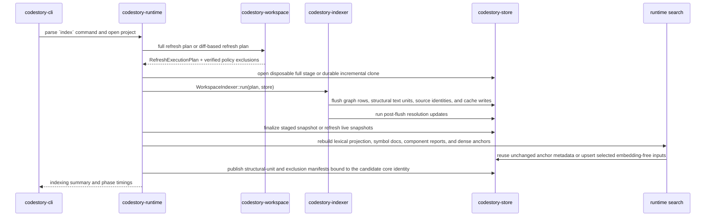
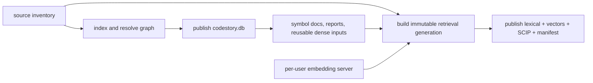
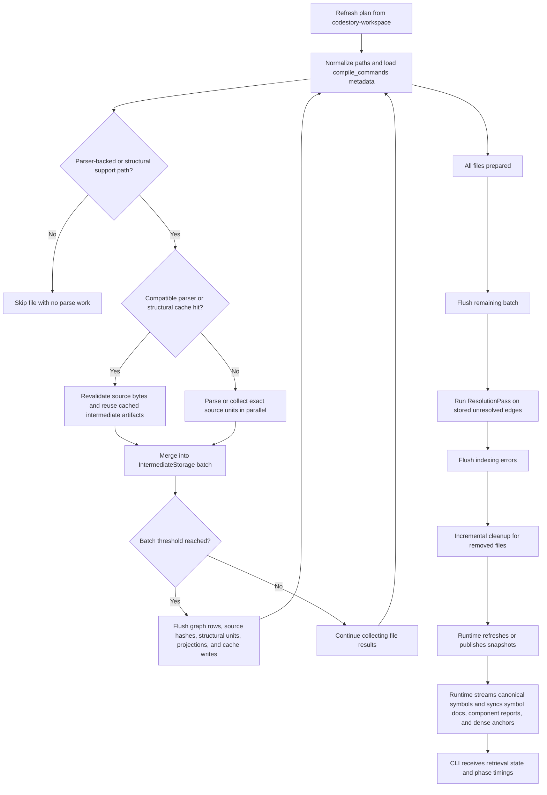

# Indexing Pipeline

This page explains how `codestory-cli index` turns a repository into SQLite-backed graph state, projection rows, and grounding snapshots.

Read this page when you need the implementation mental model. For live evidence
from an indexed workspace, use contributor CLI commands in
[getting-started.md](../contributors/getting-started.md) or operator repair
paths in [users/troubleshooting.md](../users/troubleshooting.md).

Default `index` includes graph-native symbol docs and selected dense anchors. A
successful run returns only after graph indexing, snapshots, lexical search
projection, deterministic `symbol_search_doc` rows, component reports, and
persisted dense-anchor inputs are synchronized. This is the core publication
contract. Immutable retrieval generation finalization is a separate fence.

## End-To-End Command Path

## Who Owns What

- `codestory-cli` parses the command and renders the indexing summary.
- `codestory-runtime` chooses full versus incremental flow and staged versus live store behavior.
- `codestory-workspace` discovers source files and computes the refresh plan.
- `codestory-indexer` turns the plan into projection writes and post-flush resolution.
- `codestory-store` persists rows, invalidates or refreshes snapshots, publishes staged builds, and stores symbol docs plus embedding-free dense-anchor inputs.
- `codestory-runtime` owns the runtime search engine, deterministic symbol/dense input construction, retrieval readiness, and timing surface.
- `codestory-retrieval` owns model execution, immutable vector generations, producer evidence, validation, and query generation leases.

That split is intentional: the runtime orchestrates the run, the indexer performs indexing work, and the store owns persistence mechanics.

## Two publication fences

Core indexing and retrieval publication deliberately do not share one commit:

1. runtime and store publish a coherent core graph generation;
2. runtime synchronizes deterministic search documents and reusable dense inputs
   in that core generation;
3. a broad activating call or explicit retrieval-index operation builds and
   validates immutable `lexical-index.sqlite3`, `vectors.sqlite3`, and SCIP
   artifacts;
4. retrieval publishes a manifest that binds those artifacts to the exact core
   generation/run, source input, and embedding producer.

Local graph navigation can use a current core publication while retrieval is
still preparing. Packet/search requires both publications plus a live
policy-compliant engine. See [retrieval design](retrieval-design.md).

## Semantic projection-only republish

`codestory-cli retrieval republish-projections` is an explicit writer for a
complete, verified core whose graph and source identity remain authoritative
but whose semantic or dense-selection policy needs a new publication. It does
not run workspace discovery, schedule files, invoke parsers or structural
collectors, or reopen source files.

The runtime pins the live core publication, clones it with SQLite backup, and
validates its dense-anchor, structural-unit, and source-policy manifests. It
also binds the selected native project identity to the stored source-policy
project/workspace identity, so an arbitrary cache override cannot adopt another
repository's core. The CLI binds the explicit root and cache in memory and
acquires the common exclusive writer lock before any database open or schema
migration.
Schema 29 is accepted only when its structural manifest is absent and all three
structural stores (units, projections, and artifact cache) are empty; the new
generation then carries an explicit complete empty structural manifest. Any
nonempty unmanifested structural state fails closed. The runtime then streams
canonical graph nodes in bounded pages, requires an exact stored
symbol document for every eligible node, recomputes graph context, component
reports, dense-anchor selection, and policy metadata, and builds the ordinary
persisted search generation. Stored document text is reusable only when its
node metadata, document schema, provenance, and current alias-bound hash match;
otherwise the command fails with `semantic_projection_migration_required`.
There is no source-reading fallback.

The replacement receives the `semantic_projection` core publication mode and
uses the same incomplete marker, catalog lock, live-publication revalidation,
snapshot seal, promotion journal, rollback validation, and cache publication
as full and incremental indexing. A missing contract, cancellation, concurrent
writer, or changed live publication leaves the previous complete core usable.
Failure and cancellation coverage includes semantic-context index creation,
stored-node/document pages, endpoint graph reads, snapshot summary/detail
publication, manifest rebinding, search build/symbol pages/index write/
validation/completion/catalog, marker completion, and database replacement.
Every pre-promotion case preserves the prior core, retrieval identity, and
search generations while removing staged database and search artifacts. A
generation change after the initial pin is revalidated before promotion; the
competing complete core/search and the prior complete search rollback are
retained while the unpublished candidate is removed.
The runtime-cache checkpoint is after the durable point of no return. Failure
or cancellation there does not roll back the committed core: the prepared
search generation becomes the controller's current generation, indexing state
clears, and only complete current/rollback search directories remain. The
retrieval manifest is not rebound by this convergence path.
The prior retrieval manifest intentionally remains bound to the old core, so
packet/search fail closed until `retrieval index --refresh none` builds and
publishes retrieval artifacts for the new core.

## Indexer Phases

## Step By Step

### 1. CLI dispatches the `index` workflow

`crates/codestory-cli/src/main.rs` routes `Command::Index` into `run_index`. The CLI does not index files directly. It builds a runtime context, asks runtime to open the project with the requested refresh mode, and then renders the returned summary.

### 2. Runtime chooses full or incremental indexing

`crates/codestory-runtime/src/lib.rs` owns the orchestration split:

- `index_full` opens a fresh stage with `SnapshotStore::open_disposable_full_refresh`, asks the workspace for a full refresh plan, runs the indexer against the staged store, finalizes every core/search identity, and then seals and publishes it to the live path
- `index_incremental` clones the current live database into a durable staged store, collects refresh inputs from stored inventory, builds a diff-based execution plan, runs the same indexer against the clone, and publishes the completed replacement

Only the fresh full stage uses relaxed SQLite synchronization. It remains in
WAL mode so a bounded cache reader is available when verified structural rows
were copied forward, and keeps a nonzero 64 MiB automatic-checkpoint budget.
An entirely fresh stage opens no second reader. The consuming publish call
restores NORMAL synchronization, completes a blocking TRUNCATE checkpoint,
syncs the database and containing directory, and only then enters the store's
old-or-new promotion journal. Its phase telemetry exposes the checkpoint
budget, checkpoint time, and sync time. Generic build stores and incremental
clones keep WAL/NORMAL throughout.

Incremental clone telemetry records the successful live-to-staged SQLite
backup call and the logical source/target database bytes. The clone happens
before incremental indexing begins, so `staged_snapshot_copy` is independent
of the later `publish_ms` wall. Every successful core publication also reports
nested promotion telemetry for lock/recovery, candidate and prior-live
validation, the optional rollback-backup copy and validation, prepared-journal
write/file sync/directory sync, staged-to-live restore, promoted-live
validation, committed-journal transition, and cleanup. The promotion object
retains candidate, prior-live, and rollback-backup logical bytes plus a
saturating residual that reconciles its displayed total. Logical bytes use
SQLite `page_count * page_size`, including committed pages still backed by WAL;
they do not measure filesystem allocation or physical writes. Only
`core_promotion` is a diagnostic nested inside the publication wall.

The indexer does not know whether the store is staged or live.

### 3. Workspace computes the refresh plan

`crates/codestory-workspace/src/lib.rs` decides which files belong in the run:

- `source_files` walks the configured source groups from the workspace manifest, follows directories, applies exclude globs, sorts the result, and removes duplicates
- `source_inventory` retains whether that walk was complete, partial, unreadable, or stopped by its candidate bound, plus any traversal failures
- `source_inventory_with_oversized_policy` hashes stable source bytes above the
  shared parser cap and classifies them before parser scheduling, independent
  of whether they are generated, vendored, or ordinary project files
- `build_refresh_plan` compares discovered files against stored inventory and only plans stored-file deletion from a complete inventory. Stored parser-backed rows carry the verified SHA-256 identity of the bytes that produced their projection, so matching millisecond mtimes do not hide changed content

For incremental work, a file is reindexed when:

- it is new
- its modification time differs from the stored row
- its modification time matches but its verified parser content hash differs
- it exists in the store but is marked as not indexed

Legacy rows and text-only collectors without a verified source hash retain the
metadata fallback. Parser-backed and structural collector rows carry a
verified SHA-256 identity; structural files therefore cannot hide changed
content behind a restored timestamp. Oversized candidates use the separate
source-policy identity described below.

Verified byte-bound candidates are removed before parser scheduling.
Structural collectors may also return a verified exclusion when a source below
the byte cap exceeds the structural-unit cap; that worker result writes no
partial projection or cache. Runtime publishes the combined complete exclusion
manifest bound to project, workspace, candidate core generation/run, policy
version, observed byte/unit counts, both caps, row count, and digest. The rows
remain source inventory only: they make no parser graph, structural semantic,
typed-target, or sufficiency claim. A content or policy change forces
reclassification.

Files that disappeared from a complete discovery are collected into
`files_to_remove`. Partial, unreadable, bounded, or concurrently changing
inventories retain observed files for safe reindexing but never infer deletion
or a complete exclusion set from absence. Runtime treats them as source
coverage blockers and preserves the previous complete publication.

### 4. The indexer prepares file work

`WorkspaceIndexer::run` in `crates/codestory-indexer/src/lib.rs` starts by preparing state for the whole run:

- it seeds the symbol table from existing stored node kinds for incremental runs
- it chunks `files_to_index` using batch settings
- it loads parsed compilation metadata from `compile_commands.json` when available
- it picks a parser-backed language configuration or structural collector for
  each file and skips unsupported files before any parse work

Compilation metadata matters mostly for native-language parsing and is part of the artifact-cache key, so changes to compiler flags or include paths can invalidate cached artifacts. Artifact-cache identity uses the root-relative file path so compatible clean worktrees can reuse copied artifact rows.

### 5. Compatible caches decide parse or collection versus reuse

`prepare_index_work` checks the parser artifact cache before reparsing a file.
Structural collectors use a separate, versioned cache whose payload contains
only collector-owned source units and their graph projection. Copy-forward
never relabels parser artifacts as structural units.

Runtime supplies an explicit access policy for each cache family. A fresh
disposable full stage uses `known_empty` for parser artifacts because no parser
rows are copied into it. Structural access remains `known_empty` unless the
verified prior publication copied at least one structural row; only then does
it use `read_through`. Incremental clones retain both cache families and use
`read_through`. `known_empty` still records one logical miss per eligible file,
but performs no SQLite query and cannot produce a hit.

The parser cache key includes:

- the root-relative file path
- file bytes
- language queries
- feature-flag values that affect graph shape
- compilation metadata when present and root-relative enough to be portable

A cache hit can reuse the serialized indexing artifact and turn it back into
`IntermediateStorage`. A cache miss sends the file through parse and extract
work. Before either result is accepted, the indexer re-reads the source and
compares its SHA-256 hash with the bytes used to build the cache key or parser
input. A mismatch, including one hidden by a restored timestamp, becomes an
incomplete file-level retry error; stale graph output and artifact-cache writes
are discarded.

The structural cache key includes the root-relative path, exact source bytes,
collector producer, and structural descriptor version. A hit is accepted only
after the current source hash, file identity, unit descriptors, placement
identities, and per-file projection digest all revalidate. Corrupt,
incompatible, or source-drifted rows are recollected. A verified full refresh
may copy this cache alone from the prior publication; incremental refresh
retains unchanged file projections and fully replaces a changed file's units.

File diagnostics retain a typed coverage reason: `parser_partial`,
`source_changed`, `unreadable`, `oversized`, `discovery_incomplete`, or
`collector_failure`. Each entry reports whether the condition is retryable and
whether verified source and projection data exist. A full candidate may publish
a stable parser-partial projection; the other reasons remain source-integrity
gaps and preserve the previous complete publication.

### 6. Parse and extract run in parallel

Cache misses become `PreparedIndexInput` values and are parsed in parallel. Each file produces `IntermediateStorage`, which is the in-memory shape of a future store flush:

- file metadata
- verified parser or structural source hashes
- nodes
- edges
- occurrences
- component access
- callable projection state
- impl anchors
- structural text units, including evidence producer, tier, resolution status,
  exact source span, file role, descriptor version, content identity, and
  placement identity
- one structural projection per admitted structural file, including files that
  legitimately produce zero units
- structural cache writes
- errors

This phase is where the indexer builds unresolved edges and other graph artifacts. Resolution does not happen yet.

Parsed artifact-cache writes retain Rayon result order and commit once per
existing file chunk. Structural cache writes instead commit in the projection
transaction with the file identity, graph nodes, source units, and per-file
projection. A row failure therefore rolls back the entire structural file
replacement. Duplicate paths retain ordered last-write semantics.
Cancellation is observed at the next chunk boundary: an in-flight transaction
either commits completely or rolls back, and a staged full refresh still
cannot become live before the runtime publication fence.

File-backed full refreshes open one query-only artifact-cache connection only
when a scheduled cache family uses `read_through`; the connection is attributed
to the first scheduled enabled family in reader-open telemetry and can serve
both families. A copied structural cache with no scheduled structural files
does not cause a reader open. When both policies are `known_empty`, the same
bounded producer/writer pipeline runs without a second connection. The producer
prepares and parses the next chunk, then sends it through a capacity-one
channel. This overlaps parser work with persistence while preserving one SQLite
writer and applying backpressure instead of growing an unbounded result queue.
Incremental indexing and in-memory fixtures retain the serial path.

Index telemetry reports parser and structural policy, logical lookups, physical
queries, hits, misses, reader opens, and physical-query wall time separately.
Compare cache timings only when the cache state and selected policies match;
aggregate artifact-cache writes and transactions remain separate writer
telemetry.

Full refresh chooses each chunk with an 8 MiB planned-source target and a
120,000 projected-node target instead of a fixed small file count. The node
projection uses the previous prepared chunk's observed node density, so tiny
sparse files can fill a larger Rayon window while dense files reduce the next
one. A 512-file ceiling bounds empty, tiny, unreadable, or unsupported inputs.
One file always advances even when it alone exceeds a target; telemetry records
that overrun plus planning time and the maximum files, planned bytes, and
produced nodes seen in a chunk. Incremental indexing keeps its existing fixed
serial window.

At most three prepared chunks can be materialized at once: one owned by the
writer, one queued, and one being prepared. A cancellation drops work that has
not crossed the channel boundary; already accepted chunks finish their
artifact-cache transaction and projection flush before the writer joins. The
runtime still owns the later atomic publication decision, so cancellation
cannot expose the staged database.

### 7. The indexer flushes projection batches

As file results are merged, `WorkspaceIndexer::run` flushes batches once file, node, edge, or occurrence counts cross the configured thresholds.

Projection flushes write more than the core graph:

- files
- nullable verified parser or structural source hashes
- nodes
- edges
- occurrences
- component access tuples
- callable projection state
- structural text units and per-file projections
- structural artifact-cache writes

The store flush path writes the verified hash beside the file row and clears it
when a refreshed row has no verified content identity. The source hash, graph
rows, structural units and cache entry, errors owned by refreshed file rows,
and grounding/resolution dirty markers advance in the same SQLite transaction.
Modification time is captured only after the verification read matches. A
cache-maintenance failure can report a file-scoped outcome without a
replacement file row; the writer retains the separate fallback transaction for
that error-only case. Projection flush is both a write boundary and a
derived-state invalidation boundary; ordinary owning batches do not follow the
graph commit with a second error transaction or snapshot autocommits.

Full-refresh timing output includes produced and persisted chunk counts, queue
capacity and high-water mark, producer backpressure time, and writer idle time.
Those fields are omitted for the serial incremental path.

`source_prepare_ms` covers the cache-key source read, hashing, decode, and
artifact lookup before a file is parsed or reused. `projection_batch_wall_ms`
covers complete nonempty store flush calls, including transaction setup and
commit; `projection_flush_ms` and its per-table breakdown are nested inside it.
The accompanying `projection_persistence` object reports transactions,
transaction/setup/commit wall, and each persisted family's logical row
attempts, estimated raw bind-input bytes, statement executions, and wall. These
are nested diagnostics, not additive phases. Bound-input bytes are not
database, WAL, or physical-write bytes.

### 8. Resolution happens after flushes

Once all batched projection data has been flushed, the indexer runs `ResolutionPass`.

That pass:

- loads unresolved call, import, and override edges from the store
- builds candidate indexes
- applies structural strategies first
- uses semantic candidate lookup as a fallback when enabled and supported

Resolution is scoped differently by refresh mode:

- full refresh resolves without a touched-file scope
- incremental refresh limits the pass to touched files

This is why unresolved edges are visible in storage before resolution completes.

### 9. Incremental cleanup removes stale state

Cleanup is split into two pieces for incremental runs:

- before merging new results for a touched file, the indexer may delete stale callable projection rows for that file
- after the resolution pass, the indexer removes files that no longer exist in the workspace

That makes incremental indexing more than just "parse changed files." It also reconciles stale projection state.

### 10. Runtime refreshes or publishes snapshots

The last step belongs to runtime plus store:

- full refresh finalizes a staged build, creates deferred indexes, refreshes the summary snapshot, and publishes the staged database
- incremental refresh mutates a durable clone, refreshes both summary and detail snapshots there, and publishes the completed replacement

Full and incremental stage preparation remain intentionally different even
though both finish through the same core-promotion journal.

Staged finalization splits deferred indexes around summary materialization. It
creates the four source, target, resolved-source, and resolved-target edge
indexes immediately before semantic context reads. The normal deferred schema
also retains those statements. Snapshot finalization then creates the remaining
source/core indexes used by the snapshot query. It fills the grounding node
table with both destination indexes absent, then bulk-builds the node file-rank
index needed by the file-summary join. After file materialization it bulk-builds
the node root-rank index and both file-summary indexes before the stage can
publish. All index-build segments belong to `deferred_indexes_ms`;
`semantic_ms.context_index` isolates the early endpoint-index work and
`summary_snapshot_ms` covers only materialization. Any failure in a build
segment leaves the candidate unpublished and the previous live generation
usable.

### 11. Runtime synchronizes core search inputs

After graph and snapshot work, runtime streams canonical search symbols
directly from the node table, opens or refreshes the persisted Tantivy search
directory, writes graph-native symbol docs, writes deterministic component
reports, and synchronizes selected dense-anchor docs. The legacy
`search_symbol_projection` table remains a compatibility surface; product
indexing does not rebuild or read it. This is part of the default `index`
contract.

A new persisted symbol generation reads the canonical count and then advances
through 4,096-row node-id keyset pages. It retains only the resident name map
and search structures, rather than loading every complete graph node or a
second derived SQLite table into memory. One 20 MB Tantivy writer spans all
pages and commits/reloads once. Runtime checks cancellation after each page and
immediately before the commit. Dropping an unfinished writer restores its
in-memory fuzzy projection; the generation is not admitted until the streamed,
indexed, and stored document counts agree and the completion marker succeeds.
This protects process failure and cancellation. The completion-marker rename
does not claim power-loss durability before its parent directory is synced.

Semantic sync does these pieces of work:

- build deterministic generated text for durable AST symbols and store it in `symbol_search_doc`
- build deterministic component/community report docs with extracted provenance
- classify each symbol under `graph_first_v2`
- reuse unchanged dense-anchor input metadata when generated text hash, selection reason, and policy version still match
- publish selected anchor text, source provenance, source range, content hash, policy, and exact core generation/run identity without loading the embedding engine
- prune stale symbol docs or dense inputs that no longer correspond to the refreshed graph and policy

For a full staged refresh, runtime first collects only the distinct semantic
file identities needed to preserve the existing lexicographic file-text cache
budget. It then advances through accepted node kinds in 4,096-row integer-ID
keyset pages. Each page loads component access and the existing 200-ID edge
chunks, resolves only that page's effective endpoints through cache-isolated
node reads, emits the existing bounded document windows, and drops the
page-local node/context maps. The node query explicitly stays on the integer
primary key so a deferred kind index cannot introduce a temporary ordering
tree. Component reports retain only their exact symbol count, first twelve
files, and top eight central nodes across pages. Full-refresh output remains in
node-ID order. Incremental graph dependency discovery and repair scopes retain
their existing whole-scope loader.

Full refresh has an extra copy-forward path: if a previous live database exists, unchanged symbol docs, retrieval artifact nodes, and dense-anchor inputs are copied into the staged database before publish. The later sync can retain content-level reuse while rebinding every selected input to the candidate core publication.

Incremental refresh scopes symbol-doc and dense-anchor invalidation to changed or removed files plus files connected to them through the graph before or after the refresh. Related-symbol text, edge digests, centrality, and component reports can change at either endpoint, so those graph-dependent files are rebuilt even when their source bytes did not change. Unrelated untouched files keep their existing inputs. Vector reuse and rebuild happen only when retrieval finalizes the next immutable generation.

The default symbol-doc scope is durable symbols: classes, structs, interfaces, annotations, unions, enums, typedefs, functions, methods, macros, global variables, constants, and enum constants. Lower-signal module, namespace, package, field, local variable, and type-parameter docs stay out of dense retrieval by default while remaining present in graph and lexical search. Set `CODESTORY_SEMANTIC_DOC_SCOPE=all` only for investigations.

The dense-anchor policy version is `graph_first_v2`. Dense reasons are `public_api`, `entrypoint`, `documented_nontrivial`, `central_graph_node`, `component_report`, and `unstructured_doc`. Centrality uses complete bounded graph relationship counts, while generated symbol documents retain their six-item member and related-symbol presentation caps. Private trivial helpers, generated/vendor code, and test-only implementation details are skipped for dense embedding unless they are structurally central; they remain discoverable through exact lookup, `symbol_search_doc`, source lexical search, and graph expansion.

The default semantic text alias policy is `CODESTORY_SEMANTIC_DOC_ALIAS_MODE=alias_variant`. It keeps compact language, terminal-name, owner-name, and symbol-role hints, but leaves out the noisier full name-alias and path-alias lists from the earlier `current_alias` research variant. Use `no_alias` for baseline research rows and `current_alias` only when reproducing older alias-enriched runs.

Dense input generation remains part of core indexing. Model execution,
query-versus-bulk scheduling, platform policy, and immutable vector publication
belong to [retrieval design](retrieval-design.md) and the
[llama-sys subsystem](subsystems/llama-sys.md).

Keep measured repo-scale timings in [codestory-e2e-stats-log.md](../testing/codestory-e2e-stats-log.md). Architecture explains the lifecycle; the testing log owns time-specific numbers because caches, backends, and workstation state drift.

## Mental Model

### How files are selected for refresh

`codestory-workspace` is the source of truth for file discovery and diffing. Incremental runs only reindex files whose stored inventory is missing, stale, or marked unindexed.

### When files are skipped

The indexer skips files before parsing when it cannot select a parser-backed
language configuration or structural collector for the path plus compilation
metadata. See [language-support.md](language-support.md) for the distinction
between parser-backed graph support, structural collectors, and candidate parser
compatibility records.

### How `compile_commands.json` participates

`WorkspaceIndexer::new` looks for a compilation database near the workspace root. When present, parsed compilation info informs language configuration and becomes part of the artifact-cache key. If compile-command paths cannot be made relative to the workspace root, the indexer skips artifact-cache lookup/write for that file and rebuilds instead.

### Where artifact caching is used

Artifact caching sits inside the indexer before parsing. Cache hits can reuse a file's serialized projection payload; cache misses fall back to parse and extract work.

### What gets written before resolution

Files, source hashes, nodes, edges, occurrences, component access, callable
projection state, structural text units, structural file projections, and
structural cache writes are flushed before `ResolutionPass` runs. Resolution
then updates unresolved edges using the stored graph state.

### How full and incremental core publication differ

Full refresh builds a fresh disposable stage and publishes it only after staged
finalization succeeds. Incremental refresh starts with a coherent SQLite backup
of the live database, changes only that durable clone, and publishes the
completed replacement. The previous live database remains usable until either
candidate enters the shared promotion journal.

Neither core path alone publishes the immutable retrieval generation.
Retrieval finalization binds its candidate to the resulting core generation and
leaves the prior retrieval publication active if source or core identity drifts.

Both core paths publish a complete structural-unit manifest immediately before
the core publication record. It binds descriptor schema, migration state, unit
and projection counts and digests, and the exact candidate generation/run.
Per-file projections bind verified source identity and producer. Missing,
legacy, corrupt, or source-incomplete structural state fails closed. Full
refresh discards the stage; incremental refresh discards its clone; promotion
and rollback validate the recorded structural identity before installing either
database.

### How symbol docs and dense anchors are kept fast

Symbol docs are deterministic graph artifacts persisted in SQLite with generated-text metadata and extracted provenance. Dense anchors are persisted separately as embedding-free inputs. Core reuse is keyed by generated text hash, selection reason, and semantic policy version; the stored source identity still changes to the exact candidate core generation/run before publication. Core publishes the complete anchor count, content digest, policy, migration state, and source identity as one manifest with the graph generation. On full refresh, runtime copies prior retrieval artifact nodes, symbol docs, and dense inputs forward into the staged database before checking them. On incremental refresh, runtime rebuilds inputs for changed and removed files plus files connected to them through the previous or refreshed graph, then rebinds the complete carried-forward set before publication.

Retrieval fingerprints content, provenance, the complete core generation/run,
and the stable model/engine/device compatibility identity before selecting a
generation. Core can reuse unchanged embedding-free anchor inputs, but each
core or producer-compatibility publication receives a distinct immutable vector
generation and producer-evidence identity. Retrieval embeds the selected inputs
in bounded batches, validates exact anchor/hash coverage and vector properties,
and publishes the attested generation. Core indexing never loads the model.

### What timing output means

The index summary reports graph and semantic work separately:

- `full_refresh_wall_ms`: mutually exclusive full-refresh stages from live-state inspection through catalog publication. `core_refresh_ms` is their wall envelope and `unattributed_ms` is the raw-duration residual after subtracting the named siblings. This object is absent for incremental refresh.
- `timings_ms.cache_refresh`: post-core runtime-cache installation. A prepared full publication has already built semantic and search state, so this is not their wrapper.
- `cache_ms.search_projection`: compatibility timing for the retired SQLite search-symbol projection rebuild; fresh product builds report zero
- `cache_ms.search_index`: runtime search index construction for symbol names
- `symbol_index.stream_ms`, `stream_rows`, and `stream_batches`: nested canonical-node read telemetry; stream time is part of `cache_ms.search_index`, not an additive phase
- `symbol_index`: documents written plus Tantivy writer, commit, and reader-reload counts and final commit/reload durations; all are nested inside `cache_ms.search_index`, and completed-generation reuse reports zero
- `cache_ms.runtime_publish`: publishing the rebuilt search state into the live runtime
- `projection_persistence`: transaction count and wall plus per-family row attempts, estimated bound-input bytes, statement executions, and wall; setup, commit, and family walls are nested in `projection_batch_wall_ms`
- `semantic_ms.context_index`: creating the four staged edge endpoint indexes before semantic context reads; this is nested in `timings_ms.deferred_indexes`
- `semantic_ms.node_load`, `node_rows`, and `node_batches`: keyset-reading
  accepted full-refresh semantic nodes; incremental dependency scopes retain
  their legacy whole-scope load
- `semantic_ms.endpoint_load`, `endpoint_rows`, and `endpoint_batches`:
  cache-isolated page endpoint/file-fallback reads; these are nested in
  semantic context work
- `semantic_context.lookup_peak`: the largest semantic-page plus endpoint
  lookup retained at once, not a total row count
- `semantic_ms.context`: loading the page-local graph context used by generated semantic documents
- `semantic_ms.doc_build`: generated semantic text and hashes
- `semantic_ms.embedding`: always zero for core indexing; retained as a compatibility field
- `semantic_ms.db_upsert`: SQLite writes for symbol docs and embedding-free dense inputs
- `semantic_ms.reload`: compatibility timing for the core search state
- `semantic_ms.prune`: removing stale dense inputs after the refreshed symbol set is known
- `symbol_search_docs_written`: graph-native symbol docs and component reports written for lexical/graph recall
- `semantic_docs.reused`: dense-anchor inputs whose content/policy metadata was reusable
- `semantic_docs.embedded`: always zero for core indexing; vector production is retrieval-owned
- `semantic_docs.pending`: changed dense-anchor inputs that require the next retrieval-generation decision
- `semantic_docs.stale`: persisted dense-anchor inputs pruned because they no longer match the refreshed symbol set
- `semantic_dense_docs_skipped` and `semantic_dense_*`: policy skip and dense-reason counters for `graph_first_v2`
- `staged_snapshot_copy`: successful incremental live-to-staged SQLite backup-call wall and logical source/target database bytes (`page_count * page_size`); this clone happens before incremental indexing, is outside `publish_ms`, and is absent for full refresh
- `core_promotion`: successful nested promotion wall, validation/copy/journal/restore/cleanup subphases, logical candidate/prior/rollback database bytes, and its saturating residual; rollback backup fields are absent for a first publication

Only the sibling fields inside `full_refresh_wall_ms` are additive. Indexer
children, semantic diagnostics, search stream/commit/reload timings, snapshot
timings, SQLite checkpoint/sync, core-promotion timings, and runtime-cache
publication are nested diagnostics and must not be added again.
`staged_snapshot_copy` is an earlier independent wall and is not part of
`publish_ms`. Inside `core_promotion`, named millisecond fields plus
`unattributed_ms` reconcile to `total_ms`; optional backup fields distinguish a
first publication from a replacement instead of reporting fabricated zero-work
phases. The repo-scale evidence artifact retains the complete first and repeat
`phase_timings` objects so new diagnostics are not silently lost by a
hand-maintained field list.

Use these fields before changing parser, graph, or SQLite code for a slow
`index` run.

## How To Debug Indexing

Start with static docs first:

1. [Architecture overview](overview.md)
2. [Runtime execution path](runtime-execution-path.md)
3. [Indexer subsystem](subsystems/indexer.md)
4. [Debugging guide](../contributors/debugging.md)

Then use live tooling if you need workspace-specific evidence:

- `codestory-cli index --project .`
- `codestory-cli search --project . --query <symbol>`
- the canonical plugin skill in `plugins/codestory/skills/codestory-grounding/SKILL.md`

Treat the grounding workflows as follow-up evidence, not the primary
explanation. Local grounding and search-state rebuilds can depend on semantic
retrieval assets and current machine health, so the architecture docs should
remain the primary reference when you are learning the pipeline.

## Verification Targets

If you change indexing behavior, review or run the suites that guard it:

- `cargo test -p codestory-indexer --locked --test fidelity_regression`
- `cargo test -p codestory-indexer --locked parser_result_changed_with_restored_mtime_is_incomplete_and_not_cached`
- `cargo test -p codestory-indexer --locked artifact_cache_result_changed_with_restored_mtime_is_rejected`
- `cargo test -p codestory-store --locked projection_batch_round_trips_and_clears_file_content_hash`
- `cargo test -p codestory-indexer --locked --test tictactoe_language_coverage`
- `cargo test -p codestory-indexer --locked --test integration`
- targeted resolution suites under `crates/codestory-indexer/tests/`
