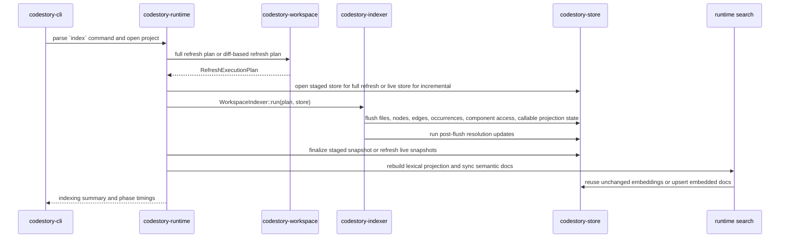
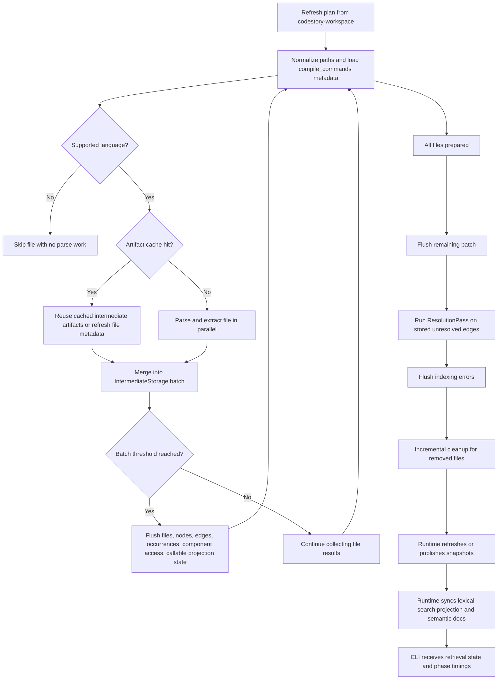

# Indexing Pipeline

This page explains how `codestory-cli index` turns a repository into SQLite-backed graph state, projection rows, and grounding snapshots.

Read this page when you need the implementation mental model. Use the CLI grounding workflows after that if you want live evidence from an indexed workspace.

Default `index` includes semantic docs. A successful run returns only after graph indexing, snapshots, lexical search projection, and persisted semantic docs are synchronized. Semantic work is measured separately in the phase timings instead of being hidden behind a later read command.

## End-To-End Command Path

## Who Owns What

- `codestory-cli` parses the command and renders the indexing summary.
- `codestory-runtime` chooses full versus incremental flow and staged versus live store behavior.
- `codestory-workspace` discovers source files and computes the refresh plan.
- `codestory-indexer` turns the plan into projection writes and post-flush resolution.
- `codestory-store` persists rows, invalidates or refreshes snapshots, publishes staged builds, and stores semantic docs.
- `codestory-runtime` owns the runtime search engine, semantic doc sync, retrieval readiness, and timing surface.

That split is intentional: the runtime orchestrates the run, the indexer performs indexing work, and the store owns persistence mechanics.

## Indexer Phases

## Step By Step

### 1. CLI dispatches the `index` workflow

`crates/codestory-cli/src/main.rs` routes `Command::Index` into `run_index`. The CLI does not index files directly. It builds a runtime context, asks runtime to open the project with the requested refresh mode, and then renders the returned summary.

### 2. Runtime chooses full or incremental indexing

`crates/codestory-runtime/src/lib.rs` owns the orchestration split:

- `index_full` opens a staged store with `SnapshotStore::open_staged`, asks the workspace for a full refresh plan, runs the indexer against the staged store, finalizes the staged snapshot, and then publishes it to the live path
- `index_incremental` opens the live store, collects refresh inputs from stored inventory, builds a diff-based execution plan, runs the same indexer against the live store, and then refreshes live summary and detail snapshots

The indexer does not know whether the store is staged or live.

### 3. Workspace computes the refresh plan

`crates/codestory-workspace/src/lib.rs` decides which files belong in the run:

- `source_files` walks the configured source groups from the workspace manifest, follows directories, applies exclude globs, sorts the result, and removes duplicates
- `build_refresh_plan` compares discovered files against stored inventory

For incremental work, a file is reindexed when:

- it is new
- its modification time is newer than the stored row
- it exists in the store but is marked as not indexed

Files that disappeared from discovery are collected into `files_to_remove`.

### 4. The indexer prepares file work

`WorkspaceIndexer::run` in `crates/codestory-indexer/src/lib.rs` starts by preparing state for the whole run:

- it seeds the symbol table from existing stored node kinds for incremental runs
- it chunks `files_to_index` using batch settings
- it loads parsed compilation metadata from `compile_commands.json` when available
- it picks a language configuration for each file and skips unsupported files before any parse work

Compilation metadata matters mostly for native-language parsing and is part of the artifact-cache key, so changes to compiler flags or include paths can invalidate cached artifacts.

### 5. Artifact cache decides parse versus reuse

`prepare_index_work` checks the index artifact cache before reparsing a file.

The cache key includes:

- the file path
- file bytes
- language queries
- feature-flag values that affect graph shape
- compilation metadata when present

A cache hit can reuse the serialized indexing artifact and turn it back into `IntermediateStorage`. A cache miss sends the file through parse and extract work.

### 6. Parse and extract run in parallel

Cache misses become `PreparedIndexInput` values and are parsed in parallel. Each file produces `IntermediateStorage`, which is the in-memory shape of a future store flush:

- file metadata
- nodes
- edges
- occurrences
- component access
- callable projection state
- impl anchors
- errors

This phase is where the indexer builds unresolved edges and other graph artifacts. Resolution does not happen yet.

### 7. The indexer flushes projection batches

As file results are merged, `WorkspaceIndexer::run` flushes batches once file, node, edge, or occurrence counts cross the configured thresholds.

Projection flushes write more than the core graph:

- files
- nodes
- edges
- occurrences
- component access tuples
- callable projection state

The store flush path invalidates grounding snapshots as part of persistence. That is why the docs should treat projection flush as both a write boundary and a derived-state invalidation boundary.

### 8. Resolution happens after flushes

Once all batched projection data has been flushed, the indexer runs `ResolutionPass`.

That pass:

- loads unresolved call, import, and override edges from the store
- builds candidate indexes
- applies structural strategies first
- uses semantic candidate lookup as a fallback when enabled and supported

Resolution is scoped differently by refresh mode:

- full refresh resolves without a touched-file scope
- incremental refresh limits the pass to touched files

This is why unresolved edges are visible in storage before resolution completes.

### 9. Incremental cleanup removes stale state

Cleanup is split into two pieces for incremental runs:

- before merging new results for a touched file, the indexer may delete stale callable projection rows for that file
- after the resolution pass, the indexer removes files that no longer exist in the workspace

That makes incremental indexing more than just "parse changed files." It also reconciles stale projection state.

### 10. Runtime refreshes or publishes snapshots

The last step belongs to runtime plus store:

- full refresh finalizes a staged build, creates deferred indexes, refreshes the summary snapshot, and publishes the staged database
- incremental refresh stays on the live database and refreshes both summary and detail snapshots in place

Full and incremental snapshot behavior are intentionally not symmetric.

### 11. Runtime synchronizes search and semantic docs

After graph and snapshot work, runtime rebuilds the search-symbol projection, opens or refreshes the persisted Tantivy search directory, and synchronizes semantic symbol docs. This is part of the default `index` contract.

Semantic sync does four pieces of work:

- build the generated text for indexable symbols
- reuse existing embeddings when doc version, generated text hash, embedding model, and embedding dimension still match
- embed only pending docs and upsert them back into SQLite
- prune stale docs that no longer correspond to the refreshed symbol set

Full refresh has an extra copy-forward path: if a previous live database exists, unchanged semantic docs are copied into the staged database before publish. The later semantic sync can then reuse those rows instead of re-embedding them.

Incremental refresh scopes semantic invalidation by touched file. Untouched files keep their existing semantic docs; new, changed, or removed symbols in touched files are embedded or pruned.

The default semantic scope is durable symbols: classes, structs, interfaces, annotations, unions, enums, typedefs, functions, methods, macros, global variables, constants, and enum constants. Lower-signal module, namespace, package, field, local variable, and type-parameter docs stay out of semantic retrieval by default while remaining present in graph and lexical search. Set `CODESTORY_SEMANTIC_DOC_SCOPE=all` to restore the broader semantic doc set for investigations.

Embedding throughput is optimized for the CPU default path:

- pending semantic docs are sorted by generated text length before embedding, which keeps padded ONNX batches close to uniform length
- the default semantic embedding batch size is `64`, with `CODESTORY_LLM_DOC_EMBED_BATCH_SIZE` available for profiling
- ONNX sessions use graph optimization, shared prepacked weights, and a small session pool
- `CODESTORY_EMBED_SESSION_COUNT` controls worker count; the default is bounded by available parallelism and capped at two workers
- `CODESTORY_EMBED_INTRA_THREADS`, `CODESTORY_EMBED_INTER_THREADS`, and `CODESTORY_EMBED_PARALLEL_EXECUTION` expose ONNX CPU tuning
- optional `onnx-cuda` and `onnx-directml` Cargo features enable CUDA or DirectML provider selection through `CODESTORY_EMBED_EXECUTION_PROVIDER`

The repo-scale cold baseline on 2026-04-18 was `38.43s` total index time with `2.92s` graph phase, `32.07s` semantic phase, and `3,690` semantic docs embedded. A repeat full refresh on the same cache was `7.56s` with `3,690` semantic docs reused and `0` embedded. Keep new measurements in [codestory-e2e-stats-log.md](../testing/codestory-e2e-stats-log.md).

## Mental Model

### How files are selected for refresh

`codestory-workspace` is the source of truth for file discovery and diffing. Incremental runs only reindex files whose stored inventory is missing, stale, or marked unindexed.

### When files are skipped

The indexer skips files before parsing when it cannot select a supported language configuration for the path plus compilation metadata.

### How `compile_commands.json` participates

`WorkspaceIndexer::new` looks for a compilation database near the workspace root. When present, parsed compilation info informs language configuration and becomes part of the artifact-cache key.

### Where artifact caching is used

Artifact caching sits inside the indexer before parsing. Cache hits can reuse a file's serialized projection payload; cache misses fall back to parse and extract work.

### What gets written before resolution

Files, nodes, edges, occurrences, component access, and callable projection state are flushed before `ResolutionPass` runs. Resolution then updates unresolved edges using the stored graph state.

### What full refresh publishes that incremental refresh does not

Full refresh builds a staged database and publishes it only after staged finalization succeeds. Incremental refresh never publishes a staged build; it updates the live store and refreshes live snapshots in place.

### How semantic docs are kept fast

Semantic docs are persisted in SQLite with generated-text metadata. Reuse is keyed by schema version, generated text hash, embedding model, and embedding dimension. On full refresh, runtime copies prior semantic docs forward into the staged database before semantic sync checks them. On incremental refresh, runtime passes a touched-file scope so only docs belonging to changed files are rebuilt or pruned.

Cold start still has to embed any semantic doc that has no reusable row. The cold path is kept under control by using the durable-symbol default scope, length-bucketed batches, batch size `64`, and bounded ONNX session parallelism.

### What timing output means

The index summary reports graph and semantic work separately:

- `semantic_ms.doc_build`: generated semantic text and hashes
- `semantic_ms.embedding`: embedding runtime work for pending docs
- `semantic_ms.db_upsert`: SQLite writes for embedded docs
- `semantic_ms.reload`: loading persisted semantic docs into the runtime search engine when needed
- `semantic_docs.reused`: existing docs accepted without embedding
- `semantic_docs.embedded`: docs newly embedded in this run
- `semantic_docs.pending`: docs that needed embedding after reuse checks
- `semantic_docs.stale`: persisted docs pruned because they no longer match the refreshed symbol set

Use these fields before blaming parser, graph, or SQLite code for a slow `index` run.

## How To Debug Indexing

Start with static docs first:

1. [Architecture overview](overview.md)
2. [Runtime execution path](runtime-execution-path.md)
3. [Indexer subsystem](subsystems/indexer.md)
4. [Debugging guide](../contributors/debugging.md)

Then use live tooling if you need workspace-specific evidence:

- `codestory-cli index --project .`
- `codestory-cli search --project . --query <symbol>`
- the repo-local `codestory-grounding` skill in `.agents/skills/codestory-grounding/SKILL.md`

Treat the grounding workflows as follow-up evidence, not the primary explanation. Local grounding and search-state rebuilds can depend on semantic retrieval assets and current machine health, so the architecture docs should remain the first stop when you are learning the pipeline.

## Verification Targets

If you change indexing behavior, review or run the suites that guard it:

- `cargo test -p codestory-indexer --test fidelity_regression`
- `cargo test -p codestory-indexer --test tictactoe_language_coverage`
- `cargo test -p codestory-indexer --test integration`
- targeted resolution suites under `crates/codestory-indexer/tests/`
