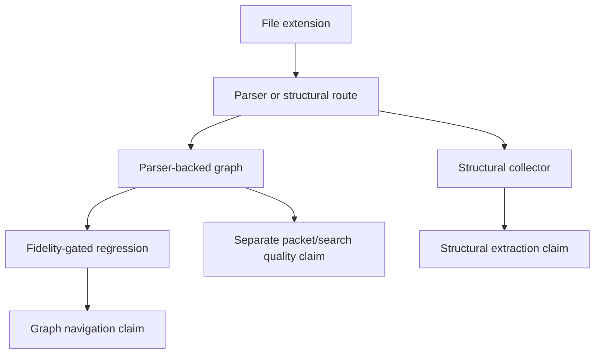
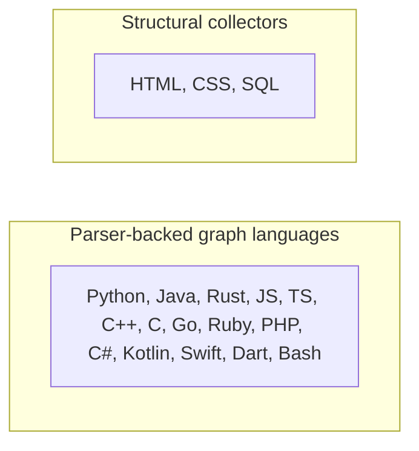

# Language Support Contract

CodeStory uses the word "support" only with a qualifier. Parser routing,
regression evidence, framework route coverage, and agent packet/search quality
are separate claims.

The source of truth for extension ownership, stored-language names, support
modes, evidence tiers, and claim labels is
`crates/codestory-contracts/src/language_support.rs`. The indexer maps those
shared support profiles to parser/rule construction in `get_language_for_ext`.
The shared registry owns public support claims. Workspace discovery also carries
compatibility-only filters for file types that can be scanned or grouped without
being claimed as parser-backed language support.

## Claim Ladder



## Claim Terms

- `parser-backed graph`: the file extension routes to a tree-sitter parser and
  rule asset, and the indexer can emit graph nodes and edges for that language.
- `fidelity-gated`: parser-backed graph support has overlapping regression
  evidence for symbols, imports, calls, member ownership, representable
  inheritance, and resolved-call behavior covered by the fixture suites.
- `semantic-resolution-backed`: the language has explicit semantic resolver
  dispatch and tests for the resolution behavior being claimed. This is a
  narrower claim than parser-backed graph support.
- `structural collector`: the language is indexed by dedicated structural
  collectors, not full tree-sitter graph rules.
- `candidate parser compatibility record`: a parser crate/version was checked
  for possible future use, but that record is not a runtime support claim until
  the language has dependency wiring, rule assets, routing, and fidelity tests.

## Current Matrix

| Runtime claim | Languages | Runtime path | Evidence floor | Safe claim |
| --- | --- | --- | --- | --- |
| Parser-backed graph, fidelity-gated | Python, Java, Rust, JavaScript, TypeScript/TSX, C++, C, Go, Ruby, PHP, C#, Kotlin, Swift, Dart, Bash | tree-sitter parser plus graph rules | fidelity lab, tictactoe coverage, raw graph contracts, targeted rule/resolution suites, and the opt-in OSS language corpus; agent-facing A/B evidence is separate and currently mixed | daily graph navigation on typical code, with language-specific caveats |
| Structural collector | HTML, CSS, SQL | dedicated structural collectors | structural collector tests | structural entity extraction, not semantic code navigation |

Agent-facing packet/search quality is a separate claim from parser-backed graph
support. The current language-expansion A/B report records a mixed full
18-language result and a stronger packet-eligible slice; do not use that report
as blanket promotion proof for every parser-backed language.



The parser-backed graph claim is not a promise that every language has identical
dispatch or semantic-resolution semantics. Typed receiver-call support is
claimed only for the fixture-backed cases named in the indexer regression
suites. Current support covers simple local owner qualified calls where tests
prove the behavior. Cross-package receiver lookup, polymorphic dispatch,
inheritance-heavy target selection, framework-handler resolution, and
declarative parameter extraction require separate fixtures and cannot be used
as product claims until those fixtures pass.

## Parser Compatibility Matrix

This table is a parser-version compatibility record, not a runtime support
claim. Candidate parser crates are judged against the workspace parser-version
policy before they become durable language-support evidence:

- `tree-sitter = "0.24"`
- `tree-sitter-graph = "0.12"`

Validation method: checked candidate parser crates in an isolated temporary probe
crate (outside workspace members) with `tree-sitter = "0.24"`,
`tree-sitter-graph = "0.12"`, and exactly one pinned `<language-parser-crate>`
dependency, then ran `cargo check` for each language.

| Language | Candidate crate | Version checked | `cargo check` with 0.24/0.12 | Decision | Notes |
|---|---|---:|---|---|---|
| Go | `tree-sitter-go` | `0.23.4` | pass (`cargo check` + parse smoke) | crates.io pin | `0.25.0` compiles but fails at runtime with `LanguageError { version: 15 }` on tree-sitter `0.24`. |
| Ruby | `tree-sitter-ruby` | `0.23.1` | pass (`cargo check` + parse smoke) | crates.io pin | Wired in indexer with `rules/ruby.scm`. |
| PHP | `tree-sitter-php` | `0.23.11` | pass (`cargo check` + parse smoke) | crates.io pin | `0.24.2` compiles but fails at runtime with `LanguageError { version: 15 }` on tree-sitter `0.24`. |
| C# | `tree-sitter-c-sharp` | `=0.23.0` | pass (`cargo check` + parse smoke) | crates.io pin | `0.23.5` compiles but fails at runtime with `LanguageError { version: 15 }` on tree-sitter `0.24`. |
| Kotlin | `tree-sitter-kotlin-ng` | `1.1.0` | pass (`cargo check` + parse smoke) | crates.io pin | Wired in indexer with `rules/kotlin.scm`. |
| Swift | `tree-sitter-swift` | `0.7.0` | pass (`cargo check` + parse smoke) | crates.io pin | `0.7.1` and newer tested candidates use ABI 15 and fail at runtime on tree-sitter `0.24`. |
| Dart | `tree-sitter-dart-orchard` | `0.3.2` | pass (`cargo check` + parse smoke) | crates.io pin | Replaces `tree-sitter-dart = 0.2.0`, whose language export uses ABI 15 with tree-sitter `0.24`. |
| HTML | `tree-sitter-html` | `0.23.2` | pass | crates.io pin | Parser is available if structural extraction chooses parser-backed route. |
| CSS | `tree-sitter-css` | `0.25.0` | pass | crates.io pin | Parser is available if structural extraction chooses parser-backed route. |
| SQL | `tree-sitter-sequel` | `0.3.11` | pass | crates.io pin | SQL parser candidate compiles with policy pins. |
| Bash | `tree-sitter-bash` | `0.23.3` | pass (`cargo check` + parse smoke) | crates.io pin | `0.25.x` uses ABI 15 and fails at runtime on tree-sitter `0.24`. |

Current outcome:

- No language in this matrix currently requires a git pin, custom fork, or forced
  text-only fallback for parser-policy compatibility.
- Go, Ruby, PHP, C#, Kotlin, Swift, Dart, and Bash have parser dependencies,
  rule assets, and extension routing wired in the current branch.
- HTML, CSS, and SQL have structural extraction paths, but they are not
  parser-backed rule assets from this matrix.
- New parser candidates should stay on this page as compatibility records until
  they also have dependency wiring, rule assets, language routing, and fidelity
  coverage.

## Route Coverage Is Separate

Framework route extraction has its own confidence labels in
[framework-route-coverage.md](../testing/framework-route-coverage.md). A
language can have parser-backed graph support while a framework remains
partial or heuristic. A route claim needs fixture or real-repo route evidence,
not just a language parser.

## Expansion Checklist

Before adding a new parser-backed language or broader framework claim:

1. Add or update the parser/rule path and extension mapping.
2. Add tictactoe coverage for symbol, import, call, member, and inheritance
   shapes that the language can reasonably represent.
3. Add or update fidelity-lab fixtures for symbols, imports, call edges, and
   any resolution behavior being claimed.
4. Add targeted resolution tests before claiming local receiver-aware,
   polymorphic, cross-package, framework-handler, or owner-qualified call trails.
5. Update `crates/codestory-contracts/src/language_support.rs`, including
   `language_support_profile_for_ext` and
   `language_support_profile_for_language_name`, parser construction such as
   `get_language_for_ext`, and this page in the same change.
6. Add or update the
   [OSS language corpus](../testing/oss-language-corpus.md) entry so the new
   public language-support profile has a pinned medium-sized open source project and
   a raw-without-CodeStory indexing comparison lane.
7. Add or update the `language-expansion-holdout` task manifest so the language
   also has a strict `without_codestory` versus `with_codestory` agent A/B task
   that measures elapsed time, tokens, tool calls, command counts, source reads,
   post-packet source reads, and answer quality.
8. Run the full test binaries, not filtered test names:

   ```sh
   cargo test -p codestory-indexer --test fidelity_regression
   cargo test -p codestory-indexer --test tictactoe_language_coverage
   cargo test -p codestory-indexer --test call_resolution_common_methods
   cargo test -p codestory-indexer --test import_resolution
   cargo test -p codestory-indexer --test query_rule_regressions
   cargo test -p codestory-indexer --test trait_interface_resolution
   ```

9. For broader real-project smoke evidence, run either the OSS corpus dry-run
   manifest check or the relevant full corpus language subset:

   ```sh
   CODESTORY_OSS_CORPUS_DRY_RUN=1 cargo test -p codestory-indexer --test oss_language_corpus -- --ignored --nocapture
   CODESTORY_RUN_OSS_LANGUAGE_CORPUS=1 CODESTORY_OSS_CORPUS_LANGUAGES=python cargo test -p codestory-indexer --test oss_language_corpus -- --ignored --nocapture
   ```

10. For agent-facing evidence, run at least the targeted language task from the
    A/B suite, and run the full suite before making language-wide savings or
    answer-quality claims:

    ```sh
    node scripts/codestory-agent-ab-benchmark.mjs \
      --task-suite language-expansion-holdout \
      --arms without_codestory,with_codestory \
      --repeats 3 --materialize-repos --prepare-codestory-cache \
      --out-dir target/agent-benchmark/language-expansion-holdout \
      --timeout-ms 600000
    ```

11. Before widening typed receiver-call claims, add same-file and cross-file
    fixtures for the target language. If implementation still uses signature
    string slicing, document that as a transitional boundary; prefer a
    tree-sitter-query or global-resolution-backed implementation for new
    claims.
