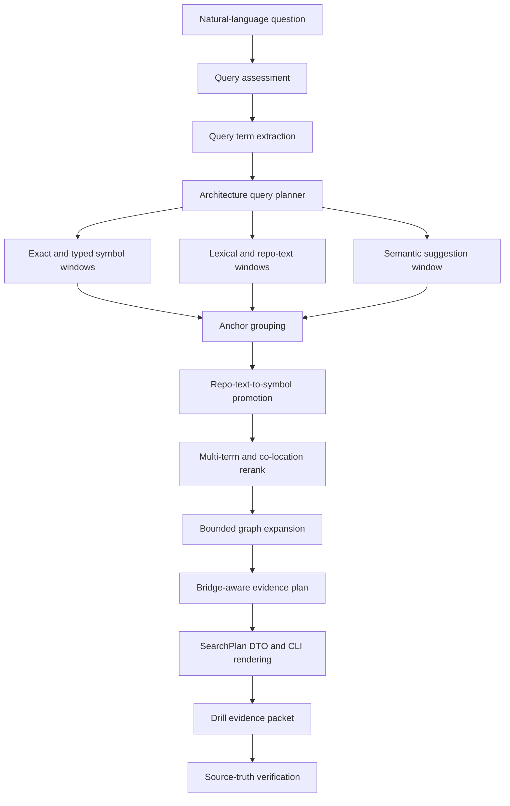

# Natural-Language Search Blueprint

This blueprint covers the next CodeStory search-quality step: broad
natural-language architecture questions should produce a usable evidence plan,
not a flat list of lucky hits. The goal is to make the agent's first pass
grounded enough that source-truth verification checks the answer instead of
rebuilding it from scratch.

## Problem

The real-repo drill exposed a repeatable gap. Exact anchor searches usually
work, but broad questions such as "how does full indexing support search,
trail, and snippet commands" are still too dependent on semantic ranking and
repo-text luck. CodeStory can index the repos and expose evidence, but the agent
has to do too much manual decomposition before `symbol`, `trail`, `snippet`, and
`context` become useful.

The improved path must preserve the current command boundaries:

- `search` is a discovery surface, not an answer surface.
- `context` and `explore` remain target-first evidence packets.
- `drill` remains the end-to-end agent grounding surface with CodeStory-only and
  source-truth phases.
- Source verification is still mandatory for final claims.

## Target Outcome

For a broad natural-language query, CodeStory should return a transparent
`SearchPlan` alongside normal hits:

- decomposed subqueries and dropped terms
- typed anchor groups instead of one flat hit list
- repo-text hits promoted to indexed symbols when possible
- bridge evidence between selected anchors
- explicit uncertainty, truncation, and source-truth next checks

The agent should be able to say, before opening files directly, which anchors
CodeStory believes matter, why those anchors were selected, which relationships
are graph-supported, and which claims are still only leads.

## Flow

## Components

- `QueryTermExtractor`: extracts identifiers, compound terms, CamelCase parts,
  path hints, framework nouns, and relation verbs; reports dropped terms.
- `ArchitectureQueryPlanner`: turns a broad query into bounded subqueries,
  candidate windows, intended anchor roles, and expected bridges.
- `CandidateWindowCollector`: gathers typed symbols, lexical matches, semantic
  suggestions, and repo-text leads in separate windows before truncation.
- `RepoTextAnchorPromoter`: converts file/line leads into indexed symbols where
  possible, while preserving unpromoted leads as source-read-required evidence.
- `BridgeAwareRanker`: scores anchor groups by coverage, co-location,
  multi-term relevance, and graph relationships.
- `EvidencePlanRenderer`: exposes the plan in JSON and `--why` Markdown without
  pretending that discovery evidence is final source truth.
- `SearchQualityGate`: expands the existing search-quality harness with
  architecture-query and real-repo drill fixtures.

## CodeGraph Lessons

This spec uses `colbymchenry/codegraph` commit
`c3f1e273d4c5e7052c8a9ec6bd3109c042f3af8c` as an external design reference.
Adopt the mechanics that improve grounding; do not adopt tool guidance that
weakens CodeStory's verification model.

Adopt:

- hybrid entry-point collection: exact symbols, text/FTS candidates, then merge
  and rerank before graph traversal
- query-term extraction as a tested module
- exact-symbol injection, co-location boosts, and multi-term reranking before
  truncation
- bounded graph expansion with edge recovery after node trimming
- adaptive output budgets and line-numbered evidence packets

Adapt:

- CodeGraph's `context`/`explore` split is useful as a retrieval pattern, but
  CodeStory should keep broad natural-language planning in `search` and `drill`;
  `context` remains target-first.
- Stop words and stemming should be visible in `--why` and JSON instead of
  hidden policy.

Avoid:

- telling agents to trust results without source-truth verification
- making `search` generate answer prose
- letting semantic suggestions outrank exact typed anchors without an explicit
  reason

Reference files:

- CodeStory runtime path: `crates/codestory-runtime/src/lib.rs`
- CodeStory ranking path: `crates/codestory-runtime/src/symbol_query.rs`
- CodeStory CLI drill path: `crates/codestory-cli/src/main.rs`
- CodeGraph context flow:
  https://github.com/colbymchenry/codegraph/blob/c3f1e273d4c5e7052c8a9ec6bd3109c042f3af8c/src/context/index.ts
- CodeGraph query utilities:
  https://github.com/colbymchenry/codegraph/blob/c3f1e273d4c5e7052c8a9ec6bd3109c042f3af8c/src/search/query-utils.ts
- CodeGraph quality loop:
  https://github.com/colbymchenry/codegraph/blob/c3f1e273d4c5e7052c8a9ec6bd3109c042f3af8c/docs/SEARCH_QUALITY_LOOP.md
