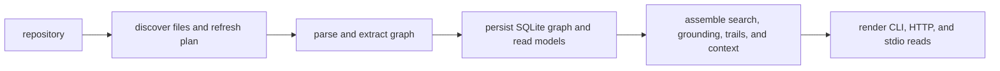
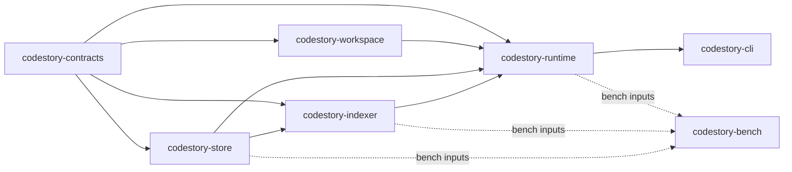

# Architecture Overview

CodeStory has one job: turn a repository into local evidence that a coding agent
can query before relying on a small set of manually opened files.

The runtime path is:

User-visible guarantees come from those boundaries:

- Project evidence is stored in a local per-workspace cache.
- Read commands can report stale, partial, or non-`full` retrieval state.
- CLI rendering stays thin; orchestration belongs to runtime.
- Full refreshes can publish a staged store; incremental refreshes update the
  live store and refresh derived views.
- Search and context output should be traceable back to files, symbols, or
  explicit gaps.

## Layers

The workspace has seven crates: six owning layers plus one support crate for
benchmarks and perf validation.

- `codestory-contracts` defines the shared graph model, DTOs, grounding/trail types, and shared events.
- `codestory-workspace` discovers files, loads `codestory_project.json`, and computes full or incremental refresh plans.
- `codestory-store` owns SQLite schema, graph persistence, snapshot lifecycle, trail queries, bookmark rows, and stored search documents.
- `codestory-indexer` parses files, extracts symbols and edges, flushes batches to the store, and runs semantic resolution.
- `codestory-runtime` orchestrates indexing, search, grounding, trail building, project summaries, and agent flows.
- `codestory-cli` is the thin command adapter that parses args, calls runtime services, and renders text or JSON.
- `codestory-bench` measures indexing, grounding, resolution, and cleanup-sensitive paths without owning product behavior.

## Dependency Direction

The intended dependency flow is:

`contracts -> workspace / store / indexer -> runtime -> cli`

Important rules:

- `workspace` does not depend on the store or runtime.
- `indexer` depends on `store`, not the reverse.
- `runtime` is the only orchestration layer.
- `cli` does not import indexing or storage crates directly.
- `bench` can depend on runtime-facing crates for measurement, but it does not define product contracts.

## Operating Constraints

- Keep the public command surface centered on grounding, target context,
  navigation, health, and serving workflows.
- Add shared graph, DTO, grounding, and event types to `codestory-contracts`, not
  to adapter crates.
- Put source-of-truth persistence and snapshot lifecycle in `codestory-store`.
- Keep rendering and argument parsing in `codestory-cli`; orchestration belongs
  in `codestory-runtime`.
- When behavior changes, update the owning subsystem page instead of layering a
  migration-only guide on top.

## Where To Start

- Product mental model: [../concepts/how-codestory-works.md](../concepts/how-codestory-works.md)
- System behavior: [runtime-execution-path.md](runtime-execution-path.md)
- Indexing lifecycle: [indexing-pipeline.md](indexing-pipeline.md)
- Ownership details: [subsystems/contracts.md](subsystems/contracts.md), [subsystems/workspace.md](subsystems/workspace.md), [subsystems/indexer.md](subsystems/indexer.md), [subsystems/store.md](subsystems/store.md), [subsystems/runtime.md](subsystems/runtime.md), [subsystems/cli.md](subsystems/cli.md)
- Historical context: [../decision-log.md](../decision-log.md)
