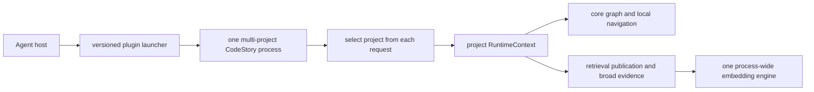
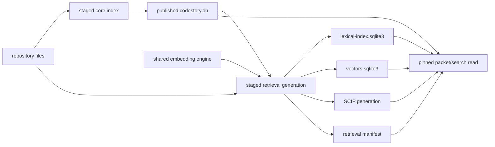
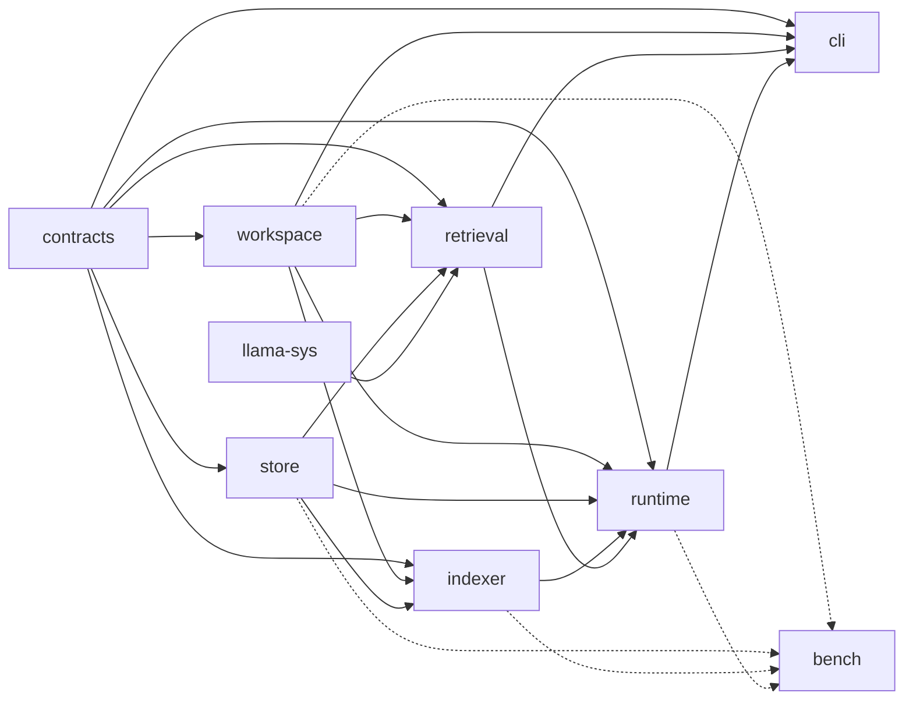

# Architecture Overview

CodeStory is one local executable that turns a checkout into cited graph and
retrieval evidence. A host plugin may provision the matching executable, but
the executable owns indexing, retrieval, and serving. The CodeRankEmbed Q8
model and accelerator backend are compiled into the release; runtime work does
not depend on Docker, an embedding server, a port, or a user-managed service.

## Runtime topology

The launcher provisions only the exact CodeStory executable required by the
installed plugin. It validates the archive, checksum, version, and stdio
handshake, then hands requests to that executable. It does not provision a
model or backend separately.

Every MCP request carries an absolute project root. The stdio process retains
one isolated runtime context per project while all projects share one lazily
initialized model and accelerator context. Hook-written active-project files
are diagnostics; they never route requests.

## Data topology

Core and retrieval publication are separate fences. The core publication owns
the graph, snapshots, search documents, and reusable dense-anchor rows. A
retrieval generation binds one core publication to immutable lexical, vector,
and SCIP artifacts plus the embedding producer identity. A successful core
refresh does not by itself make broad retrieval ready.

Writers stage and validate complete candidates before publication. Readers
require one coherent `RetrievalPublicationIdentity`, hold the relevant core
read and generation leases during resolution, then revalidate before returning.
Concurrent publication produces one bounded retry rather than mixed-generation
evidence.

## Identity scopes

| Scope | Identity and state | Lifetime |
| --- | --- | --- |
| Process | captured startup defaults and one embedding engine | one CLI or stdio process |
| Project | repository identity, cache namespace, immutable runtime config | retained across requests in multi-project stdio |
| Publication | core generation/run plus retrieval generation/input/producer | one atomic old-or-new published view |
| Request | explicit project, tool arguments, task and retry budget | one tool or CLI call |

These scopes are deliberately independent. A path spelling does not replace
repository identity, a process-global active project does not route a request,
and `retrieval_mode=full` does not replace live engine and publication checks.

## Workspace crates

The workspace has nine crates: eight product layers and one measurement crate.

- `codestory-contracts` defines shared graph types, DTOs, events, readiness,
  publication, and language-support contracts.
- `codestory-workspace` owns discovery, repository identity, refresh planning,
  atomic files, and owned deletion.
- `codestory-store` owns SQLite schema, read snapshots, durable promotion, core
  publication, and persisted graph/search state.
- `codestory-indexer` parses and extracts graph projections, then resolves
  stored edges.
- `codestory-llama-sys` compiles the pinned CodeRankEmbed Q8 model and
  llama.cpp/ggml engine into the executable.
- `codestory-retrieval` owns immutable lexical/vector/SCIP generations,
  manifests, engine integration, health, retention, and fail-closed queries.
- `codestory-runtime` is the only product orchestration layer.
- `codestory-cli` parses and renders CLI, HTTP, and stdio adapters.
- `codestory-bench` measures product paths without defining product behavior.

The intended direction is
`contracts -> workspace/store/indexer/llama-sys/retrieval -> runtime -> cli`.
The exact dependency edges are shown above; bench may depend on product crates
for measurement.

## Read next

- Host and plugin lifecycle: [host-integration.md](host-integration.md)
- Per-request orchestration: [runtime-execution-path.md](runtime-execution-path.md)
- Core indexing: [indexing-pipeline.md](indexing-pipeline.md)
- Retrieval publication and readiness: [retrieval-design.md](retrieval-design.md)
- Language claim tiers: [language-support.md](language-support.md)
- Crate ownership: [subsystems/](subsystems/)
