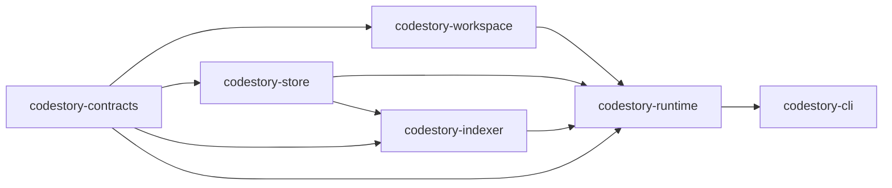

# Architecture Overview

CodeStory has one delivery path and six owning layers.

## Layers

- `codestory-contracts` defines the shared graph model, DTOs, grounding/trail types, and shared events.
- `codestory-workspace` discovers files, loads `codestory_project.json`, and computes full or incremental refresh plans.
- `codestory-store` owns SQLite schema, graph persistence, snapshot lifecycle, trail queries, bookmark rows, and stored search documents.
- `codestory-indexer` parses files, extracts symbols and edges, flushes batches to the store, and runs semantic resolution.
- `codestory-runtime` orchestrates indexing, search, grounding, trail building, project summaries, and agent flows.
- `codestory-cli` is the thin command adapter that parses args, calls runtime services, and renders text or JSON.

## Dependency Direction

The intended dependency flow is:

`contracts -> workspace / store / indexer -> runtime -> cli`

Important rules:

- `workspace` does not depend on the store or runtime.
- `indexer` depends on `store`, not the reverse.
- `runtime` is the only orchestration layer.
- `cli` does not import indexing or storage crates directly.

## Where To Start

- System behavior: [runtime-execution-path.md](runtime-execution-path.md)
- Ownership map: [crate-map.md](crate-map.md)
- Constraints: [invariants.md](invariants.md)
- Failure patterns: [failure-modes.md](failure-modes.md)
