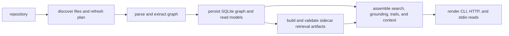
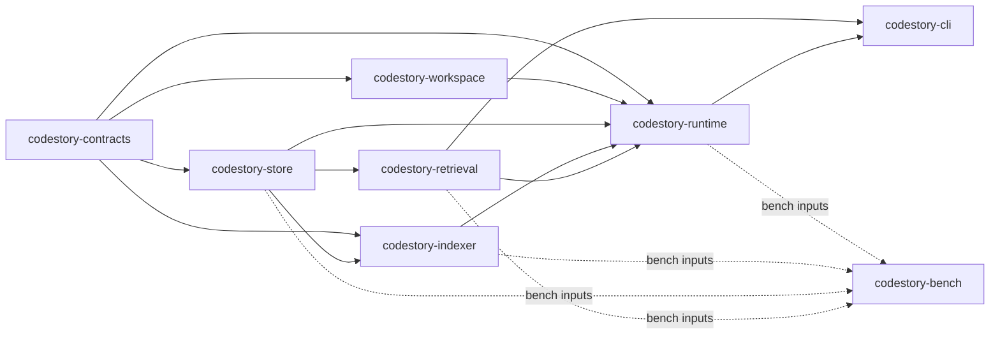

# Architecture Overview

**Situation.** You are changing CodeStory, not just running the CLI on a repo.

**Task.** Know which crate owns indexing, storage, retrieval, and CLI output so
you do not put SQL in the wrong layer.

**Action.** Follow the runtime path and dependency diagram below before editing.

**Result.** Changes land in the owning crate; product behavior stays traceable
from files and symbols back to the graph and sidecar manifest.

User-facing intro: [README](../../README.md). Operator flows: [usage.md](../usage.md).

The runtime path is:

User-visible guarantees come from those boundaries:

- Project evidence is stored in a local per-workspace cache.
- Read commands can report stale, partial, or non-`full` retrieval state.
- CLI rendering stays thin; orchestration belongs to runtime.
- Full refreshes can publish a staged store; incremental refreshes update the
  live store and refresh derived views.
- Search, packet, and context output should be traceable back to files,
  symbols, sidecar readiness, or explicit gaps.

## Layers

The workspace has eight crates: seven owning layers plus one support crate for
benchmarks and perf validation.

- `codestory-contracts` defines the shared graph model, DTOs, grounding/trail types, and shared events.
- `codestory-workspace` discovers files, loads `codestory_project.json`, and computes full or incremental refresh plans.
- `codestory-store` owns SQLite schema, graph persistence, snapshot lifecycle, trail queries, bookmark rows, and stored search documents.
- `codestory-indexer` parses files, extracts symbols and edges, flushes batches to the store, and runs semantic resolution.
- `codestory-retrieval` owns mandatory sidecar retrieval contracts: Zoekt/Qdrant/SCIP health, sidecar manifests, product embedding backend checks, and fail-closed query execution.
- `codestory-runtime` orchestrates indexing, search, grounding, trail building, project summaries, and agent flows.
- `codestory-cli` is the thin command adapter that parses args, calls runtime or retrieval services, and renders text or JSON.
- `codestory-bench` measures indexing, grounding, resolution, and cleanup-sensitive paths without owning product behavior.

## Dependency Direction

The intended dependency flow is:

`contracts -> workspace / store / indexer / retrieval -> runtime -> cli`

Important rules:

- `workspace` does not depend on the store or runtime.
- `indexer` depends on `store`, not the reverse.
- `retrieval` depends on `store` and owns sidecar artifacts; runtime and CLI call it instead of reimplementing sidecar rules.
- `runtime` is the only orchestration layer.
- `cli` does not import indexing or storage crates directly.
- `bench` can depend on runtime-facing crates for measurement, but it does not define product contracts.

## Operating Constraints

### Browser surface gate

Status: deferred.

`codestory-cli` `explore` and `serve --stdio` remain the current browser
surfaces. Do not add a new `browse` command, web UI route, or browser-specific UI
until all of the gates below have current evidence in the repo.

Before starting web UI work:

- Tool, resource, and prompt manifests must be stable under stdio catalog tests.
- HTTP and stdio browser contracts must stay aligned with the read-only browser
  service.
- Warm stdio/browser-loop p50, p95, and p99 timings must be recorded and must
  meet the active Current Promotion Budget in
  `docs/testing/codestory-stdio-warm-loop-stats.md`: small-fixture smoke p95
  stays under the smoke budget, and a current real-repo run meets the Web
  Cockpit Promotion Budget.
- Browser stress lanes must pass at the intended scale, and synthetic evidence
  must not be treated as real-repository promotion proof.
- `explore` must demonstrate the browser workflow in JSON/Markdown and
  keyboard-first TUI paths.
- Screenshot-visible review must be planned before implementation, with one
  reviewer for the full viewport and one reviewer for the changed surface or
  acceptance path.

Evidence sources: `crates/codestory-cli/tests/stdio_protocol_contracts.rs`,
`crates/codestory-cli/tests/http_transport_contracts.rs`,
`crates/codestory-cli/tests/stdio_warm_loop_stats.rs`,
`docs/testing/codestory-stdio-warm-loop-stats.md`,
`docs/testing/codestory-stress-lanes.md`, and
`crates/codestory-cli/tests/cli_golden_path.rs`.

If the gates are satisfied, start with a written implementation plan that names
why the new surface is not a duplicate of `explore`, the exact routes or
commands to add, the screenshot-visible review loop, and the rollback path.

### Layer boundaries

- Keep the public command surface centered on grounding, target context,
  navigation, health, and serving workflows.
- Add shared graph, DTO, grounding, and event types to `codestory-contracts`, not
  to adapter crates.
- Put source-of-truth persistence and snapshot lifecycle in `codestory-store`.
- Keep rendering and argument parsing in `codestory-cli`; orchestration belongs
  in `codestory-runtime`.
- When behavior changes, update the owning subsystem page instead of layering a
  migration-only guide on top.

## Where To Start

- Product mental model: [../concepts/how-codestory-works.md](../concepts/how-codestory-works.md)
- System behavior: [runtime-execution-path.md](runtime-execution-path.md)
- Indexing lifecycle: [indexing-pipeline.md](indexing-pipeline.md)
- Language support claims: [language-support.md](language-support.md)
- Ownership details: [subsystems/contracts.md](subsystems/contracts.md), [subsystems/workspace.md](subsystems/workspace.md), [subsystems/indexer.md](subsystems/indexer.md), [subsystems/store.md](subsystems/store.md), [subsystems/runtime.md](subsystems/runtime.md), [subsystems/cli.md](subsystems/cli.md)
