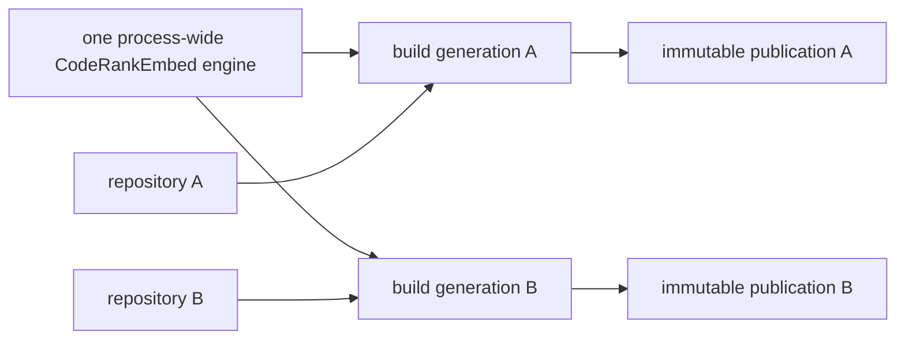
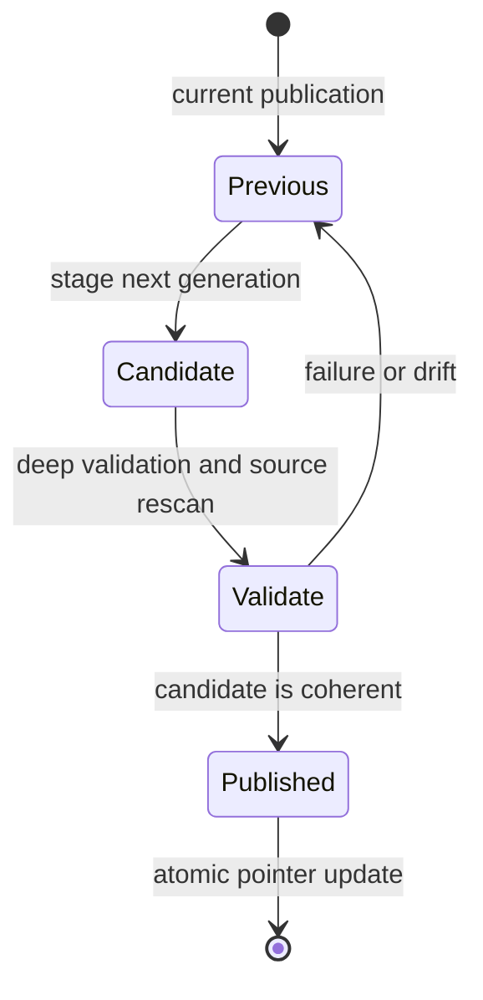

# Retrieval Design

CodeStory serves packet/search evidence only when one current core publication,
one complete retrieval generation, and one live embedding engine agree.
Artifact completeness, producer identity, and live execution are separate
proofs; none can substitute for another.

## Engine scope

Release executables contain the checksum-pinned CodeRankEmbed Q8 GGUF model and
statically linked llama.cpp/ggml implementation. The process materializes
the model atomically to a verified content-addressed cache file when mmap is
required. Retrieval performs no runtime model, backend, or helper download.
Development builds may deliberately omit the embedded model; they cannot claim
product retrieval readiness.

One lazily initialized engine serves every project in a multi-project stdio
process. Initialization freezes process-level cache-root and CPU-policy
compatibility; a later project cannot silently reconfigure the shared engine.
One-shot CLI processes pay cold initialization themselves.

The existing model worker also owns residency. It keeps the verified backend,
model, and context warm while requests are active, then drops all three after
60 seconds without a completed request or publication lease. The lightweight
worker and its last verified identity remain. A later product request reloads
the content-addressed model, reruns the timed accelerator smoke, and continues
without a download, repair command, or consent step.

The engine has one model worker with bounded interactive-query and bulk queues.
Interactive queries take priority, including between bulk batches. Embedding
uses the pinned CodeRank tokenizer, the
`Represent this query for searching relevant code: ` query prefix, no document
prefix, CLS pooling, L2 normalization, 768-dimensional vectors, and the product
batching contract.

| Environment | Backend policy |
| --- | --- |
| Apple Silicon macOS | verified Metal acceleration |
| Windows | verified Vulkan acceleration |
| Linux | verified Vulkan only where protected hardware evidence exists |
| Hosted CI or maintainer diagnostic | CPU only with `CODESTORY_EMBED_ALLOW_CPU=1` |

There is no silent GPU-to-CPU fallback. Software adapters such as llvmpipe,
lavapipe, WARP, and SwiftShader do not satisfy accelerated policy.

## Per-project artifact layout

Each project cache contains a core `codestory.db` and immutable retrieval
generations:

- lexical source and virtual-document data in `lexical-index.sqlite3`;
- semantic vectors and metadata in `vectors.sqlite3`;
- a generation-bound SCIP artifact;
- a manifest binding those artifacts to core, source, schema, and producer
  identities.

The core database also retains graph-native symbol documents, component reports,
and reusable embedding-free dense-anchor rows. Each row carries its content
hash, selection policy, source provenance, and exact core generation/run
identity. Those rows are inputs to retrieval publication, not a replacement for
the published vector generation.

Model state is shared for efficiency; source, vectors, manifests, identities,
and retention remain project-owned.

## Publication identity

`RetrievalPublicationIdentity` carries:

- core `generation_id` and `run_id`;
- retrieval generation and input hash;
- semantic generation.

The manifest additionally records lexical/source fingerprints, graph artifact
identity, counts, schema and policy versions, and a versioned embedding producer
evidence contract. That evidence binds model bytes and tokenizer/config
digests, dimensions and query/document semantics, engine build/backend/device,
live execution eligibility, and the exact core/retrieval/vector publication.
A changed compatibility identity causes one transparent generation rebuild; it
does not select a legacy engine or reuse ambiguous rows.

Some stable DTOs and internal types still use `sidecar` or
`sidecar_generation` names. These are compatibility vocabulary for the
project-local retrieval publication, not evidence of an external service.

## Writer protocol

1. Read the current core publication and complete source inventory.
2. Build lexical, vector, and SCIP artifacts in a candidate generation.
3. Deep-validate schemas, row relationships, vectors, source identity, and
   producer identity.
4. Enter the publication fence and rescan the lexical source/input fingerprint.
5. Reject drift and leave the previous generation active, or atomically publish
   the complete candidate and manifest.

The writer holds one embedding residency lease from backend validation through
candidate publication. The lease pins the owner and load generation, so the
idle policy cannot divide one publication across two runtime instances.

Failure, cancellation, incomplete discovery, or source drift never authorizes a
partial publication or deletion inferred from absence. Retention removes only
proved CodeStory-owned generations through the shared handle-relative deletion
boundary.

Until the final pointer update, readers continue to use `Previous`. A rejected
candidate never weakens the last known-good publication.

## Reader protocol

1. Open one matching core SQLite read transaction.
2. Validate the immutable manifest, exact vector database bytes and canonical
   row digest, anchor coverage, producer evidence, and live engine identity.
3. Retain the referenced lexical/vector/SCIP generations and engine residency.
4. Execute candidate work and resolve files, roles, and node IDs through that
   same session.
5. Revalidate current core, retrieval, and engine identities before returning.

Query and resolution share one pinned session; they never reopen “whatever is
current” for numeric candidate resolution. A publication change yields the
typed `publication_changed` error and permits one whole-operation runtime retry.
One pinned retrieval session covers sidecar query execution and numeric
candidate resolution. Higher-level graph, source, packet, agent, CLI, and MCP
assembly is not yet part of that proof boundary and must not describe the
session identity as a complete-operation pin.

## Readiness

`retrieval_mode=full` means the persisted retrieval artifacts form a complete
publication. Broad agent surfaces additionally require:

- a current core and source identity;
- the exact in-process producer identity;
- a current or automatically restorable timed embedding smoke;
- `accelerated` or explicitly permitted `cpu_explicit` policy;
- an allowed packet/search/context surface.

This preserves the wire contract while preventing a full manifest from
overriding unavailable live execution. Normal plugin output reports that
retrieval is ready, preparing, or unavailable. Backend, adapter, model, and
timing details stay in maintainer diagnostics.

Status and doctor observe this state. A broad product call may initialize the
engine and build a missing generation automatically; it never asks the user to
approve or repair an internal subsystem.

Sleeping is healthy because the owner, packaged model, immutable policy, and
last verified adapter identity remain available for automatic wake. A failed
wake records the load error and blocks broad retrieval until a later product
request proves a successful reload.

## Ownership and evidence

`codestory-retrieval` owns artifact construction, manifest health, query
execution, retention, and engine integration. `codestory-runtime` owns when to
prepare retrieval and how to assemble product evidence. See
[retrieval subsystem](subsystems/retrieval.md),
[llama-sys subsystem](subsystems/llama-sys.md), and
[retrieval verification](../testing/retrieval-architecture.md).
