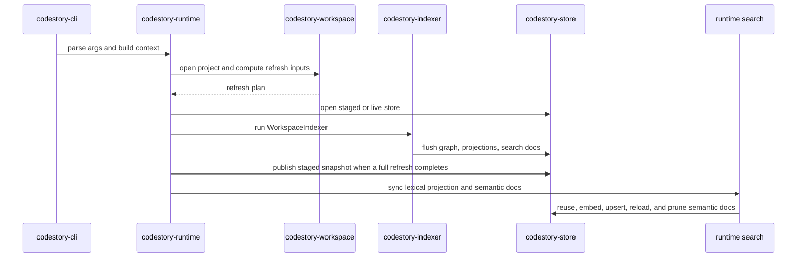
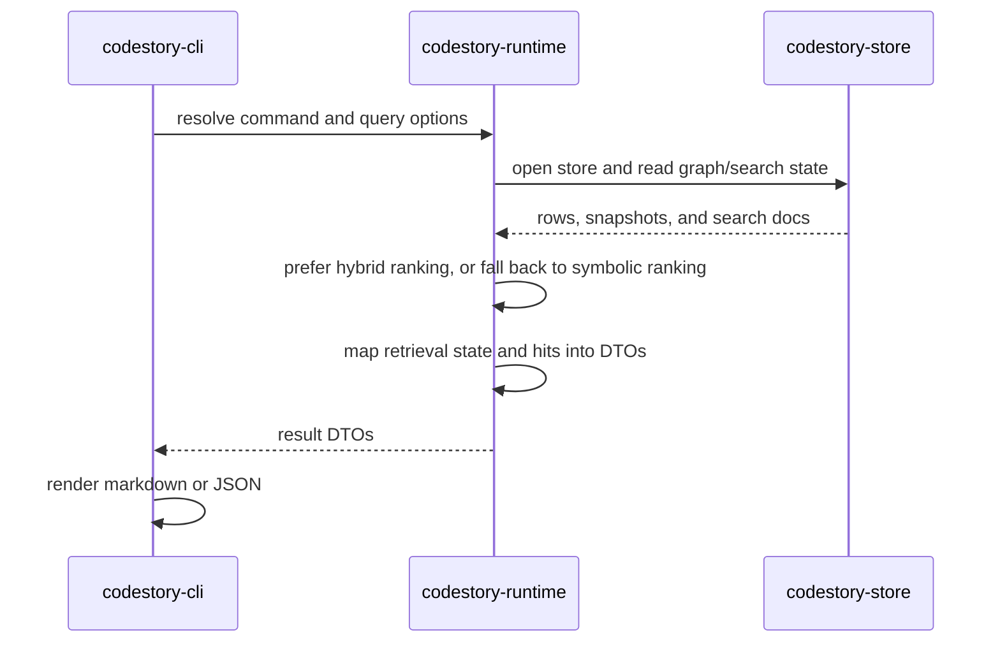
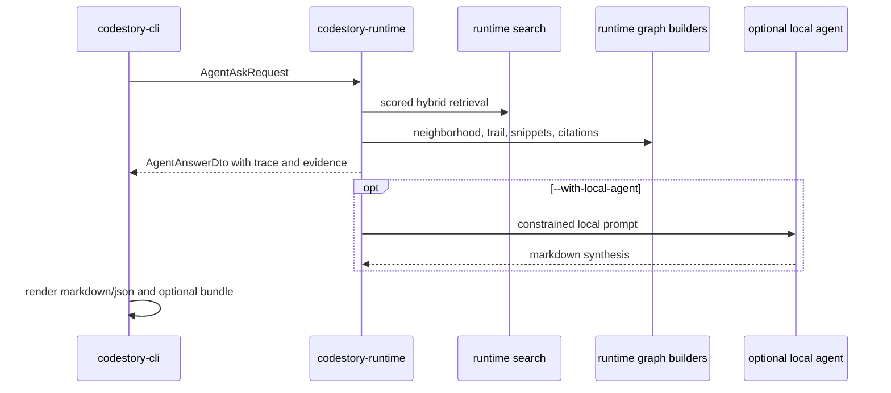
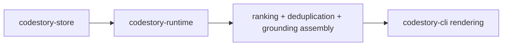

# Runtime Execution Path

This page describes the current command path for the core CLI workflows:
`index`, `ground`, `search`, `ask`, `symbol`, `trail`, `snippet`, `explore`,
`serve`, and `doctor`.

## Index Command

1. `codestory-cli` parses the request and builds a runtime context.
2. `codestory-runtime` opens the project root, store path, and workspace manifest.
3. `codestory-workspace` computes the refresh plan from discovery plus stored file inventory.
4. `codestory-runtime` opens a staged or live store depending on refresh mode.
5. `codestory-indexer::WorkspaceIndexer` parses files, extracts graph artifacts, flushes projection batches, and runs resolution.
6. `codestory-store` updates graph rows, occurrence rows, callable projection state, search-doc rows, and snapshot invalidation state.
7. Runtime finalizes staged builds through `SnapshotStore` and publishes the finished snapshot when a full refresh completes.
8. Runtime refreshes the search-symbol projection and synchronizes semantic docs before returning the index summary.

Default index runs do not defer semantic docs. When embedding assets are available, the returned retrieval state should have `semantic_ready = true` and a non-zero semantic doc count. If semantic assets are missing or hybrid retrieval is disabled, runtime still completes graph and lexical state and reports the fallback reason.

## Search Command

1. CLI resolves the project and query options.
2. Runtime opens the store and ensures runtime-owned search state is available.
3. Runtime search prefers hybrid ranking when semantic docs and a local embedding runtime are ready.
4. When semantic retrieval is unavailable, runtime falls back to symbolic ranking and records the fallback reason in the DTO surface.
5. Runtime maps retrieval state plus matches into contract DTOs and CLI renders them.

When `search --why` is requested, the CLI renders compact explanations from the
same DTO surface: origin, fallback state, and lexical/semantic/graph score
breakdowns when runtime produced hybrid scored hits.

## Ask Command

`ask` is DB-first by default. It runs runtime-owned retrieval planning and answer
packet assembly without invoking an external process. `--with-local-agent`
opts into a local Codex or Claude command after the indexed evidence packet has
been built.

## Ground, Symbol, Trail, and Snippet Commands

1. CLI resolves the project root plus any query or location inputs.
2. Runtime reads graph rows, occurrences, trail data, search docs, or snapshot digests from the store.
3. Runtime adds ranking, deduplication, and grounding-specific assembly on top of store-owned state.
4. CLI formats the resulting DTOs without reimplementing orchestration.

`explore` composes the same symbol, trail, and snippet DTOs into one bundled
view and now adds definition plus incoming/outgoing reference metadata. `serve`
reuses the same runtime calls for `/definition`, `/references`, `/symbols`, and
stdio MCP-style resources/prompts/tools. `doctor` opens the project summary and
reports cache/index/retrieval health without mutating state.

## Ownership Notes

- The runtime layer owns orchestration and search assembly.
- The indexer layer owns parse/extract/resolve behavior.
- The store layer owns persistence and snapshot lifecycle.
- The CLI layer owns rendering only.
- The contracts layer defines the DTOs and graph types that move between these layers.
