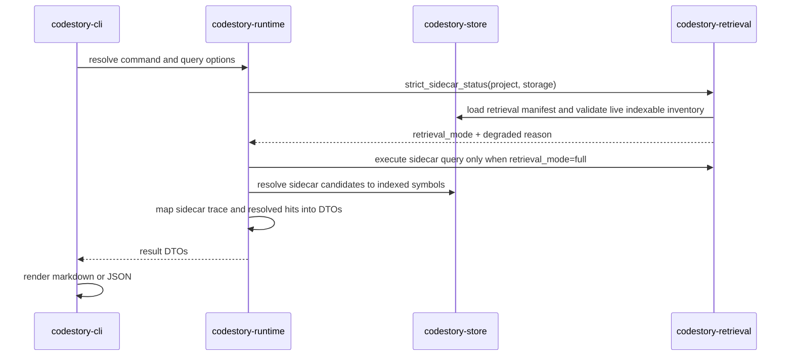
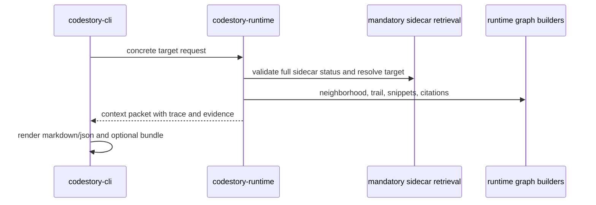
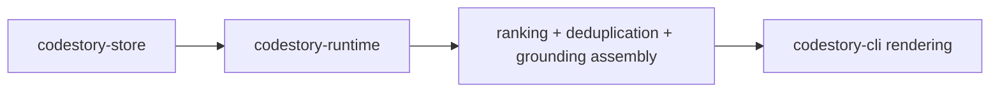

# Runtime Execution Path

This page describes the current command path for the core CLI workflows:
`index`, `ground`, `search`, `context`, `symbol`, `trail`, `snippet`, `explore`,
`serve`, and `doctor`.

## Index Command

See [indexing pipeline](indexing-pipeline.md) for the full indexing lifecycle,
refresh modes, and staged snapshot publish path.

At runtime, `codestory-cli` delegates to `codestory-runtime`, which opens the
workspace refresh plan, runs `codestory-indexer::WorkspaceIndexer`, flushes graph
and search projections through `codestory-store`, and synchronizes symbol docs,
component reports, and selected dense anchors before returning the index summary.

Default index runs do not defer symbol docs. When embedding assets are available, the returned retrieval state reports the selected dense-anchor corpus for `graph_first_v1`; that corpus may be zero for graph-only projects. If embedding assets are missing, runtime still completes graph, lexical, symbol-doc, and component-report state and reports the degraded-state reason instead of pretending dense retrieval is ready.

## Search Command

1. CLI resolves the project and query options.
2. Runtime asks `codestory-retrieval` for sidecar status before serving results.
3. Retrieval status loads the stored retrieval manifest, applies stale-manifest checks, and reports the exact degraded reason before any healthy sidecar probe can bless an invalid manifest.
4. `retrieval_mode = full` is the only product-serving search path. Missing, stale, partial, or non-product sidecar state fails closed with the degraded reason.
5. Runtime executes the mandatory sidecar query in AST-first order: exact symbol/AST lookup, lexical source and virtual-doc search, graph expansion, then dense-anchor augmentation. It resolves returned candidates back into indexed symbols and rejects unresolved or non-full candidate sets before returning product hits.
6. Hybrid semantic state, repo-text matches, and local lexical search are diagnostic/navigation surfaces only; they are not a product fallback for `search`.
7. For broad architecture-style queries, runtime may assemble a Search Plan with extracted/dropped terms, bounded subqueries, candidate windows, anchor groups, bridge evidence, next commands, and source-truth checks.
8. Runtime maps retrieval state plus resolved sidecar matches into contract DTOs and CLI renders them.

When `search --why` is requested, the CLI renders compact explanations from the
same DTO surface: sidecar origin, degraded/fail-closed state, candidate
provenance (`exact`, `lexical_source`, `symbol_doc`, `graph_neighbor`,
`component_report`, `dense_anchor`),
resolution details, and the Search Plan when the broad-query planner emitted
one. Legacy hybrid score details may appear only as diagnostic data from
non-serving paths.

## Context Command

`context` is target-first. The CLI resolves `--id`, `--query`, or `--bookmark`
to one concrete target. Query target selection may use read-only indexed-symbol
resolution to choose that target, but context answer/evidence retrieval still
fails closed unless strict sidecar status reports `retrieval_mode = full`.
Runtime then builds the deep evidence packet from graph neighborhoods, trails,
snippets, and citations. It is not a question-answering command and does not
interpret broad natural-language prompts. Repo-text or hybrid state can guide
diagnostics, but `retrieval_mode = full` sidecar evidence is the only
product-serving retrieval state.

## Ground, Symbol, Trail, and Snippet Commands

1. CLI resolves the project root plus any query or location inputs.
2. Runtime reads graph rows, occurrences, trail data, search docs, or snapshot digests from the store.
3. Runtime adds ranking, deduplication, and grounding-specific assembly on top of store-owned state.
4. CLI formats the resulting DTOs without reimplementing orchestration.

`explore` composes the same symbol, trail, and snippet DTOs into one bundled
view and now adds definition plus incoming/outgoing reference metadata. `serve`
reuses the same runtime calls for `/definition`, `/references`, `/symbols`, and
stdio MCP-style resources/prompts/tools. `doctor` opens the project summary and
reports cache/index/retrieval health without mutating state.

`explore` remains the browser surface until the
[browser surface gate](overview.md#browser-surface-gate) is satisfied. Do not add a
separate `browse` command, web UI route, or browser-specific UI without
current manifest, warm-loop, stress-lane, explore, and screenshot-review
evidence.

## Ownership Notes

- The runtime layer owns orchestration and search assembly.
- The indexer layer owns parse/extract/resolve behavior.
- The store layer owns persistence and snapshot lifecycle.
- The CLI layer owns rendering only.
- The contracts layer defines the DTOs and graph types that move between these layers.
