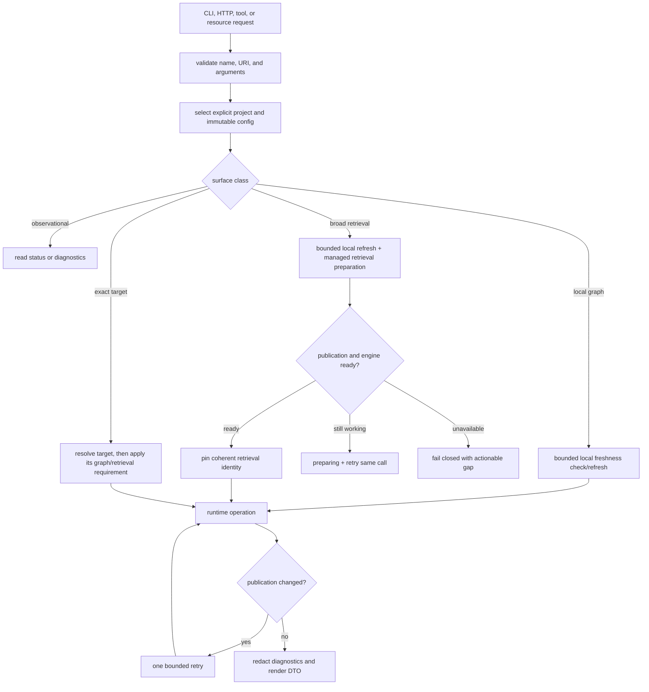
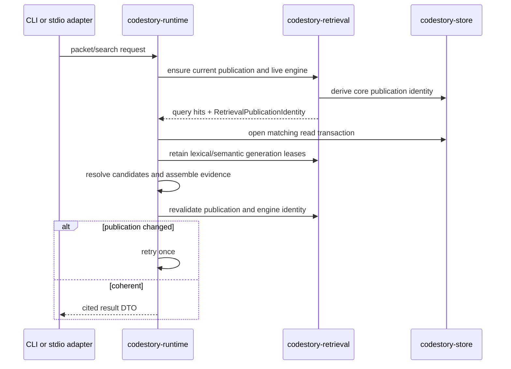

# Runtime Execution Path

CodeStory routes CLI, HTTP, and MCP calls through the same product boundaries.
The adapter validates and renders; `codestory-runtime` orchestrates; the owning
workspace, store, indexer, and retrieval crates enforce their state contracts.

## Request state machine

Validation precedes activation. An unknown resource or malformed request cannot
refresh a project, initialize the engine, or mutate status state.

## Surface classes

| Class | Examples | May activate work | Required state |
| --- | --- | --- | --- |
| Observational | `status`, `doctor`, retrieval-engine diagnostics | No | readable current state |
| Local graph | `ground`, `files`, `symbol`, `callers`, `trail`, `snippet` | bounded local refresh | current core publication for the requested surface |
| Broad retrieval | `packet`, `search`, broad query-based `context` | local refresh, engine init, retrieval finalization | coherent retrieval publication and live policy-compliant engine |
| Exact target | definition/reference/node and focused context calls | only what the selected operation needs | resolved target plus its declared readiness |

`ground` is the normal first call. It can return a useful local repository map
after the bounded graph refresh while managed broad-retrieval preparation
continues. A later `packet` or `search` call either completes that preparation,
returns `preparing` for a bounded retry, or reports an environment gap. There is
no user-facing sidecar setup or repair decision.

## Core indexing

An explicit `index` request delegates to runtime, which asks
`codestory-workspace` for a complete or incremental refresh plan,
`codestory-indexer` to parse and resolve projections, and `codestory-store` to
publish or refresh the core database. Runtime then synchronizes graph-native
symbol documents and reusable dense-anchor rows.

This publishes core state, not the immutable retrieval generation. Normal
agent activation or an explicit retrieval index operation may next finalize
lexical, vector, and SCIP artifacts against that core publication. See the
[indexing pipeline](indexing-pipeline.md).

Managed activation enters through the summary-only core reader. It does not
require the derived search generation that activation may need to repair. Once
core freshness and the dense-anchor publication are coherent, runtime takes the
project writer and search-generation locks, validates the generation against
the exact core publication, rebuilds missing or corrupt search state, and
publishes its completion marker last. The normal project reader remains
fail-closed and never performs this repair.

## Broad retrieval read

Query execution and candidate resolution use one retrieval-owned pinned session
holding the matching core read transaction, immutable generation leases,
manifest/evidence identity, and engine residency. Numeric node IDs are accepted
only through that session. A concurrent publish returns typed
`publication_changed` to the whole-operation bounded retry instead of resolving
an old candidate against a new graph.

`retrieval_mode=full` records the artifact classification. Serving additionally
requires a current manifest, matching producer identity, live embedded engine,
and allowed surface. The mode string alone cannot bless dead or mismatched
infrastructure.

## Local and exact-target reads

Runtime reads graph rows, occurrences, trails, search documents, or grounding
snapshots from `codestory-store` and assembles contract DTOs. `explore` and
`serve` reuse those services; adapters do not open SQLite or invent product
fallbacks. When broad retrieval is unavailable, local graph tools can remain
usable, but their output must not be presented as a full packet/search result.

Packet callers may supply tagged probes for an exact project-relative path,
stable symbol ID, file-scoped symbol, free query, or continuation. CLI and
stdio normalize those forms and legacy string probes into the same runtime
resolver. Workspace owns native path containment; runtime resolves exact paths
and IDs before fuzzy discovery and returns ordered ambiguity candidates rather
than choosing one. A valid source file outside graph coverage remains a
`valid_uncovered_path`, and source-range-only text remains distinct from an
indexed symbol.

Continuation probes carry the probe contract version, project identity, core
generation, and optional retrieval generation. Runtime rejects a continuation
when any bound identity differs from the selected public operation. Resolved
probe queries may add packet evidence work, but they do not change task-class
route order or packet sufficiency requirements.

## Failure boundaries

- adapters never choose a global active project;
- status and diagnostics never activate managed work;
- project switching never rereads ambient process defaults;
- core success never implies retrieval publication success;
- internally repairable writer contention or publication drift returns a
  stable `preparing` operation with a same-tool retry instead of terminal
  unavailability;
- stale, partial, ambiguous, non-`full`, or engine-mismatched broad evidence
  fails closed;
- CLI rendering does not reimplement runtime orchestration.

Read [host integration](host-integration.md) for plugin lifecycle and
[retrieval design](retrieval-design.md) for publication mechanics.
