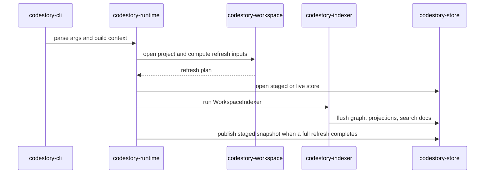
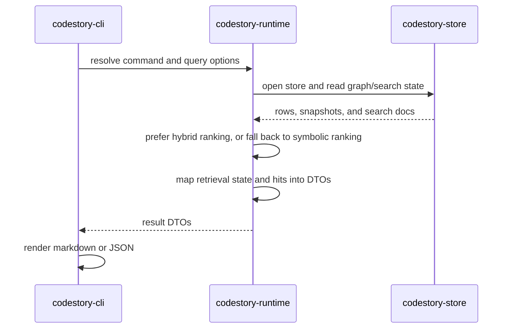
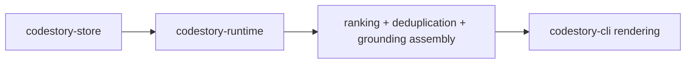

# Runtime Execution Path

## Index Command

1. `codestory-cli` parses the request and builds a runtime context.
2. `codestory-runtime` opens the project root, store path, and workspace manifest.
3. `codestory-workspace` computes the refresh plan from discovery plus stored file inventory.
4. `codestory-runtime` opens a staged or live store depending on refresh mode.
5. `codestory-indexer::WorkspaceIndexer` parses files, extracts graph artifacts, flushes projection batches, and runs resolution.
6. `codestory-store` updates graph rows, occurrence rows, callable projection state, search-doc rows, and snapshot invalidation state.
7. Runtime finalizes staged builds through `SnapshotStore` and publishes the finished snapshot when a full refresh completes.

## Search Command

1. CLI resolves the project and query options.
2. Runtime opens the store and ensures runtime-owned search state is available.
3. Runtime search prefers hybrid ranking when semantic docs and a local embedding runtime are ready.
4. When semantic retrieval is unavailable, runtime falls back to symbolic ranking and records the fallback reason in the DTO surface.
5. Runtime maps retrieval state plus matches into contract DTOs and CLI renders them.

## Ground, Symbol, Trail, and Snippet Commands

1. Runtime reads graph rows, occurrences, trail data, or snapshot digests from the store.
2. Runtime adds ranking, deduplication, and grounding-specific assembly.
3. CLI formats the resulting DTOs without reimplementing orchestration.

## Ownership Notes

- The runtime layer owns orchestration and search assembly.
- The indexer layer owns parse/extract/resolve behavior.
- The store layer owns persistence and snapshot lifecycle.
- The CLI layer owns rendering only.
