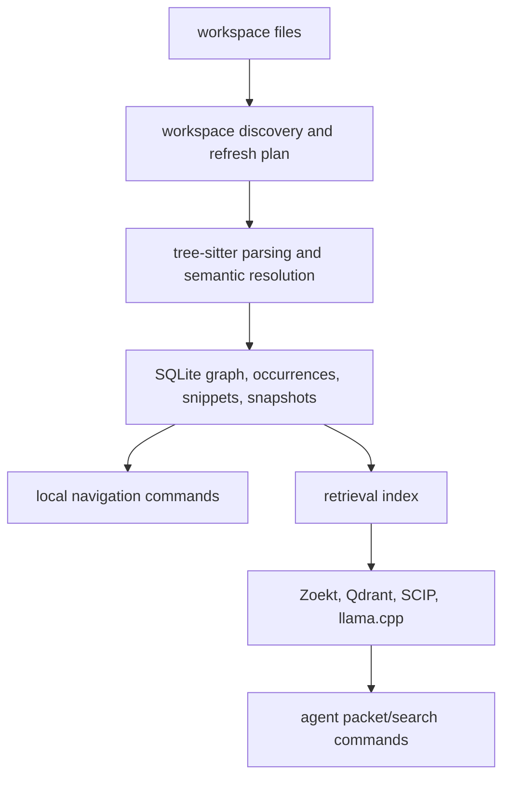

# How CodeStory Works

CodeStory indexes a workspace into a local graph, then serves read commands
against that graph. It does not replace tests or judgment; it structures the
first pass.

Command loop: [README - What Your Agent Gets](../../README.md#what-your-agent-gets).
Readiness lanes: [usage.md](../usage.md#readiness-tracks).



## What gets stored

Per-project SQLite under your user cache, keyed by workspace path:

| Stored | Purpose |
| --- | --- |
| File inventory and refresh metadata | Incremental re-index |
| Graph nodes and edges | Calls, imports, overrides, references |
| Snippets and occurrences | Source-backed reads |
| Search projections and symbol docs | Lookup without opening every file |
| Snapshots | Cached read models rebuilt from the graph |
| Dense anchors (when policy selects them) | Sidecar vector search only |

Repo content stays local. Managed setup may fetch tool assets; indexed evidence
does not leave the cache unless you copy it.

## The loop

```text
doctor -> index -> ground/report/files -> exact target -> trail/snippet/context
```

Use `packet` and `search` after the sidecar lane reports
`retrieval_mode: "full"`. Until then, keep local browsing on exact targets from
`ground`, `report`, `files`, or existing node ids.

## Terms

| Term | Meaning |
| --- | --- |
| Grounding | Context tied back to indexed files and symbols |
| Symbol doc | Generated searchable text for a symbol (lexical, not embedded by default) |
| Dense anchor | Policy-selected symbol or report that gets a vector |
| Snapshot | Derived read model; may be stale, and commands should say so |
| Trail | Graph walk from one symbol: callers, callees, neighbors |
| Packet | Bounded task evidence with citations, gaps, next commands |

More: [glossary.md](../glossary.md).

## What good output looks like

A good CodeStory-backed answer does three things:

1. Names the files, symbols, snippets, or sidecar evidence it used.
2. Says when evidence is stale, partial, ambiguous, or missing.
3. Gives the next concrete command when the current evidence is not enough.

The goal is not a more confident answer. The goal is confidence constrained by
source evidence.

## Related

- [usage.md](../usage.md)
- [architecture/overview.md](../architecture/overview.md)
- [contributors/debugging.md](../contributors/debugging.md)
