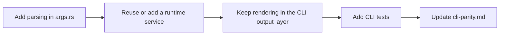

# Add A CLI Command

1. Add parsing in `crates/codestory-cli/src/args.rs`.
2. Reuse or add a runtime service.
3. Keep rendering in the CLI output layer.
4. Add CLI tests.
5. Update `docs/reference/cli-parity.md`.
