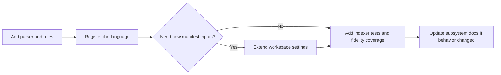

# Add A Language

1. Add the parser and rules in the indexing implementation.
2. Register the language in the indexer-facing registry path.
3. Extend workspace settings only if the language needs new manifest inputs.
4. Add indexer tests and, when relevant, fidelity coverage.
5. Update the subsystem docs when the public behavior changes.
