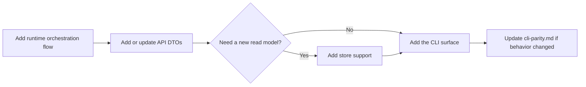

# Add A Query Mode

1. Add the orchestration flow in `codestory-runtime`.
2. Add or update DTOs through `codestory-contracts::api`.
3. Add storage support through `codestory-store` only if a new read model is needed.
4. Add the CLI surface after the runtime flow exists.
5. Update `docs/reference/cli-parity.md` if user-visible behavior changes.

