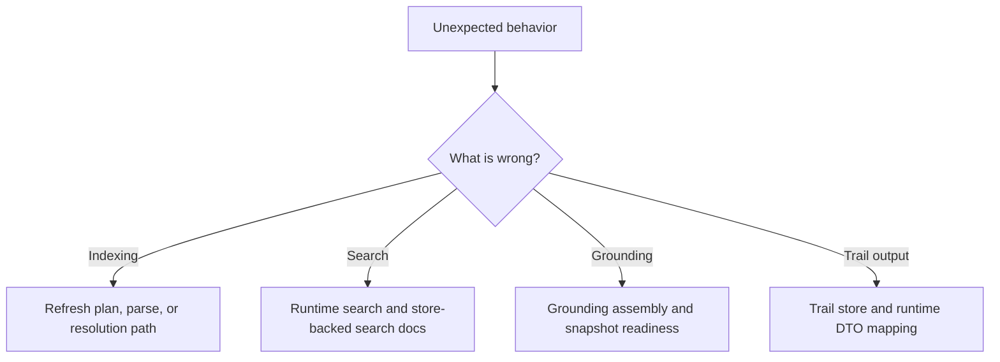

# Debugging Guide

## If Indexing Is Wrong

Start with:

- `crates/codestory-workspace/src/lib.rs`
- `crates/codestory-indexer/src/lib.rs`
- `crates/codestory-indexer/src/resolution/`
- `crates/codestory-indexer/src/semantic/`

Check:

- whether the refresh plan included the file
- whether the run was incremental or full refresh
- whether projection flushing completed
- whether resolution ran and updated the expected edges

## If Search Is Wrong

Start with:

- `crates/codestory-runtime/src/search/`
- `crates/codestory-runtime/src/lib.rs`
- `crates/codestory-store/src/search_doc_store.rs`

Check:

- whether the symbol exists in store-backed search docs
- whether runtime rebuilt its search state after indexing
- whether semantic retrieval is disabled or missing model assets
- whether graph-based boosts are overwhelming lexical matches

## If Grounding Is Wrong

Start with:

- `crates/codestory-runtime/src/grounding.rs`
- `crates/codestory-store/src/snapshot_store.rs`

Check:

- summary versus detail snapshot readiness
- recent invalidation after writes
- whether the candidate set was expanded by trail/search logic correctly

## If Trail Output Is Wrong

Start with:

- `crates/codestory-store/src/trail_store.rs`
- trail DTO mapping in `crates/codestory-runtime/src/lib.rs`

Check:

- trail mode and direction
- edge and occurrence presence in store
- stale projections after incremental indexing
