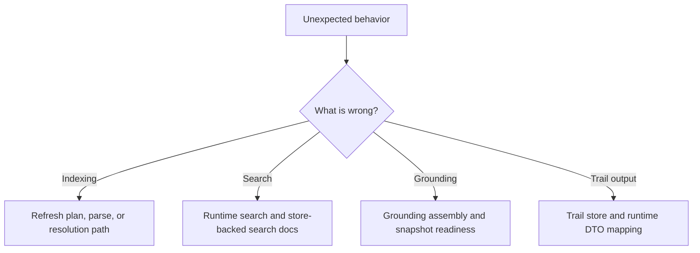

# Debugging Guide



## If Indexing Is Wrong

Common symptoms:

- a changed file is skipped during incremental refresh
- symbols exist but edges or occurrences are missing
- resolution regresses for one language only

Start with:

- `crates/codestory-workspace/src/lib.rs`
- `crates/codestory-indexer/src/lib.rs`
- `crates/codestory-indexer/src/resolution/`
- `crates/codestory-indexer/src/semantic/`

Check:

- whether the refresh plan included the file
- whether the run was incremental or full refresh
- whether projection flushing completed
- whether resolution ran and updated the expected edges

Recovery order:

1. Run `index --refresh full` once to rule out stale incremental state.
2. If a delete or rename still looks stale, inspect `codestory-workspace` path normalization and the file rows in the SQLite cache.
3. If the same repo repeatedly forces full rebuilds or looks perpetually dirty, inspect stored modification times versus filesystem times before changing resolution logic.

## If Store Or Snapshot State Is Wrong

Common symptoms:

- full refresh succeeds but the live snapshot does not publish
- grounding summaries are stale after writes
- trails or search docs lag behind graph rows

Start with:

- `crates/codestory-store/src/lib.rs`
- `crates/codestory-store/src/storage_impl/mod.rs`
- `crates/codestory-store/src/snapshot_store.rs`
- `crates/codestory-store/src/trail_store.rs`

Check:

- whether staged snapshot publish completed
- whether invalidation and refresh touched the expected projections
- whether search-doc and trail rows were refreshed alongside graph writes

Recovery order:

1. If a full refresh fails during publish, keep the staged snapshot path from the error output and inspect that database before deleting it.
2. If grounding snapshots look stale, force a fresh `index --refresh full` before debugging higher-level runtime assembly.
3. If file metadata looks wrong after a rename or move, inspect the `file` table values for `path`, `language`, and `modification_time`.

## If Search Is Wrong

Common symptoms:

- lexical results exist but semantic ranking disappears
- grounding returns the right files but poor symbol digests
- trail output is correct but grounding assembly is noisy

Start with:

- `crates/codestory-runtime/src/search/`
- `crates/codestory-runtime/src/lib.rs`
- `crates/codestory-store/src/search_doc_store.rs`

Check:

- whether the symbol exists in store-backed search docs
- whether runtime rebuilt its search state after indexing
- what retrieval mode `index`, `ground`, or `search` reported for the current run
- whether dense-anchor retrieval is disabled, ONNX model/tokenizer paths are missing, sidecars are not full, or symbol docs / dense anchors are missing
- whether `CODESTORY_HYBRID_RETRIEVAL_ENABLED`, `CODESTORY_SEMANTIC_DOC_SCOPE`, `CODESTORY_EMBED_RUNTIME_MODE`, `CODESTORY_EMBED_BACKEND`, or the `CODESTORY_EMBED_ONNX_*` paths changed between runs
- whether graph-based boosts are overwhelming lexical matches

Recovery order:

1. Confirm whether the miss is in `indexed_symbol_hits`, `repo_text_hits`, or both.
2. Confirm the reported retrieval mode and degraded-state reason before touching search ranking code.
3. For product sidecar evidence, run `codestory-cli retrieval bootstrap --project .`, set
   `CODESTORY_EMBED_BACKEND=llamacpp`, and point `CODESTORY_EMBED_LLAMACPP_URL` at the local
   bge-base-en-v1.5 llama.cpp `/v1/embeddings` endpoint before reindexing.
4. Rebuild once with `codestory-cli index --project . --refresh full`, then
   `codestory-cli retrieval index --project . --refresh full`.
5. Require `codestory-cli retrieval status --project . --format json` to report
   `retrieval_mode: "full"` before trusting packet/search evidence.
6. If `doctor` reports `missing_managed_assets`, use `codestory-cli setup embeddings --project .`
   only for managed ONNX/local semantic diagnostics. Managed setup installs ONNX assets and should
   not start a server or create the product retrieval manifest.
7. If semantic retrieval is still the only failing part, inspect the reported degraded-state reason before touching lexical ranking or CLI rendering.

## If Cold Indexing Is Slow

Common symptoms:

- `index --refresh full` is much slower on an empty cache than on a repeat full refresh
- graph timings are small but total index time is dominated by semantic work
- unchanged dense anchors are embedded again when they should be reused

Start with:

- `crates/codestory-runtime/src/lib.rs`
- `crates/codestory-runtime/src/search/engine.rs`
- `crates/codestory-store/src/search_doc_store.rs`
- `docs/testing/codestory-e2e-stats-log.md`
- `docs/testing/embedding-backend-benchmarks.md`

Check:

- `semantic_ms.doc_build`, `semantic_ms.embedding`, `semantic_ms.db_upsert`, and `semantic_ms.reload`
- `symbol_search_docs_written`, `semantic_dense_docs_skipped`, dense reason counters, `semantic_docs.reused`, `semantic_docs.embedded`, `semantic_docs.pending`, and `semantic_docs.stale`
- whether `CODESTORY_SEMANTIC_DOC_SCOPE=all` is forcing the broad all-symbol symbol-doc set
- whether `CODESTORY_SEMANTIC_DOC_ALIAS_MODE` was changed from the profiled default of `alias_variant`
- whether `CODESTORY_LLM_DOC_EMBED_BATCH_SIZE` was changed from the profiled default of `128`
- whether mandatory sidecars report `retrieval_mode=full` according to `doctor`
  and `retrieval status`
- whether `CODESTORY_EMBED_BACKEND=llamacpp` and the local
  `CODESTORY_EMBED_LLAMACPP_URL` endpoint match the manifest embedding backend
- whether an ONNX, hash, or other diagnostic comparison is clearly labeled and
  excluded from agent-facing sidecar evidence

Recovery order:

1. Run one measured cold E2E and append the headline numbers to `docs/testing/codestory-e2e-stats-log.md`.
2. Compare symbol-doc counts, dense skipped/reason counts, and dense embedded/reused counts before changing graph code.
3. For reuse regressions, inspect semantic doc version, generated text hash, embedding profile/backend/model/dimension, document prefix, and semantic policy version.
4. For cold-only regressions, inspect durable symbol scope, dense-anchor policy, length-bucket ordering, embedding batch size, sidecar health, and local embedding endpoint latency.
5. For backend experiments, first verify the runtime is using the backend under test, then rerun the speed and quality comparisons documented in `docs/testing/embedding-backend-benchmarks.md`.

## If Grounding Is Wrong

Start with:

- `crates/codestory-runtime/src/grounding.rs`
- `crates/codestory-store/src/snapshot_store.rs`

Check:

- summary versus detail snapshot readiness
- recent invalidation after writes
- whether the candidate set was expanded by trail/search logic correctly

If `ground --budget max` is the only failing path, check detail-snapshot readiness first. Summary-ready and detail-ready are separate states.

## If Trail Output Is Wrong

Start with:

- `crates/codestory-store/src/trail_store.rs`
- trail DTO mapping in `crates/codestory-runtime/src/lib.rs`

Check:

- trail mode and direction
- edge and occurrence presence in store
- stale projections after incremental indexing

## If CLI Boundary Or Output Is Wrong

Common symptoms:

- command parsing accepts the wrong shape
- output formatting changes without a runtime contract change
- CLI logic bypasses runtime behavior

Start with:

- `crates/codestory-cli/src/args.rs`
- `crates/codestory-cli/src/main.rs`
- `crates/codestory-cli/src/output.rs`

Check:

- whether the CLI maps directly to runtime services
- whether JSON and markdown output still match the runtime DTO shape
- whether the change belongs in runtime rather than the adapter layer

## Cache Reset Cookbook

Use this when you need to wipe state instead of debugging a clearly broken cache:

```sh
./target/release/codestory-cli index --project . --refresh full
```

If the cache directory itself needs to go:

```sh
mv <cache-dir> <cache-dir>.bak
./target/release/codestory-cli index --project . --refresh full
```

Keep the work serialized. Running multiple cargo or CLI indexing commands at once can hide the real failure behind lock contention and avoidable memory pressure.

If the repo-scale runtime integration gate hits memory pressure, do not keep retrying it in a loop. Capture the failing command, confirm the default runtime and retrieval lanes still pass, and treat the repo-scale run as a heavy manual follow-up on a roomier machine or after further containment work.

If retrieval behavior changes at the same time, walk the recovery order above before assuming the memory event and the ranking regression share the same cause.
