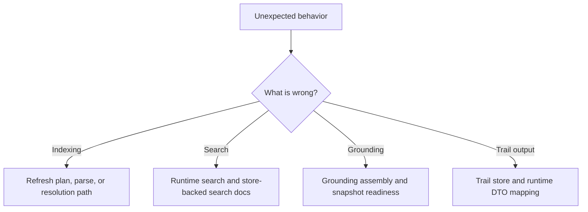

# Debugging Guide

## If Indexing Is Wrong

Common symptoms:

- a changed file is skipped during incremental refresh
- symbols exist but edges or occurrences are missing
- resolution regresses for one language only

Start with:

- `crates/codestory-workspace/src/lib.rs`
- `crates/codestory-indexer/src/lib.rs`
- `crates/codestory-indexer/src/resolution/`
- `crates/codestory-indexer/src/semantic/`

Check:

- whether the refresh plan included the file
- whether the run was incremental or full refresh
- whether projection flushing completed
- whether resolution ran and updated the expected edges

## If Store Or Snapshot State Is Wrong

Common symptoms:

- full refresh succeeds but the live snapshot does not publish
- grounding summaries are stale after writes
- trails or search docs lag behind graph rows

Start with:

- `crates/codestory-store/src/lib.rs`
- `crates/codestory-store/src/storage_impl/mod.rs`
- `crates/codestory-store/src/snapshot_store.rs`
- `crates/codestory-store/src/trail_store.rs`

Check:

- whether staged snapshot publish completed
- whether invalidation and refresh touched the expected projections
- whether search-doc and trail rows were refreshed alongside graph writes

## If Search Is Wrong

Common symptoms:

- lexical results exist but semantic ranking disappears
- grounding returns the right files but poor symbol digests
- trail output is correct but grounding assembly is noisy

Start with:

- `crates/codestory-runtime/src/search/`
- `crates/codestory-runtime/src/lib.rs`
- `crates/codestory-store/src/search_doc_store.rs`

Check:

- whether the symbol exists in store-backed search docs
- whether runtime rebuilt its search state after indexing
- what retrieval mode `index`, `ground`, or `search` reported for the current run
- whether semantic retrieval is disabled, missing model assets, or missing semantic docs
- whether graph-based boosts are overwhelming lexical matches

## If Grounding Is Wrong

Start with:

- `crates/codestory-runtime/src/grounding.rs`
- `crates/codestory-store/src/snapshot_store.rs`

Check:

- summary versus detail snapshot readiness
- recent invalidation after writes
- whether the candidate set was expanded by trail/search logic correctly

## If Trail Output Is Wrong

Start with:

- `crates/codestory-store/src/trail_store.rs`
- trail DTO mapping in `crates/codestory-runtime/src/lib.rs`

Check:

- trail mode and direction
- edge and occurrence presence in store
- stale projections after incremental indexing

## If CLI Boundary Or Output Is Wrong

Common symptoms:

- command parsing accepts the wrong shape
- output formatting changes without a runtime contract change
- CLI logic bypasses runtime behavior

Start with:

- `crates/codestory-cli/src/args.rs`
- `crates/codestory-cli/src/main.rs`
- `crates/codestory-cli/src/output.rs`

Check:

- whether the CLI maps directly to runtime services
- whether JSON and markdown output still match the runtime DTO shape
- whether the change belongs in runtime rather than the adapter layer

