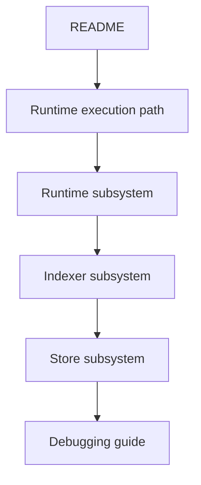

# First Day

## Goal

Build a mental model before reading the biggest legacy files.

## Recommended Order

1. [README](../../README.md)
2. [Runtime execution path](../architecture/runtime-execution-path.md)
3. [Runtime subsystem](../architecture/subsystems/runtime.md)
4. [Indexer subsystem](../architecture/subsystems/indexer.md)
5. [Store subsystem](../architecture/subsystems/store.md)
6. [Debugging guide](debugging.md)
