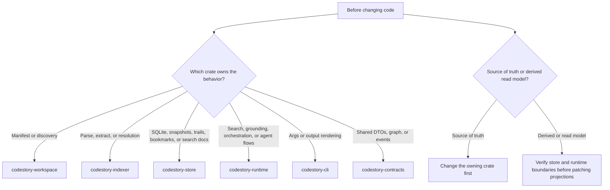

# Contributor Setup

CodeStory exists because agents otherwise rediscover the same repository on
every question. When you change CodeStory itself, use the same grounding loop
you ship to users: check readiness, ground the checkout, then trace the owning
crate before editing.

**Example when working in this repository:**

```text
@CodeStory Where is RefreshMode defined, which codestory-cli commands accept --refresh, and what is the call path from index into codestory-store?
```

**Generalizable prompt template for any CodeStory change:**

```text
@CodeStory Where is [TARGET_FEATURE] defined, which codestory-cli commands accept --refresh, and what is the call path from index into [OWNING_CRATE]?
```

Replace `[TARGET_FEATURE]` and `[OWNING_CRATE]` with the specific feature and crate you are working on.

## Choose The Verification Lane First

Before running Cargo or setting up sidecars, answer two questions:

1. Which crate owns the behavior?
2. What is the smallest proof that covers the change?

Use this lane picker from the repo root:

| Change | Start here | Escalate when |
| --- | --- | --- |
| Docs only, including `README.md` or `docs/**` | Read the changed pages back, then run `git diff --check`. | The doc depends on new code behavior, command output, generated docs, or release evidence. |
| CLI args, help, or output envelopes | `cargo test -p codestory-cli` | The CLI path crosses runtime behavior; use the runtime-backed CLI lane in the testing matrix. |
| Runtime, search, grounding, or orchestration | `cargo test -p codestory-runtime` and `cargo test -p codestory-runtime --test retrieval_eval` | Agent-facing `packet` or `search` readiness is claimed; use the full sidecar proof path below. |
| Indexer, graph, language, or semantic resolution | The full indexer fidelity suites in the testing matrix. | Language-level packet quality is claimed; use the manifest-backed packet-runtime lane. |
| Store, snapshots, trails, bookmarks, or search docs | `cargo test -p codestory-store` | The change affects repo-scale semantic or cold-start behavior. |
| Release or version bump | The release scripts in the testing matrix. | Packet/search readiness is part of the release claim; use the sidecar evidence tiers. |

**Key concepts for verification lanes:**

- **Docs-only changes**: Documentation that doesn't depend on new code behavior, command output, generated docs, or release evidence. Use `git diff --check` to verify formatting.
- **CLI changes**: Changes to command-line arguments, help text, or output envelopes. These cross runtime behavior and need runtime-backed CLI verification.
- **Runtime changes**: Changes to search, grounding, orchestration, or agent flows. These claim agent-facing `packet` or `search` readiness and need full sidecar proof.
- **Indexer changes**: Changes to indexing, graph, language, or semantic resolution. These claim language-level packet quality and need manifest-backed packet-runtime verification.
- **Store changes**: Changes to storage, snapshots, trails, bookmarks, or search docs. These affect repo-scale semantic or cold-start behavior.
- **Release changes**: Changes that affect release or version bump. These need sidecar evidence tiers for packet/search readiness.

## Crate Ownership

Before changing code, decide where the change belongs:



Use this mapping:

- manifest or discovery issue: `codestory-workspace`
- parse, extract, or resolution issue: `codestory-indexer`
- SQLite, snapshots, trails, bookmarks, or search docs: `codestory-store`
- search ranking, grounding, orchestration, or agent flows: `codestory-runtime`
- args or output rendering: `codestory-cli`
- shared DTOs or graph/event types: `codestory-contracts`

## Basic Cargo Lane

Run these from the repo root:

```sh
cargo fmt --check
cargo check
cargo test -p codestory-cli
```

**Why run serially:**

This workspace shares Cargo build locks. Running commands serially prevents lock contention and ensures consistent build results.

**When to use this lane:**

Use this lane after the picker says broad Rust checks are useful. If you touch
graph extraction, semantic resolution, runtime search, grounding, or repo-scale
indexing behavior, check the testing matrix before you finish so the heavy lane
is explicit instead of accidental.

**What each command does:**

- `cargo fmt --check`: Verifies that the code follows Rust formatting standards
- `cargo check`: Checks for compilation errors without building
- `cargo test -p codestory-cli`: Runs CLI tests to verify command behavior

**Best practices:**

- Always run these commands serially in the order shown
- If any command fails, fix the issue before proceeding to the next
- Use this lane for routine code changes and documentation updates
- For heavy changes, use the appropriate verification lane from the testing matrix

## Local CLI Loop

When CLI behavior is in scope, verify the shipped flow with the built binary
instead of `cargo run`:

```sh
cargo build --release -p codestory-cli
./target/release/codestory-cli setup embeddings --project . --dry-run
./target/release/codestory-cli index --project . --refresh auto
./target/release/codestory-cli ready --project . --goal local
./target/release/codestory-cli ground --project . --why
./target/release/codestory-cli files --project . --limit 20
./target/release/codestory-cli doctor --project .
```

On Windows PowerShell, use `.\target\release\codestory-cli.exe`.

This loop proves the local CLI and managed ONNX diagnostic path are wired, but
it is not product packet/search sidecar setup. Treat `setup embeddings
--dry-run` as an asset-plan check only. It should not start an embedding server,
write a product retrieval manifest, or make agent-facing retrieval evidence
trustworthy by itself.

Read commands default to `--refresh none`. If a read command says the cache is
empty, either run `index --refresh full` first or rerun the read command with an
explicit refresh mode. Agent-facing `packet` and `search` evidence require full
retrieval sidecars; prepare the sidecar lane below before treating those
commands as product-quality proof.

## Hybrid Retrieval Setup

Use this lane only for packet/search, retrieval, ranking-quality, or sidecar
work. Prepare the managed full-sidecar path before debugging ranking quality:

- product sidecar setup: `node scripts/setup-retrieval-env.mjs --fetch-embed-model`, then `codestory-cli retrieval bootstrap --project .`
- default symbol-doc scope: durable symbols only; set `CODESTORY_SEMANTIC_DOC_SCOPE=all` when you intentionally need the broad all-symbol diagnostic symbol-doc set
- default dense policy: `graph_first_v1` embeds only selected dense anchors; private trivial code remains searchable through symbol docs, lexical source, and graph expansion
- default semantic alias mode: compact aliases; set `CODESTORY_SEMANTIC_DOC_ALIAS_MODE=no_alias` or `current_alias` only when reproducing benchmark rows
- embedding throughput tuning: `CODESTORY_LLM_DOC_EMBED_BATCH_SIZE` and local llama.cpp sidecar settings

Hash embeddings, ONNX-only flows, and lexical-only switches are diagnostic or
historical comparison modes only; they are not valid agent-facing retrieval
setup.

After bootstrap, run a target-repo sidecar index before using packet/search:

```sh
./target/release/codestory-cli index --project . --refresh full
./target/release/codestory-cli retrieval index --project . --refresh full
./target/release/codestory-cli retrieval status --project . --format json
./target/release/codestory-cli ready --project . --goal agent
```

`index`, `ground`, `search`, `context`, and `doctor` report the active retrieval mode plus any degraded-state reason when retrieval state is available, so confirm that output before assuming the ranking logic regressed. Agent-facing retrieval requires `retrieval_mode=full`.

## Recommended Reading Order

Build a mental model in this order before editing the biggest implementation paths:

1. [README](../../README.md)
2. [Architecture overview](../architecture/overview.md)
3. [Runtime execution path](../architecture/runtime-execution-path.md)
4. [Indexing pipeline](../architecture/indexing-pipeline.md)
5. the subsystem page for the owning crate
6. [Debugging guide](debugging.md)
7. [Testing matrix](testing-matrix.md)

## Rustdoc Baseline

Run the rustdoc baseline before raising documentation or public API cleanup PRs:

```sh
RUSTDOCFLAGS="-D warnings" cargo doc --workspace --no-deps
```

CI runs the same rustdoc warning gate for Rust and contributor-doc changes. It
keeps `codestory-bench` in the workspace pass for warning and link regressions,
but `publish = false` benchmark helpers do not carry a broader missing-docs
policy.

Document public Rust APIs that a maintainer, integration, or downstream crate
would need to call correctly. Keep comments operational:

- Start each public crate and intentionally public module with `//!` docs that
  name the crate boundary, source of truth, and runtime side effects.
- Put `///` docs on public structs, enums, traits, type aliases, constants,
  re-exports, and functions that are meant to be reused across crates.
- State invariants, cache or sidecar effects, error behavior, and required
  verification commands when those details affect correct use.
- Avoid issue history, benchmark holdout names, local machine paths, and
  process narration in rustdoc.
- Prefer one accurate paragraph over examples that would duplicate tests or
  drift from real command behavior.

Public API documentation priority:

| Crate | Public surface to document first |
| --- | --- |
| `codestory-contracts` | Shared DTOs, graph model, events, language support contracts, and query/trail types. |
| `codestory-runtime` | Headless orchestration, service facades, cache rehydration, search/runtime exports, and repository identity reports. |
| `codestory-retrieval` | Sidecar health, query planning/execution, index manifests, cache keys, and degraded-mode contracts. |
| `codestory-workspace` | Workspace discovery/settings, refresh planning, language settings, and repository/sidecar identity. |
| `codestory-store` | Storage facades and projection/snapshot/file-store contracts. |
| `codestory-indexer` | Public indexing config/results/events, language config, semantic-resolution contracts, and candidate path helpers. |
| `codestory-cli` | Binary command behavior belongs in user/contributor docs; add rustdoc only for reusable library APIs if one is introduced. |
| `codestory-bench` | Publish-false benchmark helpers; document only helpers reused outside a single benchmark lane. |

Do not enable workspace-wide or crate-wide `missing_docs` yet. The current
public surface is broad enough that a crate-wide lint would force a noisy sweep.
Phase it in behind explicit allowlists: start with module-scoped
`#![warn(missing_docs)]` on newly cleaned public modules, allow known transitional
exports explicitly, and move to crate-wide lints only after the crate root and
intentional re-exports are documented.

## Before Large Changes

Read these pages first:

- `docs/architecture/overview.md`
- `docs/architecture/runtime-execution-path.md`
- `docs/architecture/indexing-pipeline.md`
- the subsystem page for the owning crate
- `docs/contributors/debugging.md`
- `docs/contributors/testing-matrix.md`

## Cache And Refresh Notes

- default cache layout: user cache root + hashed project path
- explicit `--cache-dir`: use the exact directory you passed
- `cache identity`: reports the root-derived project id, canonical repository id, Git remote/tree freshness input, cache schema version, and portable-reuse eligibility without changing cache files
- Child worktree bootstrap: run `codestory-cli cache rehydrate --from-project <main-or-parent-worktree> --project <child-worktree>` before the first child-thread index. The command copies a compatible cache only when both worktrees are clean, share the same `origin` URL, have the same Git tree, the source SQLite schema matches the running CLI, and the target cache directory is empty.
- Rehydrated caches rebase copied path-bound SQLite graph/search/doc rows under the child worktree path, preserve portable v2 index artifact cache rows, and invalidate retrieval manifests. Run the printed `doctor` command to inspect freshness, then run `retrieval index --refresh full` before using sidecar-backed packet/search evidence.
- If `cache rehydrate` reports `skipped`, use the printed rebuild commands. This is CodeStory SQLite graph/search/doc plus portable v2 index artifact cache reuse; retrieval sidecar reuse across path/root-derived identities remains future work. It does not configure Rust compilation caching such as `sccache`.
- `index --refresh auto`: chooses full on an empty cache and incremental after that
- `ground`, `search`, `context`, `symbol`, `trail`, `snippet`, `query`, `explore`, `serve`: default to `--refresh none`
- `drill`: defaults to `--refresh full` so report bundles are mechanically fresh
- `drill --jobs N` and `drill-suite --jobs N`: only use workers with `--refresh none`; refresh/indexing runs stay serialized
- use `--refresh full` after deleting the cache directory, after schema-affecting changes, or when stale state is suspected
