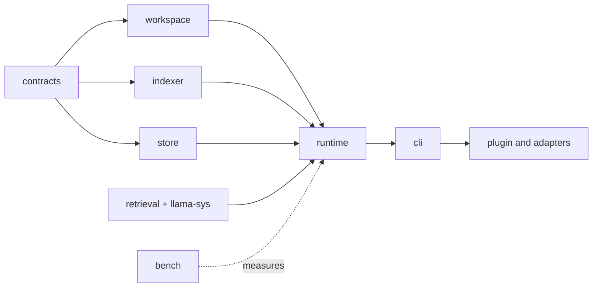

# Contributor setup

Start from the current integration head, change the owning layer, and run the
smallest proof that can disprove the change. The broad workspace and platform
gates belong on an accepted exact head, not every draft commit.

## Prerequisites

Install the Rust toolchain, Node.js 18 or later, Git, Python 3, CMake, and
LLVM/libclang. On Windows, set `LIBCLANG_PATH` to the LLVM `bin` directory when
bindgen cannot find `libclang.dll`, and install the Vulkan SDK used by the
default native backend. Run native Windows builds from a Visual Studio
developer shell, use `CMAKE_GENERATOR=Ninja` when the nested Vulkan shader build
selects MSBuild, and keep the worktree path short enough for CMake's object-path
limit. On macOS, CodeStory development supports macOS 15 or later and requires
the Xcode Command Line Tools. Apple Silicon is the protected Metal cell; Intel
Mac development uses explicit CPU operation and never claims Metal.

Debug Rust builds compile without embedding the release model. A release build
automatically reuses or prepares the exact pinned model at build time:

```sh
cargo build --release --locked -p codestory-cli
```

The preparation script verifies the declared size and digest before publishing
the build input. Set `CODESTORY_EMBED_MODEL_SOURCE` only when a hermetic or
offline build must provide an explicit preverified source. The resulting
executable contains the model; product runtime does not download it.

## Establish the proof target

Before editing, inspect the branch, integration head, active worktrees, open PR
ownership, and release state. Routine branches start from and target
`dev/codestory-next`; do not reuse another active lane.

For a delegated worktree, run:

```sh
node scripts/codex-worktree-setup.mjs
```

Treat its printed base, child head, PR head, remote-tip check, and proof target
as authoritative. The dispatcher also selects a version-matched CLI, optionally
uses `sccache`, attempts safe cache rehydration, refreshes the local map, and
reports status. Shell and PowerShell files are compatibility adapters around
this Node implementation.

By default the setup does not initialize the embedded retrieval engine. Opt in
only when full retrieval evidence belongs to the lane:

```sh
node scripts/codex-worktree-setup.mjs --full-retrieval-proof
```

Test setup behavior with:

```sh
node --test scripts/tests/codex-worktree-setup.test.mjs
```

## Ownership map

Change the source-of-truth layer first. Do not patch a CLI or plugin projection
to compensate for an upstream state bug.



| Area | Owns |
| --- | --- |
| `codestory-contracts` | Shared DTOs, graph types, events, grounding and trail contracts |
| `codestory-workspace` | Project discovery, inventories, refresh planning, repository identity |
| `codestory-indexer` | Parsing, extraction, intermediate projections, semantic resolution |
| `codestory-store` | SQLite source of truth, snapshots, projections, core publication |
| `codestory-retrieval` | Lexical/vector/SCIP generations, manifests, query execution, in-process engine policy |
| `codestory-llama-sys` | The small Rust-to-llama.cpp/ggml boundary and embedded-model build contract |
| `codestory-runtime` | Product orchestration for indexing, grounding, search, packets, and agent flows |
| `codestory-cli` | Arguments, transports, rendering, process configuration, managed runtime boundary |
| `plugins/codestory` | Host hooks, CLI provisioning, MCP routing, canonical grounding skill |
| `codestory-bench` | Measurement support; no product contracts |

## Choose the verification lane first

Use the [testing matrix](testing-matrix.md) as the source of truth. Common draft
lanes are:

| Change | Focused proof |
| --- | --- |
| Docs only | Read changed pages, `node .github/scripts/check-doc-links.mjs`, `git diff --check` |
| One Rust crate | `cargo test --locked -p <crate> <filter>` then `cargo check --locked -p <crate>` |
| CLI or stdio | Named CLI contract suite; add runtime tests when orchestration changes |
| Plugin adapter | `node --test plugins/codestory/tests/plugin-static.test.mjs` |
| Indexer or language | Full fidelity and language-coverage binaries |
| Retrieval or embeddings | Retrieval/runtime admission tests plus the named engine proof |
| Release metadata | Release-version and workflow-policy scripts |

Run Cargo build, check, test, and clippy commands serially because worktrees can
share build locks. Never serialize a test suite to hide leaked global state.

The accepted exact-head source gate runs once:

```sh
cargo fmt --all -- --check
cargo check --workspace --locked
cargo test --workspace --locked
cargo clippy --workspace --all-targets --all-features --locked -- -D warnings
```

## Local CLI loop

Use the built binary rather than `cargo run` when the shipped command boundary
is part of the claim:

```sh
cargo build --release --locked -p codestory-cli
./target/release/codestory-cli index --project . --refresh auto
./target/release/codestory-cli ready --project . --goal local
./target/release/codestory-cli ground --project . --why
./target/release/codestory-cli doctor --project .
```

On Windows, use `.\target\release\codestory-cli.exe`. Set `CODESTORY_CLI` to
that exact binary when testing the plugin adapter against a local build.

Read commands default to `--refresh none`. Use `--refresh incremental` when a
read should refresh an existing cache. Reserve full refresh for an empty cache,
schema change, diagnosed corruption, or an explicit proof lane.

## Full retrieval development

Use this loop only for packet/search, retrieval, ranking, or embedding work:

```sh
./target/release/codestory-cli index --project . --refresh full
./target/release/codestory-cli retrieval index --project . --refresh full
./target/release/codestory-cli retrieval status --project . --format json
./target/release/codestory-cli ready --project . --goal agent
```

Require `retrieval_mode: "full"` before treating packet/search output as
product evidence. The in-process CodeRankEmbed engine initializes automatically. It has no
endpoint, helper executable, port, or repair worker.

Useful diagnostic policies:

| Variable | Purpose |
| --- | --- |
| `CODESTORY_EMBED_ALLOW_CPU=1` | Explicit hosted-CI or maintainer CPU operation; never an acceleration claim |
| `CODESTORY_SEMANTIC_DOC_SCOPE=all` | Broader all-symbol diagnostic document set |
| `CODESTORY_SEMANTIC_DOC_ALIAS_MODE=no_alias|current_alias` | Reproduce nondefault alias experiments; default is compact `alias_variant` |
| `CODESTORY_LLM_DOC_EMBED_BATCH_SIZE=<n>` | Embedding batch-size experiment |

Hash embeddings and lexical-only modes are diagnostics, not agent-facing full
retrieval.

## Cache reuse across worktrees

Before indexing a clean child worktree with the same origin and Git tree:

```sh
codestory-cli cache rehydrate \
  --from-project <parent-worktree> \
  --project <child-worktree>
```

Rehydrate copies and rebases compatible SQLite graph/search/document and dense
input rows plus portable artifact-cache entries. It invalidates the copied core
dense publication and retrieval manifests because the project identity changed.
Run the printed `doctor`, incremental core index, and full retrieval index
commands in order before using packet/search. If rehydrate reports `skipped`,
use its normal rebuild commands.

Cache rules:

- `--cache-dir` is an exact override; otherwise CodeStory uses the user cache
  root plus a project identity.
- `index --refresh auto` builds an empty cache and is incremental thereafter.
- Cleanup acts only on current CodeStory-owned generations and tokens.
- Tests use isolated cache and plugin roots; never clean the real user cache to
  make a test pass.

## Documentation and Rustdoc

For docs-only scope, read the changed pages and run:

```sh
node .github/scripts/check-doc-links.mjs
git diff --check
```

When plugin files change, also run:

```sh
node --test plugins/codestory/tests/plugin-static.test.mjs
```

For public Rust API work:

```sh
RUSTDOCFLAGS="-D warnings" cargo doc --workspace --no-deps --locked
```

Document source-of-truth ownership, side effects, invariants, and error behavior.
Do not copy issue history or benchmark narration into Rustdoc, and do not enable
a workspace-wide `missing_docs` lint until the existing public surface is
deliberately reduced.

## Reading order for large changes

1. [Architecture overview](../architecture/overview.md)
2. the owning subsystem page under `docs/architecture/subsystems/`
3. [Runtime execution path](../architecture/runtime-execution-path.md) when orchestration changes
4. [Indexing pipeline](../architecture/indexing-pipeline.md) when discovery or publication changes
5. [Debugging guide](debugging.md)
6. [Testing matrix](testing-matrix.md)
7. [Retrieval engine operations](../ops/retrieval-engine.md) for embedding or retrieval work
